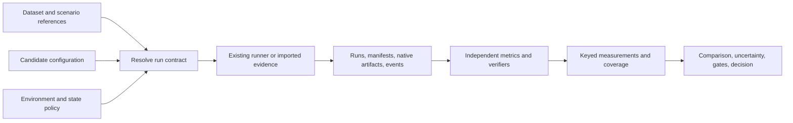

# Agent Eval Flow: the idea, then the details

**Project name adopted:** Agent Eval Flow. **Proposed Python import:**
`agent_eval_flow`. The library is still being designed. Naming is agreed;
the build proposal below remains open for discussion.

**Current focus:** identify which skills, flows, models, and harness
configurations help or hurt, and how their effects depend on one another.
OpenSRE and OpenKritt are the selected real-world testbeds. Read
[what our idea adds to current work](WHAT_AGENT_EVAL_FLOW_ADDS.md) for the
missing comparison, in under 1,000 words.

Read whichever version gives you enough context. Each is a standalone
explanation of the same proposal, with more detail as you go:

- [Version 1: up to 200 words](#version-1-up-to-200-words)
- [Version 2: up to 500 words](#version-2-up-to-500-words)
- [Version 3: up to 1000 words](#version-3-up-to-1000-words)
- [Detailed review and sources](#detailed-review-and-sources)

## Version 1: up to 200 words

**I propose a Python library that identifies which skills, flows, models, and
harness configurations improve an agent's work, and under which conditions.**

The system includes the model and its harness: instructions, skills, tools,
memory, and the logic controlling its actions.

You supply three things: the system, some evaluation tasks, and checks defining
good work. The library runs the system or reads saved outputs, applies the
checks, and returns results you can inspect and compare.

For example, compare OpenSRE with and without diagnostic guidance under two
models. Check whether the guidance improves diagnosis, whether its benefit
depends on the model, and what it costs. Use the same experiment pattern for
skills and workflows in OpenKritt.

Your document already provides a good foundation. My proposed change is to make
the complete agent system the main candidate. A skill change becomes one kind
of experiment.

Use existing runners and checks. The report should identify helpful changes,
regressions, and uncertainty, with outcomes and traces supporting the conclusion.

## Version 2: up to 500 words

**Agent Eval Flow would be a Python library for measuring complete agent systems
and comparing changes to them.** Its main question is practical: which version
does our work better, under the conditions we care about?

An agent system includes its model and harness. The harness is everything that
organizes the model's work: instructions, skills, tools, memory, retries,
verification, and decisions about when to stop or ask a human.

The interface you proposed is a good starting point:

```python
result = evaluate(candidate=my_agent, data=my_tasks, metrics=my_checks)
```

This is a proposed API, not implemented code. You provide the candidate, the
tasks, and the checks. The library runs an existing system or loads its saved
outputs. It applies the checks and returns measurements, failures, costs, and
links to the evidence. You can then compare candidates.

Consider your tender workflow. You have an existing agent and a revised one.
Give both the same PDFs. Check whether they preserved the meaning and monetary
values, included all required content, produced usable layouts, and needed
human correction. Record the total cost, including retries and failed jobs.

The report should let you see both the document-level result and the exact
page or polygon that failed. It should help answer whether the revision is
better enough to use, or whether the evidence is still unclear.

This supports two useful kinds of comparison. You can compare complete systems,
even when several components differ. You can also keep everything else fixed
and change one component to investigate its contribution. Adding a skill,
changing the model, or changing memory handling are examples.

The existing design already has much of this: ordinary data tables, candidates,
metrics, results, and careful comparisons. I recommend keeping that foundation
and making complete systems the main focus.

The central feature should be the experiment: change a skill, flow, model, or
harness; compare the complete candidates; identify improvements and regressions.
Test combinations too. A skill might help one model and hurt another. Traces
can suggest an explanation, and a follow-up controlled change can test it.
Outcome checks provide the evidence that makes these conclusions useful.

The selected testbeds are OpenSRE for incident investigation and OpenKritt for
vulnerability research. Start with a controlled change using OpenSRE's existing
incident scenarios, then express an OpenKritt skill or workflow experiment
through the same interface. Reuse their execution and suitable checks. The
result should explain which change helped, on which tasks, at what cost, and
with what uncertainty. The technical details later support that goal.

## Version 3: up to 1000 words

**I propose building Agent Eval Flow as a Python library that measures complete
agent systems and helps engineers compare their versions.** It should answer
three questions: did the system complete the work correctly, what resources
and human help did it need, and what changed between versions?

The project name is Agent Eval Flow, with `agent_eval_flow` as the proposed
Python import. The implementation and the precise API are still proposals.

**What are we evaluating?**

The candidate is a complete working system. That includes the model and its
harness: instructions, skills, tools, memory, orchestration, retries, internal
checks, and rules for stopping or asking a person for help.

You might compare two versions of your own workflow, two different harnesses
using the same model, or two complete systems using different models. The
evaluation must say which comparison it performed. If several things changed,
the result describes the combined change. To investigate one component, hold
the others fixed.

Skills remain useful experiments. Their evaluation fits inside this broader
model: run the same system with and without a skill and compare the outcomes.

**What does the user provide?**

Keep the simple interface from your document:

```python
result = evaluate(candidate=my_agent, data=my_tasks, metrics=my_checks)
```

The candidate identifies the system to evaluate. The data describes the tasks
and their inputs. The metrics define what we will measure. The result contains
the measurements and evidence needed to understand them.

The library can call an existing agent through an adapter or evaluate outputs
that were already produced. Users keep their current agent frameworks and
services. Their data can remain ordinary tables and files.

Domain knowledge belongs in the checks. A tender workflow needs translation,
coverage, and layout checks. A coding workflow needs tests and checks of the
resulting changes. The library provides a shared way to execute those checks,
connect them to the right job, and compare results.

**What would this look like for the tender agent?**

Take a set of source PDFs and two agent versions. Run both versions on the same
documents under declared conditions. Preserve their outputs, execution costs,
and any recorded human corrections.

Evaluate whether each document includes all required content, preserves facts
such as amounts and deadlines, translates correctly, and has a usable layout.
Record how much human work was required to reach the delivered version.

The result should show document-level success and allow inspection of the
specific page or polygon behind a failure. Your `doc_id`, `page`, and `poly`
structure is valuable here. Six hundred polygon checks explain one document;
they do not mean we tested six hundred independent documents.

The comparison should reveal tradeoffs. A revision might reduce human edits
while increasing cost. Another might be cheaper but miss critical content.
The user sets the requirements that determine whether those tradeoffs are
acceptable. The report should also say when there is too little evidence to
choose confidently.

**What was I asking us to change in the current design?**

Keep its core: data, candidates, measurements, results, and optional comparison
methods. Make the complete agent system the main object throughout the story,
and use skill experiments as one example.

Then make a few safeguards concrete. Check source coverage independently enough
to detect content that the candidate never extracted. Include unsuccessful
jobs and retries in resource accounting. Distinguish automatic completion from
completion after human help. Preserve uncertainty when a required check cannot
be performed.

Record which model, harness configuration, tools, budgets, and initial state
were used. Those facts help determine whether two results are comparable. For
agents that remember earlier work, specify when memory persists and when it
resets. Otherwise, the second run may benefit from information the first lacked.

Separate the checks used by the agent to repair its work from the final
evaluation. A system's own claim that it succeeded needs supporting evidence:
the resulting PDF, a trusted test, or a verified change in the environment.

These details serve the practical question at the top. They prevent a report
from recommending a revision because failures disappeared, the inputs differed,
or the evaluator missed the problem.

**What should we build first?**

Use OpenSRE and OpenKritt as the real-world testbeds. OpenSRE supplies incident
investigation; OpenKritt supplies vulnerability research. Compare configurations
within each project on appropriate tasks. Keep the tender example above as an
illustration of how detailed measurements support a system comparison.

Begin with OpenSRE's existing incident scenarios. Compare a baseline, a
diagnostic-guidance change, a model change, and both changes together. This can
show whether the guidance helps and whether its value depends on the model.
Then express an OpenKritt skill or workflow experiment through the same
interface, using fixed repository snapshots and independently checked findings.

Reuse native execution and suitable checks. Build the layer that declares
changes, collects comparable runs, retains failures, and reports effects,
tradeoffs, interactions, and uncertainty. Its first deliverable should explain
which parts of a real agent system helped or hurt on the tested work.

The research and detailed critique below are supporting material for this
proposal. They are not all requirements for the first release.

## Detailed review and sources

<details>
<summary>Expand the technical review, research, and proposed architecture</summary>

Research cutoff: 2026-09-05. The following preserves the detailed review;
architecture and release recommendations remain proposals for discussion.

Reviewed `WORKFLOW_EVALUATION_MODEL.md` first, then `PROJECT_PLAN.md` and
`README.md`. Research below uses original papers and official project sources.
The review combines abstracts, selected methods and limitation sections, and
official project documentation; supplementary abstract-only readings are
identified. Recent preprints provide
design evidence, not independently replicated conclusions. No benchmark runs
or integrations were executed for this review.

## 1. Recommendation and what to preserve

The adopted project name is **Agent Eval Flow**. The proposed scope is:

> Evaluate complete agent systems on real work, compare revisions under explicit
> conditions, and connect the decision to verifiable outcomes, failures, human
> effort, and resource use.

The evaluated system includes the model configuration and its harness:
instructions, skills, tools, orchestration, context handling, persistent memory,
delegation, retries, stopping rules, approval behavior, and online verification.
A skill ablation becomes one supported experiment within that scope.

The beginning of the workflow document is its strongest part. Preserve:

- `evaluate(candidate, data, metrics)` and the four public concepts;
- ordinary tables, related tables, row keys, and nested measurements;
- runnable candidates and imported evidence;
- explicit finite-dataset claims and optional population assumptions;
- separate autonomous and delivered artifacts;
- hard constraints, explicit objectives, and inspectable evidence;
- execution through existing systems and derived evidence graphs.

The original project plan already contains useful system/context separation,
factorial contrasts, failure policies, and statistical caveats. The pivot should
promote and reconcile those ideas, not claim they were absent.

Three small corrections belong near the opening. Use `Candidate` consistently
instead of alternating among `Candidate`, `System`, and `Variant` as if they
were interchangeable. Say that `unit_key` identifies the work unit; it does not
establish independence. Explain that the simple API resolves an execution and
measurement contract internally even when the user does not author it.

## 2. Red team of the current design

### 2.1 A wrapper around runners and metrics is insufficient differentiation

AgentCompass already separates benchmarks, harnesses, and environments. A²E
already combines task adapters, native trace instrumentation, and multidimensional
evaluation. These are substantial overlaps, not just adjacent products.
[AgentCompass paper](https://arxiv.org/html/2607.13705v1),
[A²E paper](https://arxiv.org/html/2608.07346v1).

Our product hypothesis should be that teams need better **decision evidence**:
domain tables joined to runs, honest comparison eligibility, denominators,
uncertainty, operational constraints, and evidence supporting a release choice.
That differentiation still needs a real user/workflow demonstration. It is not
established merely by adding more schema names.

### 2.2 A complete harness is more than a callable

Sections 2.2 and 5.1 allow opaque candidates but do not fully specify how an
execution adapter proves which system actually ran. Configuration intent is
insufficient: a harness may load a global skill, a provider may change its
backend, and a remote request may time out while work continues.

Record requested and effective configuration, component digests where available,
initial state, resource limits, timestamps, stop reason, and adapter version.
Expose whether reset, isolation, cancellation, and artifact collection were
verified, merely declared, unsupported, or unknown. Unknown metadata can support
descriptive scoring; it cannot silently support a controlled-comparison claim.

Permissions need two owners: the experiment's allowed action envelope and the
candidate's own approval/enforcement policy. Changing either can change outcomes.

### 2.3 One unit key does not cover persistent agents

Section 2.1 treats the root work unit as independent. That works only under an
appropriate execution and sampling design. Tickets can share a repository;
documents can share a template; sessions can inherit memory. Resetting memory
before every ticket also removes the behavior a memory harness is supposed to
provide.

Keep the convenient default, but let a study separately declare pairing,
assignment, and analysis clusters. For a memory experiment, the unit can be a
whole ordered task sequence initialized from one snapshot. Reset between
independent sequence replicates, while preserving state within each sequence.
Keep before/after state references and within-sequence order. HarnessSafe's
cross-session cases make this requirement concrete.
[HarnessSafe](https://arxiv.org/html/2608.06984v1).

### 2.4 There are three different comparison questions

Section 3.9 already distinguishes component and total-stack effects. Make that
distinction a first-class study choice:

| Mode | What is held fixed | What the result answers |
| --- | --- | --- |
| Component intervention | Same surrounding system and world; declared component changes | What did this change add under these conditions? |
| Harness comparison | Same tasks, model configuration, external capabilities, and resource envelope; native harness behavior retained | Which harness works better with this model and envelope? |
| Deployment comparison | Same workload and acceptance requirements; each complete deployable configuration declared | Which system should we use for this workload? |

Equal turn counts do not mean equal compute. Report tokens, money, elapsed time,
tool use, and concurrency. Distinguish resource caps from actual consumption.
When internal calls or hidden compute are unavailable, label that limitation.
For harness optimization, account separately for development/search expenditure
and per-task deployment expenditure. Budget-matched baselines and held-out
measurement are central to the July harness-evolution critique.
[Rethinking Harness Evolution](https://arxiv.org/html/2607.12227v1).

### 2.5 The tender quality denominator can erase the defect

Sections 3.6–3.7 compare translated regions and facts against required totals.
Who establishes those totals? If the candidate's OCR misses an entire monetary
clause, its extracted table can report that every known region and fact passed.
Likewise, requiring identical polygon boundaries would unfairly penalize a
valid alternative segmentation in an end-to-end comparison.

For a frozen-polygon translation experiment, state that extraction is outside
the claim. For a complete PDF workflow, evaluate source coverage independently,
align candidate regions to source requirements, and audit omitted content.
Represent coverage as known, partial, or unknown when exhaustive references do
not exist. A deterministic comparison of two incorrect extractions is still an
incorrect verifier.

### 2.6 Filtering to successful documents can bias the cost comparison

The phrase “Only among feasible documents compare human effort, cost, and
latency” in section 3.6 can select a different, easier subset for each candidate.
The section 3.7 `winner = min(...)` example also jumps from a run-level gate to
a system-selection decision.

Keep all assigned units in the accounting. Report success rate, violation rate,
all-attempt cost per assigned unit, and human burden. Cost per accepted output
can be an additional ratio, including the expenditure on unsuccessful attempts.
If showing success-conditional cost, label its denominator and do not use it
alone to rank systems.

A deterministic gate says whether the measured artifact passed. A release rule
says whether the available evidence supports an acceptable failure rate or
non-inferiority margin. Those need separate representations, including
`insufficient_evidence`. Under an independent equal-rate Bernoulli model, zero
failures in 100 trials still permits a roughly 3% one-sided 95% upper bound:
`1 - 0.05**(1/100)`. Repeated correlated tickets cannot use that bound unchanged.

### 2.7 Zero human involvement is a policy, not universal quality

The tender objective explicitly wants zero production human touches; preserve
that as a preset. A general agent evaluator must also recognize correct
escalation. A system that asks for required authorization can be better than
one that completes an unauthorized action autonomously.

Measure autonomous success, assisted success, appropriate escalation, unnecessary
escalation, unauthorized action, and unresolved failure separately. For human
effort comparisons, record reviewer policy, experience, assignment, active time,
and waiting time; a different reviewer population is a potential co-intervention.
Evaluation audit labor and production human labor need separate cost fields.

### 2.8 Grader independence needs an executable boundary

Section 3.8 correctly separates online checks from offline metrics. Section 4.6
nevertheless places a `hidden_verifier` reference in a ticket record without an
explicit candidate-visible input projection. This is an underspecified trust
boundary, not evidence that an implemented leak already exists.

Candidate-visible inputs, permitted online feedback, and evaluator-private
references should have explicit channels. Protected verifiers inspect frozen
artifacts or external state; candidates cannot change verifier code or supply
their own final reward as trusted evidence. Verifiers need tests with known bad
outputs and known valid alternatives. RewardHackingAgents demonstrates both
evaluator tampering and held-out-data leakage in a limited ML-engineering setting.
[RewardHackingAgents](https://arxiv.org/abs/2603.11337).

### 2.9 Trace evidence has different strengths

A logged search, a claimed read, and a verified filesystem read are different
observations. A successful tool response and a committed external side effect
can also differ. Optional traces must not turn “unobserved” into “did not happen.”

Metrics should declare evidence requirements. Record evidence origin and
completeness; retain native artifacts alongside normalized events. Missing
evidence yields unknown/unavailable measurements where appropriate. Do not
require hidden chain-of-thought to evaluate reasoning: observable decisions,
artifacts, tool results, and controlled interventions provide the usable evidence.

In the DevOps example, retain `indeterminate` and the existing caution about
historical causality. An event graph establishes execution relationships; it does
not prove that retrieval caused success. Follow-up interventions would be needed
to isolate that pathway.

### 2.10 Same seeds and repeated runs do not settle uncertainty

Replace `Paired(repeats=20, same_seed=True)` in section 4.6 with an explicit
pairing/blocking policy and separately recorded environment, scheduling, and
provider seeds where supported. Matching a seed does not synchronize two
different harnesses' random call sequences.

The project plan correctly distinguishes execution randomness on a fixed suite
from sampling new tasks. Carry that distinction into the estimator contract.
Bootstrapping a single ticket cluster cannot quantify the run-to-run uncertainty
of twenty repeats. Resampling arbitrary curated tasks also does not manufacture
a population sampling justification. State which uncertainty each interval
represents and decline unsupported intervals.

Keep attempts inside their assigned unit, preserve behavior failures, and retain
the planned run inventory. Predeclared infrastructure replacement is different
from retrying until success. For live services, interleave or block comparisons
over time and record unresolved drift.

### 2.11 Repeated optimization can consume the holdout

The project plan mentions calibration/test separation. A harness-development
loop additionally needs records of which feedback each optimizer or developer
saw, candidate-selection rules, and search budgets. Rerunning a selected winner
on the same suite is regression evidence, not a fresh generalization test.

Keep exploratory task selection and release confirmation separate. HarnessLens
uses behavior-relevant verification during search and a separate blind test
entry point; this is useful inspiration. Its results and the July critique test
different methods and budgets, so they do not establish a settled answer about
automatic harness evolution.
[HarnessLens](https://arxiv.org/html/2608.27311v1).

### 2.12 The first release is still too broad

Section 8 both requires a delayed-endpoint DevOps fixture for M0 and defers
outcome windows and result revisions. The original plan also starts with a
different primary fixture. Resolve that inconsistency before implementation.

Promote basic state/reset and evidence-availability semantics into the first
contract. Defer production incident linkage, censoring estimators, a local
`Pipeline` engine, broad runner coverage, and rich displays. A comparative
library can evaluate workflows without implementing their orchestration.

## 3. Research that changes the design

Dates below identify the original preprint unless a revision is named. The
“implication” column is our design inference, not an implementation endorsed by
the paper's authors.

| Primary paper | What was checked and what it establishes | Implication and limitation |
| --- | --- | --- |
| [Harness-Bench](https://arxiv.org/html/2605.27922v1), May 27, 2026 | Protocol and limitations: 106 offline tasks; native configurations evaluated under shared external conditions; artifact and trace evidence | Make model–harness configuration the reported object. Complete-configuration effects do not identify a particular internal mechanism; offline results exclude much production behavior. |
| [Rethinking the Evaluation of Harness Evolution for Agents](https://arxiv.org/html/2607.12227v1), July 14, 2026 | Methods and held-out experiment: compares evolution with inference-time search; 45/10/34 train/validation/test split on Terminal-Bench 2.1 | Track feedback and compute budgets, selection, and unseen tasks. Limited generalization in this experiment does not prove all harness improvements are ineffective. |
| [AgentCompass](https://arxiv.org/html/2607.13705v1), July 15, 2026 | Infrastructure paper and official repository: reusable benchmark/harness/environment interfaces and runtime support | Evaluate as a substrate before building orchestration. Published integration counts do not prove suitability for our nested measurements or imported evidence. |
| [An End-to-End Agent Auditing Engine](https://arxiv.org/html/2608.07346v1), August 7, 2026 | ATP, monitoring, evaluation layers, and experiment table: adapters plus OpenTelemetry-compatible traces and process/outcome metrics | The closest overlap with the broad proposed product. Its main benchmark matrix uses five tasks per harness–benchmark cell; avoid reading it as a precise universal ranking. |
| [HarnessSafe](https://arxiv.org/html/2608.06984v1), August 7, 2026 | Lifecycle, oracle, adaptation, and denominator contracts for 328 persistent-carrier cases | Preserve session boundaries, state lineage, compatibility status, and executed effects. Unsupported workflows and noncompletion are not safety successes. Its containment results are protocol-specific. |
| [Towards a Science of AI Agent Reliability](https://arxiv.org/html/2602.16666v3), February 18; v3 June 2, 2026 | Reliability definitions and revised scope: twelve metrics across consistency, robustness, predictability, and safety; fifteen models and two benchmarks | Include repeated execution, perturbations, severity, and escalation in the evaluation profile. Do not require all twelve metrics for every use case. |
| [DuMateBench](https://arxiv.org/html/2608.26546v1), August 27, 2026 | Construction and task setting: 200 reconstructed sessions with workspace/history and insufficient, unstable, or noisy environments | Evaluate realistic failure/recovery conditions and heterogeneous artifacts. Reconstruction and injected faults approximate deployment; they do not reproduce all live-service behavior. |
| [HarnessLens / Verify Smarter, Evolve Further](https://arxiv.org/html/2608.27311v1), August 27, 2026 | Verification and blind-test protocol: selective behavior-relevant evaluation during harness evolution | Useful later for development-time test selection. Test confirmation must remain separate; configured budgets and actual consumption are different quantities. |
| [EarlyEval](https://arxiv.org/html/2609.02783v1), September 2, 2026 | Methods: classifiers predict final outcomes from partial traces; leave-one-agent-out evaluation over three benchmarks | Possible later cost-saving extension. Predicted completion must remain distinct from verified completion; early termination cannot establish subsequent safety, actual delivery, or natural full-run cost. |
| [ACES](https://arxiv.org/html/2608.20614v1), August 20, 2026 | Paired live skill-availability evaluation and normalized trajectories | Keep as an interoperability fixture and intervention preset. Outcome verification and operational constraints should remain visible independently of its composite score. |

Supplementary readings:

- [Harness the Memory](https://arxiv.org/abs/2608.15008), August 15, 2026:
  abstract checked. Reports regime-dependent memory tradeoffs and possible harm
  from excessive retrieval in sequential decisions. Its abstract promises code
  upon acceptance; this review did not validate a released implementation.
- [Deployment Decision Reliability](https://arxiv.org/html/2608.11323v1),
  August 11, 2026: methods overview and limitations checked. Interesting use of
  variance decomposition for evaluation sizing. Small cross-dataset comparisons
  and exchangeability assumptions argue for treating this as an experimental
  estimator extension, not a default statistical engine.
- [Improving Evaluation Realism with Inference-Time Compute and Deployment
  Scaffolds](https://arxiv.org/abs/2609.02302), September 2, 2026: abstract checked.
  Addresses evaluation awareness in alignment simulations. Relevant to the
  fidelity of simulated environments, but not direct evidence about our
  operational quality metrics.
- [RewardHackingAgents](https://arxiv.org/abs/2603.11337), March 11, 2026:
  abstract checked. Concrete motivation for protecting both evaluator code and
  held-out data; its three-task, two-backbone scope limits general conclusions.
- [Holistic Agent Leaderboard](https://arxiv.org/abs/2510.11977), October 13,
  2025: abstract and project page checked. Broad model/scaffold/benchmark
  evaluation and log inspection reinforce the value of retained evidence.

## 4. Architecture to discuss

Keep the existing simple public entry point. All names below are proposed API,
not functioning package calls:

```python
result = evaluate(
    candidate=my_agent_system,
    data=my_work_items,
    metrics=[task_success, critical_violations, human_effort, total_cost],
)
```

A candidate processes a work unit in an environment provided or identified by
the adapter. Input rows can reference workspace snapshots and initial state;
users still do not have to write a universal task ontology.



The main internal boundary is between the system being evaluated and the
evaluation machinery. The runner owns launch/reset/collection mechanics; the
kernel owns their declared semantics and whether evidence meets the contract.
It records provenance without pretending it can attest to an opaque service.

Add two compact contracts around the existing `Run`:

| Contract | Required meaning |
| --- | --- |
| Resolved execution manifest | Candidate identity, model/harness configuration, scenario snapshot, state scope, budgets, permitted feedback, expected work-unit identity, adapter version, execution timestamps and status; unknown fields explicitly represented |
| Evidence requirements and availability | What a metric needs, who produced the evidence, whether it is complete, and what transformations/import losses occurred |

Retain a planned-run inventory, runs, keyed measurements, comparisons, and
decisions as distinct tables. Report both overall coverage and any restricted
common-support comparison; compatible-case filtering changes the scope.

For noisy or incomplete evidence, a decision can be `supported`, `rejected`, or
`insufficient_evidence`. Artifact gates can be `pass`, `fail`, or `unknown`.
A missing safety observation must never become a zero-violation score by default.

Interoperability should preserve raw native records and expose a normalized
subset with a mapping report. Accept ATIF first if it fits the selected fixture;
do not assume one trajectory format captures every session, human event, or
external state change.

## 5. What to reuse, and what to prove ourselves

| Existing project | Verified overlap | Proposed relationship |
| --- | --- | --- |
| [AgentCompass](https://github.com/open-compass/AgentCompass) | Benchmark/harness/environment integration, isolated execution, persistence, retries, traces | First candidate for a focused integration spike |
| [A²E](https://github.com/datamllab/A2E) | Task protocol, instrumentation, process/outcome scoring, local server/UI | Compare its protocol and evidence exports; avoid duplicating its generic stack |
| [Inspect](https://inspect.aisi.org.uk/agents.html) | External agents, checkpointing, intervention, execution limits; [scoring](https://inspect.aisi.org.uk/scoring.html) | Alternative execution/scoring substrate when it fits the workload |
| [Harbor](https://www.harborframework.com/docs) | Containerized agent evaluation and reusable task environments | Reuse execution infrastructure; validate the selected version's exported evidence |
| [ACES / SkillEvaluator](https://arxiv.org/html/2608.20614v1) | Paired skill evaluation and native result production | Import/preset support within the broader contract |

These are documentation-level fit assessments. No adapter has been installed
or tested. The original plan's NeMo spike can remain a candidate, but NVIDIA
should no longer determine the order of the general architecture.

Our spike should answer a concrete question: can an existing substrate run one
real workflow through two complete candidate configurations, export native
artifacts and failure status, and let our library join those outcomes to domain
tables without rebuilding orchestration? If it already provides the decision
contract sufficiently well, an extension package is preferable to a new core.

## 6. Smaller first release

Selected real-world testbeds: OpenSRE incident investigation and OpenKritt
vulnerability research. Start with one controlled OpenSRE experiment, then use
the same comparison contract for an OpenKritt skill or workflow experiment.
The tender example remains a useful contract fixture. See
[what Agent Eval Flow adds](WHAT_AGENT_EVAL_FLOW_ADDS.md) for the updated plan.

| Step | Deliverable | Acceptance evidence |
| --- | --- | --- |
| 0. Integration spike | One workflow exported from a selected existing runner | Two candidate configurations retain effective settings, artifacts, costs, and failures; adapter limitations documented |
| 1. Offline experiment kernel | Import, declared changes, measurements, paired effects, gates, JSON/dataframe export | Known fixtures recover expected component effects and expose regressions, missing evidence, and excluded failures |
| 2. Real component and system comparisons | OpenSRE guidance × model study, then an OpenKritt skill or flow study through the same contract | Independent final verification, all assigned units accounted for, component effects and interactions with explicit uncertainty |
| 3. State and robustness fixture | Short ordered sequence with reset between replicates and faults within it | Memory survives only intended boundaries; recovery, noncompletion, and side effects are measured correctly |
| 4. Wider experiments | Model × harness study and ACES import | Interactions and component attribution use the same contracts without special-case core schemas |

Small fixtures test the library, not production reliability. Choose the real
study's number of units and repeats from a pilot's variation and the decision
margin; do not present an arbitrary small task count as sufficient evidence.

Defer the local pipeline builder, automatic harness optimizer, broad benchmark
catalog, large dashboard, production deployment control, incident attribution,
and delayed-outcome estimators. Preserve identifiers and timestamps that let
later lifecycle support join to existing runs.

The first useful report should answer which declared changes improved or harmed
the work, whether their effects depend on the model or flow, which task types
were affected, what they cost, and how strongly the evidence supports changing
the system. Runs, measurements, and traces make those conclusions inspectable.

## 7. Proposed edits after discussion

1. Completed: the design/README use Agent Eval Flow and the proposed Python
   import name `agent_eval_flow`. Remote repository and local folder migration
   are separate mechanical changes.
2. Retain sections 1–2, with the three opening corrections above.
3. Make the main tender comparison two complete workflows; retain the skill
   ablation as a follow-up attribution experiment.
4. Add the three comparison modes, execution manifest, state scope, and private
   evaluation boundary before the worked cases.
5. Correct source-coverage denominators, success-conditioned selection, gate
   uncertainty, hidden-verifier projection, and seed wording in the examples.
6. Move NVIDIA from architectural centerpiece to the integrations section.
7. Reconcile the two milestone lists around the smaller release above.

The key discussion is the first user and decision: do we want the initial
product to help engineers choose revisions of their own production workflows,
or primarily to compare general-purpose harnesses across public benchmarks?
I recommend the former, with full-harness comparisons as a capability. That
gives the keyed data, operational constraints, and human-effort model a concrete
job from the first release.

</details>
