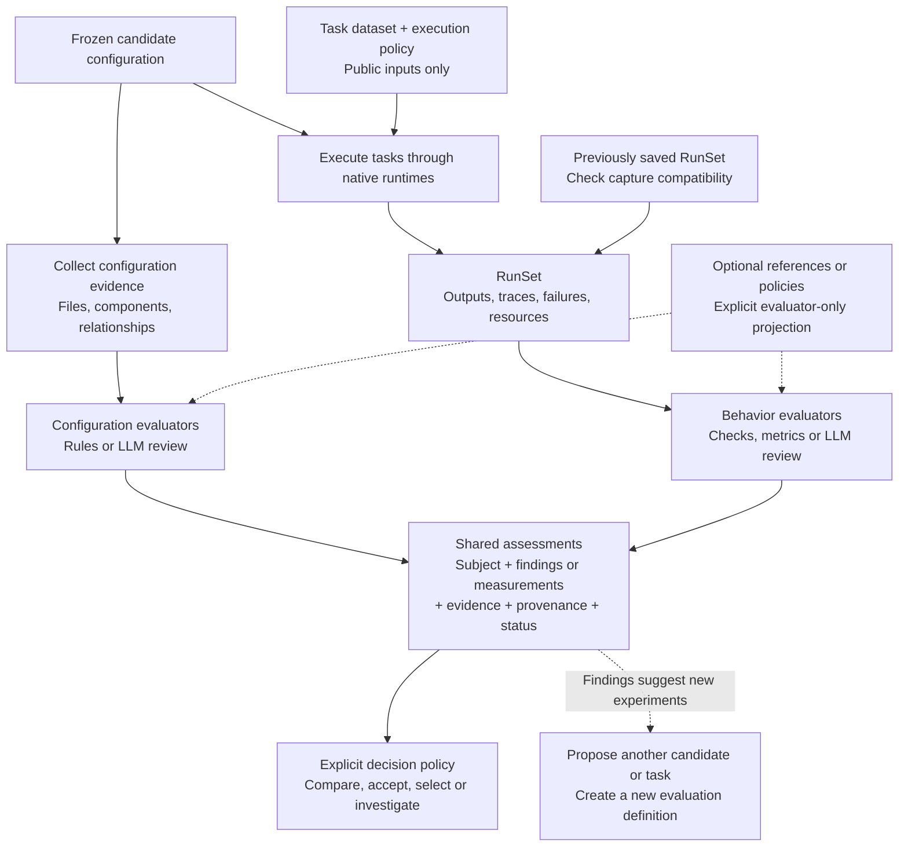

# Agent Eval Flow: unified evaluation vision

**Design update — 9 September 2026:** configuration inspection and behavioral
evaluation are peer branches of one assessment flow. This is the accepted
direction for the next extension; the implemented v0.4 library currently
provides the behavioral branch. The [unified assessment design](UNIFIED_ASSESSMENT_FLOW.md)
defines the shared concepts, evidence semantics and migration boundary.

## The unified flow



Configuration checks and task execution can proceed in parallel against the
same frozen candidate. A policy can explicitly make an inspection gate a
prerequisite for execution; inspection is not inherently a mandatory preflight.
The target design also supports either branch alone. Saved compatible runs
can be evaluated without executing an agent.

The common abstraction is **subject + evidence + versioned evaluator + optional
references → assessment → decision policy**. A subject can be a candidate,
component, run or declared study population. Findings need not become numerical
scores. An observed file reference, an inferred risk and an observed runtime
action remain different claims, even when they appear in one report.

Reference-based and reference-free checks can inspect either configuration or
execution evidence. Reference-free does not mean criteria-free: a rule or judge
still applies declared expectations. Private task answers stay in explicitly
projected evaluator inputs. Candidate findings and shared evaluator costs are
counted once, even when linked to many task runs.

For example, an inspection can flag overlapping skill descriptions; a task
trace can show which skill was selected; an outcome check can establish whether
the delivered answer met the task requirements. Together they suggest a new
experiment, rather than establish that the description caused the failure.
See the [full flow and implementation boundary](UNIFIED_ASSESSMENT_FLOW.md).

## Behavioral examples and earlier diagrams

**OpenSRE and OpenKritt are separate studies.** Each compares versions of its
own agent. They share evaluation infrastructure, while their tasks, answer
keys, scoring rules and reports stay specific to their work.

The four-page gallery below illustrates the behavioral branch and its scoring
examples; it does not yet depict the unified flow above. Open the
[four-page editable draw.io design](diagrams/AGENT_EVAL_FLOW_VISION.drawio)
in draw.io with **File → Open From → Device**, or use the
[browser gallery](diagrams/vision.html) and its **Open all 4 editable pages** button.
The gallery also works as a local HTML file. All examples and results are
invented to explain the design; no agent benchmarks have been run.

| Page | What it answers |
| --- | --- |
| [1. Pipeline](diagrams/01-pipeline.png) | What goes from each backend into the shared evaluation engine? |
| [2. OpenSRE](diagrams/02-opensre.png) | What task did we give it, what did it return, and why did it score 35 or 100? |
| [3. OpenKritt](diagrams/03-openkritt.png) | Which bugs were found, missed or falsely reported, and why did that score 40 or 100? |
| [4. Objectives](diagrams/04-objectives.png) | How can identical evaluation results produce different choices for money, latency and accuracy? |

## How the behavioral branch works

Choose the agent configurations to compare. Give them the same tasks under
declared conditions. An adapter collects outputs and available execution
evidence. The engine checks that evidence against the task requirements and
keeps the reason for every score. The report connects improvements and failures
back to the configurations being tested.

For OpenSRE, we compare a baseline with diagnostic guidance added. For
OpenKritt, we compare a baseline with a review skill added. A report should say
which tasks improved or regressed, then let us inspect the responsible
finding, claim or recorded step. It should also report resource use.

We choose the rubric and minimum requirements before the experiment. The engine
applies them; the agent does not grade itself. After measuring, we can select
the cheapest acceptable candidate, the fastest, or the most accurate. That
changes our preference, while the measured results stay the same.

## What a result actually contains

These are **proposed adapter records**, not promises about either native export.
The IDs, file locations and values below are fictional.

| Record | Example |
| --- | --- |
| SRE attempt identity | `task=SRE-006; candidate=A; attempt=1` plus pinned model, prompt, tools and backend version |
| Agent claim | `cause=cpu_saturation; resource=db-replica-1; remedy=scale_cpu` |
| Independent observation | Replica apply worker blocked; lag 120 s; unrelated workload explains CPU 92% |
| Check evidence | `cause: 0/50; resource: 15/15; facts: 20/20; remedy: 0/15`, each linked to the report claim and fixture fact |
| Final result | `quality=35; accepted=false; completed=true; elapsed=70 s; cost=$0.18; infrastructure_writes=0` |
| Kritt finding | `snapshot=V; finding=F1; file_path=api/orders.py; line=41; summary=missing ownership check` |
| Kritt check evidence | F1 matches hidden B1; independent test reads another user's order on V, while P returns 403 |
| Kritt missing evidence | Hidden B2 at fictional `api/files.py:88` has no matching final finding; independent test confirms the bug exists on V |
| Kritt false alarm | F2 claims B1 on P; independent check shows that the fixed code rejects the request |

A score is the sum of its declared check contributions. The two 100-point
rubrics express different requirements and have no shared cross-project meaning.
For Kritt, each known bug earns credit once; new claims need adjudication.
The patched snapshots are controls for these declared bugs, not proof that
the application has no other vulnerabilities.

## Same checks, different priorities

Page 4 measures 20 incidents with three fresh attempts each. Candidates B, C
and D pass the same minimum requirements; A fails the accuracy floor.

| Your objective | Selection from those saved results |
| --- | --- |
| Minimize money | B: $0.24 per attempt, 90% accepted |
| Minimize latency | D: 65 s p95, 95% accepted |
| Maximize accuracy | C: 98.3% accepted, $0.65 per attempt |

Here, “accuracy” means the fraction of attempts accepted by this task rubric.
The p95 duration means roughly 95% of attempt durations are at or below that
value. Costs and durations include failed attempts and internal retries;
missing resource records block resource-based selection. Run cost includes
declared model, tool and compute charges. Evaluation cost and human review
are separate fields unless an objective explicitly includes them.

Mixed priorities can use a weighted preference score after the minimum
requirements pass. For example, with fixed $1 and 120 s reference limits:

```text
Q = acceptance percentage
C = 100 × clip(1 − mean_attempt_cost / $1, 0, 1)
T = 100 × clip(1 − p95_duration / 120 s, 0, 1)
preference = w_quality × Q + w_cost × C + w_time × T
```

Weights are nonnegative and sum to one. These reference limits and weights
are choices, not scientific constants. Changing them re-ranks saved results.
Changing a rubric creates a new scoring version; changing an agent creates a
new candidate that must be run. Add an alternative harness runtime as another
candidate with its exact version and effective settings recorded.

B−A estimates the guidance change on this sample. C−B tests a model change;
D−B tests a flow change. C−D changes two things and does not isolate either.
Inspect uncertainty across incidents and confirm on held-out incidents before
claiming a general improvement. Kritt follows the same procedure with its own
repository families, quality measures and resource limits.

## Native integration boundaries

OpenSRE exposes a headless JSON envelope with `status`, `response`,
`denied_tools` and `error`. Structured diagnosis and tool evidence require
additional collection at the pipeline or Python API boundary. Its own
confidence or validity value is evidence about its behavior, not our answer
key. See the [headless CLI](https://www.opensre.com/docs/headless-cli),
[Python API](https://github.com/Tracer-Cloud/opensre/blob/main/docs/python-api.mdx)
and [synthetic incident suite](https://github.com/Tracer-Cloud/opensre/tree/main/tests/synthetic/rds_postgres).

OpenKritt exports findings as ZIP and exposes scan progress and failures.
Its finding schema includes locations and reproduction claims; separate step
records hold additional lineage, timing and usage. The ZIP alone is not a
complete run bundle. See [headless export](https://github.com/Kritt-ai/open-kritt/blob/main/docs-site/getting-started/headless-cli.mdx),
[finding fields](https://github.com/Kritt-ai/open-kritt/blob/main/docs-site/workflows/steps.mdx)
and [database schema](https://github.com/Kritt-ai/open-kritt/blob/main/backend/prisma/schema.prisma).
Fresh scans are required for independent attempts; its
[`repeat_runs`](https://github.com/Kritt-ai/open-kritt/blob/main/docs-site/workflows/depth-and-siblings.mdx)
feature extends a search using previous outputs.

The behavioral branch remains: task packs and candidate versions → backend
adapters → versioned checks with evidence → saved result tables → comparisons
and objective selection. The unified design adds configuration assessment as a
peer branch while preserving those execution and evidence contracts. The
gallery's numerical examples remain illustrative; see the
[implementation checkpoint](IMPLEMENTATION.md) for actual supported behavior.

The [generator](diagrams/build_vision.py) creates editable XML plus SVG/PNG
previews. It follows the [draw.io XML format](https://www.drawio.com/docs/reference/diagram-generation/).
The generated files were checked for valid IDs, connector references, score
arithmetic and text bounds; previews were visually inspected.
