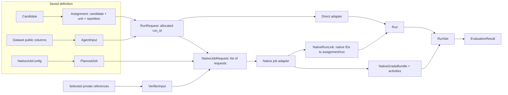

# Agent Eval Flow: configuration, inputs and outputs

**Contract revision 0.4 — specified 8 September 2026; implemented in the initial
library.** See the [implementation checkpoint](IMPLEMENTATION.md) for supported
behavior and integration limits. The original proposal wording below records
this revision's design.

**Next design direction — 9 September 2026:** the
[unified assessment flow](UNIFIED_ASSESSMENT_FLOW.md) adds peer configuration
and behavioral assessments. It does not change the v0.4 constructors or saved
schema on this page. Candidate-scoped findings, configuration-only evaluation
and shared assessment activities require an explicit future contract revision;
they must not be represented as fabricated task runs.

This is the authoritative configuration and data-boundary revision following
the agreed [integration direction](INTEGRATION_DECISION.md). The
[typed proposal](contracts/agent_eval_flow.pyi) lists every constructor and
method. The [six-object model](LIBRARY_OBJECT_MODEL.md) explains their goals
and existing evaluation semantics. This revision supersedes conflicting older
field definitions. The specification alone does not establish compatibility
with an upstream integration.

## The design in under 200 words

The user saves a **Study**: tasks, complete agent configurations, execution
conditions and evaluation definitions. An **EvaluationPipeline** connects that
definition to live adapters and provides `eval()`.

An adapter receives either one public task request or a complete native job.
It returns agent outputs, execution records, artifacts and any native grades.
We join these records by explicit IDs and preserve missing work. We do not
require Harbor or another harness to use our internal per-task scheduler.

Evaluators consume those captured records. A check can use a normal callback,
a batch grader, or a retained native grade. Each produces the same measurement
shape: value, status, explanation and evidence. Grading expenses belong to a
grading activity, so one batch charge is counted once.

The **EvaluationResult** connects measurements and scores back to tasks, agent
configurations and source evidence. Changing an optimization policy uses the
same result. Changing checks can grade the saved runs. Changing an agent
configuration requires new runs.

Our consistency rules concern types, identities, configuration ownership and
recorded facts. Users still define what successful agent behavior means.

## 1. What the user configures, and what the library produces

| Main object | User-supplied data | Produced data / main methods |
| --- | --- | --- |
| `EvalDataset` | `id: str`, root `units: DataTable`, `unit_key: tuple[str, ...]`, public `input_columns`, related `records`, private `references` | `agent_input(unit) -> AgentInput`; `validate`, `select`, `fingerprint`, `save/load` |
| `Candidate` | `id`, adapter `backend: VersionRef`, named `components`, `settings`, optional `native: NativeConfig` | `derive(...) -> Candidate`, `diff(...) -> tuple[ConfigChange, ...]`, `validate`, `fingerprint` |
| `EvalSuite` | Versioned `metrics`, `summaries`, optional `rubric` and `acceptance`, `evaluation_cost_scope` | `evaluate(dataset=..., runs=..., ...) -> EvaluationResult`; `validate`, `fingerprint` |
| `Study` | `id`, `project_id`, `question`, dataset, candidates, suite, execution policy, optional contrasts/environment | `plan() -> RunPlan`; `run(...) -> RunSet`; `evaluate(...) -> EvaluationResult`; `validate`, `fingerprint`, `save/load` |
| `RunSet` | Usually returned by execution or import | Plan, one run per assignment, native jobs/grades, mapping reports; `get`, `for_candidate`, `coverage`, `rows`, `save/load`, `import_from` |
| `EvaluationResult` | Returned by evaluation | Runs, suite, measurements, scores, summaries, grading activities/resources; `summary`, `explain`, `compare`, `select`, `report`, `save/load` |

`Study`, `EvalDataset`, `RunSet` and `EvaluationResult` are saveable roots.
Candidates and suites are saved within those roots. Runtime implementations
are bound separately:

```python
# Proposed API. Mapping keys are adapter/evaluator/reducer VersionRef.name values.
pipeline = EvaluationPipeline(
    study=study,
    backends=direct_adapters,          # Mapping[str, BackendAdapter], optional
    job_backends=native_job_adapters,  # Mapping[str, NativeJobAdapter], optional
    evaluators=single_checks,          # Mapping[str, MetricEvaluator], {} is valid
    batch_evaluators=batch_checks,     # Mapping[str, BatchMetricEvaluator], optional
    reducers=custom_reducers,          # Mapping[str, SummaryReducer], optional
)
result = pipeline.eval()
rescored = pipeline.eval(runs=saved_runs)
# In an existing async event loop:
result = await pipeline.aeval()
```

Construction binds implementations but starts no work. Registry names and
implementation revisions must match their saved references before dispatch.
Clients, credentials, connections, worker endpoints and callables are runtime
objects, never serialized in `Study`. Endpoint-dependent behavior that affects
the candidate is declared separately as a component or setting. Calling sync
`eval()` inside a running event loop raises `ConfigurationError` and directs
the caller to `aeval()`; it does not secretly create a second event loop thread.

### Configuration ownership

| Record | Required fields | Optional fields / defaults | Owns |
| --- | --- | --- | --- |
| `NativeConfig` | `schema_ref: VersionRef` with a non-null revision | `values: Record = {}` | Versioned integration dialect; native options remain JSON, not a universal agent schema |
| `Candidate` | `id: str`, `backend: VersionRef`, `components: Mapping[str, ComponentSpec]` | `settings = {}`, `description = ""`, `native = None` | Behavior under comparison: model, skill, tools, flow, harness, memory and native candidate options |
| `ExecutionPolicy` | `budget: Budget` | `repetitions = 1`, `max_concurrency = 1`, `order_seed = 0`, `infrastructure_retries = 0`, `cost_scope = ("model",)`, `native_jobs = ()` | Assignment counts, conditions, limits and job grouping |
| `Budget` | `wall_time_s: float` | `max_tokens: int \| None = None`, `max_cost_usd: Decimal \| None = None` | Limits for one complete agent assignment, including its retries and child work |
| `NativeJobConfig` | `id: str`, `backend: VersionRef`, `candidate_ids: tuple[str, ...]` | `native: NativeConfig \| None = None`, `verifiers: tuple[VerifierSpec, ...] = ()` | One native job group, possibly containing both arms of a paired skill study |
| `VerifierSpec` | `id: str`, `implementation: VersionRef` | `reference_columns = {}`, `params = {}`, `native = None`, `budget = None` | Native grading before environment teardown; separate from agent behavior and agent budget |
| `MetricSpec` | `id: str`, `source: MetricSource`, `output_type`, `role` | `params = {}`, `depends_on = ()`, `unit = None` | How a named measurement is obtained |

Native configuration is validated by its integration dialect. Unknown native
fields are either accepted and passed through by that dialect, or rejected
explicitly; they are never silently dropped. Unsupported formats can still be
retained as raw artifacts. Native options cannot silently override declared
repetitions, candidate behavior or limits. Conflicts fail the applicable
configuration check before that adapter's launch. Declared
settings and observed effective settings remain distinct records. The core
preflight validates common fields, references, ownership and capabilities
globally. The existing adapter protocol has no universal native-dialect
validation hook, so arbitrary native options are checked by their integration
before its own launch; this does not promise that every later job's native
options were inspected before any earlier job ran.

`Candidate.backend` always names the integration adapter. A job-owned
candidate's backend must equal its covering `NativeJobConfig.backend`, including
revision, and resolves in `job_backends`. It needs no entry in `backends`.
The underlying agent CLI, model and harness belong in components/native options.
Candidates not covered by a job resolve in `backends`.

Job IDs are unique in the policy. Each job has nonempty, distinct existing
candidate IDs; a candidate belongs to at most one job. Its `PlannedJob`
contains exactly all assignments for those candidates. In revision 0.4 job
groups dispatch sequentially, with direct assignments as another group;
`max_concurrency` bounds assignments inside the active group. The native
adapter owns scheduling/retries within its job and must satisfy the declared
counts and limits. There is no second library retry loop around native trials.
Unsupported live conditions fail preflight; importing observations does not
claim those conditions were enforced.

A verifier's optional budget applies to its grading invocation, independently
of agent budgets. `None` means no library-requested verifier limit, not zero
cost or unlimited service capacity. The actual grader expenses are captured.
The same verifier ID may recur in different jobs only with identical complete
`VerifierSpec` values, so its grade channel has one definition within a study.

## 2. Data sent to an adapter



| Boundary object | Fields and types | Consistency rule |
| --- | --- | --- |
| `AgentInput` | `unit: Key`, `tables: Mapping[str, tuple[Record, ...]]` | Only this unit's explicitly selected public columns; no private reference tables |
| `Assignment` | `id`, `candidate_id`, `candidate_fingerprint`, `unit: Key`, `repetition: int` | One declared candidate/unit/repetition, with repetition indices starting at zero |
| `RunRequest` | `run_id`, `assignment`, `candidate`, `input`, `policy`, `environment` | ID allocated before dispatch; assignment, candidate and input identify the same work |
| `PlannedJob` | `id`, `config: NativeJobConfig`, `assignment_ids: tuple[str, ...]` | Stable plan identity; copied config equals its policy entry |
| `NativeJobRequest` | `job_id`, `run_set_id`, `planned_job_id`, `config`, `requests: tuple[RunRequest, ...]`, `verifier_inputs: tuple[VerifierInput, ...] = ()` | One complete job invocation, with exactly the planned assignments and unique allocated run IDs |
| `VerifierInput` | `run_id`, `verifier_id`, `references: Mapping[str, tuple[Record, ...]]` | Separate private channel; one projection per requested run/verifier pair |

`Key = Mapping[str, str | int]`. `{"task_id": "1"}` differs from
`{"task_id": 1}`. Boolean keys are rejected even though Python treats `bool`
as a subclass of `int`. Every related/private table carries the root key;
its declared row key is unique. `input_columns` names public tables only.
Public root identity is also available through `AgentInput.unit`, so public
table columns are not silently expanded.

`VerifierSpec.reference_columns` names private tables and columns. Projection
filters rows to the run's unit and retains each selected table's key columns
automatically for joins. It exposes no other columns. The trusted job adapter
receives the private projection through `VerifierInput` and routes it only to
the verifier. A boolean capability declaration is not isolation: the adapter
must also isolate private files from the agent's actual environment. A native
backend without a separate verifier channel cannot receive these inputs.

Assignment IDs are stable for the same execution definition, candidate, typed
unit key and repetition. Fresh execution allocates new run-set, job and run
IDs. Saved captures preserve IDs. Native IDs are scoped by their enclosing job
and retained as `native_refs`; array positions never establish identity.

## 3. What execution and import return

| Output | Main fields | Meaning |
| --- | --- | --- |
| `Run` | `id`, `assignment_id`, `status`, `cost_scope`, `output`, **`output_state`**, `executions`, `events`, `artifacts`, environment/inventory observations, timestamps; optional `job_id` | One assignment's captured agent work; native job ownership is explicit |
| `NativeRunLink` | `run_id`, `assignment_id`, `native_refs: Mapping[str, str]` | Verified mapping from our identities to native trial/thread/task identities |
| `NativeJobRecord` | `id`, `planned_job_id`, `backend`, complete planned `assignment_ids`, status/timestamps; optional links, native refs, artifacts, effective config, error | Job-level capture, including export/dispatch failure and configuration evidence |
| `NativeJobOutput` | `job`, `runs`, required `grading_inventory_complete: Observation[bool]`, `native_grades = ()`, `projections = ()` | One native invocation's export; can be incomplete |
| `ImportedCapture` | `runs`, required `grading_inventory_complete: Observation[bool]`, `native_jobs = ()`, `native_grades = ()`, `projections = ()` | The same preserved information from a file importer, without dispatch |
| `ProjectionReport` | `mapper: VersionRef`, `source_format: VersionRef`, `sources: tuple[ArtifactRef, ...]`, `omitted_fields = ()`, `issues = ()` | How native evidence was mapped; fields outside the common view remain in raw sources |

`BackendAdapter.run(request, recorder=...) -> Run` remains the simple synchronous
callback. `NativeJobAdapter.run_job(request, recorder=...) -> NativeJobOutput`
is async and receives the whole job. `RunImporter.read(source, plan=...)`
returns `ImportedCapture`, replacing the old iterable-of-runs interface.

For a fresh native job, returned runs use the allocated IDs; their `job_id`
matches the enclosing job. Each native link agrees with its run and assignment.
The job's assignment list remains the complete planned list even if only some
trials were exported. A reconciled `RunSet` has exactly one run per assignment.
Missing exports become `unobserved` placeholders, retaining allocated run/job
IDs. Proven unstarted work can be `not_run`; a job error alone does not prove
which native trials started. External imports lacking an allocated ID get a
new placeholder ID once, then preserve it on save/load. No native ID is invented.

Unknown assignments, contradictory links and duplicate final runs produce
`CaptureValidationError`. The mapping report/raw artifacts retain the source
of the problem. A partial export is valid when its omissions are explicit.
Recorder calls are progress snapshots keyed by identity; a final return
reconciles with those snapshots. Repeated receipts do not create additional
runs, executions or charges. Conflicting terminal snapshots are invalid.

These joins also apply to imported and loaded captures: job IDs are unique;
every non-null `Run.job_id` resolves to a job owning that assignment; each link
resolves to the same run/assignment; every activity run ID resolves in the
capture. Importing may preserve missing native identities, but cannot bypass
the common identity checks.

### Output, status and missing values are separate

| Field/value | Meaning |
| --- | --- |
| `output_state="available"` | Captured delivered output; `output=None` can be a valid JSON `null` |
| `output_state="unavailable"`, `output=None` | Evidence establishes that no delivered output exists |
| `output_state="unknown"`, `output=None` | Capture does not establish whether an output exists |
| `status="completed"` | Execution state only; it does not assert task correctness or complete output capture |
| `Observation(value=None, status="unknown", reason=...)` | An unknown fact, never silently zero |

Every observed/estimated `Observation[T]` requires a non-null value of type T,
including non-resource observations. A valid delivered JSON null is represented
by `Run.output` and `output_state`, not an observed-null resource or score.
Unknown observations require `None` and a reason. Resource quantities are
finite and nonnegative; `Decimal` represents USD. Execution timestamps are
timezone-aware UTC, or `None` when unknown. End time cannot precede start time.
Parent execution IDs are run-local, acyclic, and refer to existing executions;
event execution IDs and output-source IDs must also resolve within the run.

`Coverage` partitions assignments: `completed` is completed status; `failed`
is agent error, timeout, infrastructure error or cancellation; `pending` is
running, awaiting input or paused; `unavailable` is not-run or unobserved.
`planned = completed + failed + pending + unavailable`.
`resource_unknown` overlaps those buckets; it is not a fifth partition.

## 4. How evaluation consumes these records

Every `MetricSpec` has exactly one discriminated source:

| Source | Parameters | Action |
| --- | --- | --- |
| `EvaluatorSource` | `ref: VersionRef`, `mode: "single" \| "batch" = "single"`, `kind="evaluator"` | Call the matching registered single or batch evaluator |
| `NativeGradeSource` | `channel: str`, `native_metric: str`, optional `evaluator: VersionRef`, optional `activity_id: str`, `kind="native_grade"` | Select retained grades; start no evaluator or agent |

`MetricSpec.output_type` is `bool`, `int`, `float`, `decimal` or `text`;
`role` is `quality`, `resource` or `diagnostic`. Values are checked against
the declared type without coercing `True` into `1` or a decimal into text.
Native-grade sources require empty `params` and `depends_on`: source selection
cannot pretend to reconfigure historical grading. Transformations use a
separate computed metric with declared dependencies. Existing reserved `run.*`
primitive measurements remain built-in and cannot be redefined by a MetricSpec.

`EvaluationContext` contains the unit, public input, that unit's private
references, only the run's declared dependency measurements, optional owning
`native_job`, and the suite's `evaluation_cost_scope`. It does not expose an
agent runtime or invoke one implicitly.

| Evaluation boundary | Input | Output |
| --- | --- | --- |
| Single callback | `MetricSpec`, `EvaluationContext`, `Run` | `MetricOutput(task: Measurement, details=(), evaluation_resources: Resources)` |
| Batch callback | `BatchMetricRequest(id, config_fingerprint, metric, items: tuple[EvaluationItem, ...])` | `BatchMetricOutput(measurements: tuple[Measurement, ...], activity: EvaluationActivity)` |
| Retained native grades | `NativeGradeBundle(id, channel, projection, grades, activities)` | Selected grades mapped to the named metric's measurements |

A batch request concerns **one metric across the requested runs**, with one
item per run. The engine supplies dependencies before dispatch, including on
failed or missing runs. Empty batches are not invoked. Results join by IDs,
regardless of order. Missing task rows become explicit missing measurements;
callback exceptions produce error measurements. Wrong run/metric IDs,
duplicate task rows or wrong value types are validation failures, not scores.

`Measurement` has `run_id`, `metric`, `value: MetricValue | None`,
`status: "ok" | "missing" | "error" | "not_applicable"`,
`basis: "observed" | "estimated" | None`, `reason: str`, `evidence = ()`,
`key: Key | None = None`, `activity_ids: tuple[str, ...] = ()`.
There is exactly one task measurement per `(run_id, metric)` with `key=None`;
detail keys are unique within that pair. Non-ok measurements have null value
and basis, with an explanation. Detail rows supplement the task row; they do
not silently become more independent tasks.
An ok measurement requires a non-null value of the declared output type and
an observed/estimated basis. Native grades obey the same positive/non-ok
value and basis rules; their selected value must match the metric's type.

`NativeGrade` has the same value/status/basis/reason/evidence/key fields, plus
`id`, `run_id`, `native_metric`, and a single `activity_id`. Grade IDs are unique
within the capture. Its activity must exist and include that run. For each
channel/run/native-metric/activity there is at most one task grade; associated
detail grades have unique keys and require that task grade.

Selection first filters by channel/native metric and optional evaluator or
activity. Zero task matches yields `missing`; multiple task matches yield
`error` with their IDs, never an arbitrary first/last grade. Detail rows follow
the selected task grade's activity. Native zero values accompanied by a native
error remain error records rather than successful zero-valued grades. Raw
native output and mapping issues remain inspectable.

## 5. Grading activities and resource consistency

`EvaluationActivity` records one actual grading invocation:

| Field | Type / default | Rule |
| --- | --- | --- |
| `id` | Required `str` | Unique captured grading invocation, distinct from metric ID |
| `evaluator` | Required `VersionRef` | The implementation that performed this grading |
| `config_fingerprint` | Required `str \| None` | Non-null for fresh library-requested grading; imported unknown can be `None` |
| `run_ids` | Required `tuple[str, ...]` | Distinct runs in this activity's scope |
| `status` | Required `"completed" \| "partial" \| "error"` | Invocation state, independent of individual grade success |
| `phase` | Required `"native_verifier" \| "post_run"` | When grading happened; imports preserve it |
| `resources` | Required `Resources` | Grader-only quantities, recorded once |
| `started_at`, `ended_at` | `datetime \| None = None` | Unknown timestamps stay unknown |
| `native_refs`, `artifacts`, `error` | Empty mappings; error defaults `None` | Original invocation identity and evidence |

For a single callback, the engine allocates an activity and converts the
existing `MetricOutput.evaluation_resources` into that activity's resources.
It stamps the task/detail measurements with the activity ID. The callback's
resource field describes only that invocation, not prior dependency costs.
Dependencies' activity references can also be retained as provenance, without
duplicating charges.

For a batch, the returned activity ID equals `BatchMetricRequest.id`, its
configuration fingerprint equals the request's fingerprint, its evaluator
equals the source reference, its run IDs equal the requested set, and its phase
is `post_run`. Every returned measurement references it. A failed dispatch
still creates an error activity; absent usage is unknown, not free.

Result accounting is explicit:

1. Let **N** be all activities retained in `RunSet.native_grades`, including
   unused native grades and failed grading attempts without output rows.
2. Let **F** be all grading activities newly attempted during this evaluation
   invocation. For a fresh pipeline call, this includes native verifiers run
   during execution. For grading a saved capture, historical verifiers are not F.
3. `EvaluationResult.activities = unique(N union F)`;
   `performed_activity_ids` identifies F. Repeated identical activity records
   deduplicate by ID; conflicting records under one ID fail validation.
4. `evaluation_resources` aggregates the unique activities. The method
   `incremental_evaluation_resources()` aggregates only performed IDs. Loading
   a saved result preserves its original performed IDs; loading is not grading.

Every measurement's activity IDs are distinct, resolve in the result and include
that measurement's run in their scope. Performed IDs form a distinct subset of
result activity IDs. These checks also run on load.

**An empty export does not establish zero grading work.** A native job or
import explicitly supplies `grading_inventory_complete: Observation[bool]`.
The reconciled `RunSet` retains this field, combining native job inventories.
Observed true means all grading attempts in this capture's declared scope are
represented, including failed attempts. Observed false means known omissions;
unknown means completeness was not established. Direct-only execution, whose
adapter has no separate grading channel, establishes an empty complete grading
inventory. Agent-internal reviewer calls remain agent execution resources.
After an interrupted native job, missing inventory evidence remains unknown.

`EvaluationResult.performed_grading_inventory_complete: Observation[bool]`
records completeness of newly attempted grading. Fresh native execution needs
its inventory evidence; saved-run grading does not inherit historical
incompleteness into its newly performed set. The engine records each requested
single/batch callback, including dispatch errors. Unknown/false completeness
makes the corresponding aggregate resources unknown, with the known activity
records still available. It never invents an actual grading invocation to fill
the gap. All-grading totals require both retained and performed inventories
to be observed complete; incremental totals require only the performed one.

Both aggregates use `EvalSuite.evaluation_cost_scope`, default `("model",)`.
An empty, observed-complete performed set has observed zero incremental resources. A nonempty
set with unknown usage remains unknown for the affected quantity; known values
of other quantities remain usable. Expenses cannot be relabelled across cost
scopes: if an activity cannot supply the requested scope, that cost is unknown
and the original scoped record is retained.

Agent resources stay on `Execution` records and aggregate through `Run`;
grader resources stay on activities. Shared batch expenses are not arbitrarily
divided among candidates. Job overhead or a native total combining agent and
grader expenses remains in job artifacts when it cannot be separated. Custom
metrics may interpret that evidence explicitly. A regrading export that repeats
historical agent usage does not create new agent executions or charges.

### Concrete structural example

These are fixture values, not measurements of a real agent:

| Captured record | Value | Link |
| --- | --- | --- |
| `run-A` agent model cost | $0.40 | Assignment: candidate A, task `INC-1`, repetition 0 |
| `run-B` agent model cost | $0.60 | Assignment: candidate B, same task and repetition |
| Native activity `verify-7` | $0.03 once | `run_ids=("run-A", "run-B")` |
| Native grade for A | `True`, `ok`, explanation + artifact locator | `activity_id="verify-7"` |
| Native grade for B | `None`, `error`, grader error explanation | Same activity, without a second charge |

A saved-run suite using `NativeGradeSource(channel="incident-check",
native_metric="accepted")` obtains those two measurements. Agent spending
remains $1.00; retained grading spending is $0.03; incremental grading spending
is $0.00. Adding one fresh batch check costing $0.02 changes grading totals to
$0.05 retained-plus-fresh and $0.02 incremental. It does not rerun either agent.
The user decides how the error affects summaries and selection.

OpenSRE and OpenKritt use these same shapes in separate studies. An OpenSRE
run can link incident output and a native CLI trace. An OpenKritt run can retain
both snapshot scans as executions under one task and link findings/scan IDs.
The data model does not flatten these native executions into unrelated tasks.

## 6. Serialization, validation and defaults

Records use Pydantic validation/serialization machinery, with Pydantic
dataclasses proposed for compatibility with ordinary dataclass construction
and `dataclasses.replace`. Frozen objects also need copied, immutable nested
data. Callers cannot mutate a saved definition through a retained dictionary.
Generic `Observation[T]` values are validated through a typed `TypeAdapter` or
their typed owning record with instance revalidation; the generic dataclass
constructor alone is insufficient. These are uses of the existing library,
not a new schema framework. See [Pydantic's dataclass documentation](https://docs.pydantic.dev/latest/concepts/dataclasses/).

Structural validation uses strict scalar types and rejects unknown outer
fields. The explicit JSON containers (`Record`, native configuration, event
fields and agent output) preserve their own user-defined keys. JSON arrays
exclude strings/bytes as sequences; JSON objects require string keys; floats
must be finite. `None` is allowed inside ordinary JSON even when a resource
observation would prohibit it. Missing required fields are not implicit nulls.

Saveable roots use this versioned envelope in a bundle's `manifest.json`:

```json
{
  "format": "agent-eval-flow",
  "schema_version": "0.4",
  "kind": "run_set",
  "data": {}
}
```

`data` above is schematic: a real manifest contains the complete validated
root. `kind` is `study`, `dataset`, `run_set` or `evaluation_result`. Nested
RunSet/Result `schema_version` fields must equal the envelope version. Artifact
references retain URI/media type/optional SHA-256; saving metadata does not
promise that external artifact bytes have been copied or remain reachable.
Unknown schema versions fail explicitly; loading does not guess migrations.

Wire conventions preserve Python-level types:

- Known Decimal fields such as `Resources.cost_usd.value` encode as decimal
  strings. Union `MetricValue` fields encode as tagged values, for example
  `{"type":"decimal","value":"0.20"}` or `{"type":"bool","value":true}`.
  The other tags are `int`, `float` and `text`. A missing value is JSON null.
- Only typed schema locations interpret these tags. Agent output and other
  arbitrary JSON remain unchanged, even if they contain similar-looking keys.
- UTC timestamps encode in ISO 8601 with `Z`. Typed key values retain string
  versus integer identity. Mapping-key order is insignificant; array order is
  preserved. IDs and references are nonempty strings.
- Definition fingerprints use a versioned, type-aware canonical encoding of
  validated semantic fields, not pretty-printed JSON. Mapping keys sort;
  array order remains; decimal numeric equivalents normalize. Candidate
  labels/descriptions are excluded from its behavior fingerprint. Credentials
  and runtime bindings are excluded because they are not saved fields.
  An artifact's URI and optional hash remain declared fields; a missing hash
  does not establish immutable content. Fingerprints do not assert determinism.

The complete schema-specific fingerprint field lists and algorithms are in the
[objects LLD](lld/objects/README.md#fingerprints-and-planning-identities). Revision 0.4
requires stable same-definition identities, suite-independent saved-run
compatibility, and no implicit coercion. The LLD explicitly specifies the
canonical encoding and SHA-256 domain separation.

Defaults shown in the typed proposal as `...` mean the documented value, not
an actual Ellipsis at runtime: optional collections are empty, optional text
descriptions are `""`, optional nullable fields are `None`, schema version is
`"0.4"`. Special scalar defaults remain: execution values in section 1;
`EvaluatorSource.mode="single"`; discriminators match their type;
`Execution.role="main"`; `ObjectiveTerm.weight=1.0`;
`SelectionPolicy.mode="lexicographic"`, `allow_estimates=False`.
`Candidate.derive(native=...)` is a special omission sentinel: omit to preserve,
pass `None` to clear. Component updates replace whole named components and
`None` removes one; settings update top-level keys. `ConfigChange.op` is
`add`, `remove` or `replace`, so adding a null value differs from removing it.

## 7. Change list and evidence before implementation

| Earlier proposal | Revision 0.4 |
| --- | --- |
| Only per-assignment backend calls | Keep them; add whole-job request/output and explicit job/run links |
| One flattened configuration namespace | Candidate behavior, saved job/verifier options and runtime bindings have separate owners |
| `Run.output=None` ambiguous | Required `output_state` distinguishes valid null, absent output and unknown capture |
| `RunImporter.read -> Iterable[Run]` | `ImportedCapture` also preserves native jobs, grades and mapping provenance |
| `MetricSpec.implementation` | `MetricSpec.source`: single/batch evaluator or retained native grade |
| Callback resources summed per returned row | Activity records own grading usage and expose retained versus incremental totals |
| Empty native grade export could look free | Explicit grading-inventory observations distinguish a complete empty export from missing capture |
| Missing coverage bucket for active states | Explicit `Coverage.pending` partition |
| Before/after alone for config differences | `ConfigChange.op` makes null-valued additions/removals unambiguous |

The [contract E2Es](../tests/e2e/test_data_contract.py) specify whole-job
partial export reconciliation, shuffled batch outputs and shared charge
accounting, strict task key types, and retained native-grade round trips.
The earlier [toy tests](../tests/e2e/test_toy_pipeline.py) still specify the
simple callbacks and usable result lifecycle. These are future acceptance
tests; they do not substitute a fake implementation to claim the API works.
Serialization and cross-record validation will need focused tests when those
modules exist. Actual Harbor/NAT/SkillEvaluator compatibility still needs
integration fixtures against supported versions.
