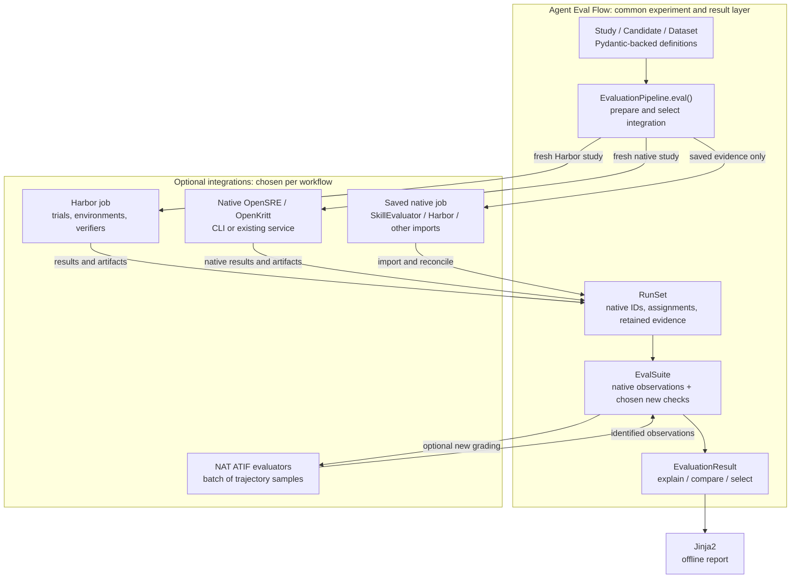

# Agent Eval Flow: which libraries should do which work?

**8 September 2026 — researched recommendation for discussion.** The HLD and LLD
describe the experience we want, not a requirement to implement every box
ourselves. No dependencies, production code, live agents or GCP resources were
installed, run or changed for this review.

**Follow-through:** the user accepted this direction. The
[revision-0.4 data contract](DATA_CONTRACT.md) now defines its configuration,
requests, native outputs and grading records. It remains a test-first design;
accepting an integration direction does not establish working compatibility.

## The recommendation in under 200 words

Use **Harbor as our first optional execution integration** for native agent
evaluation jobs. Its responsibilities include trials, environments, native
agent invocation, verification and artifact collection. There is identifiable
downstream use in LangChain's DeepAgents evaluation, beyond repository popularity.

Use **SkillEvaluator for its paired skill-study workflow**, initially through
saved results. Executing it later should use its own pinned environment; it
already uses Harbor. Do not put another trial scheduler around it.

Use **NeMo Agent Toolkit's trajectory-evaluator interface** when we need its
checks. It can grade supplied ATIF samples without adopting its whole workflow
runtime. Keep ordinary user callbacks equally supported.

Use **Pydantic** for records/validation, **AnyIO** for direct process and async
coordination, Python **graphlib** for dependency ordering, and **Jinja2** for
reports. Our code supplies experiment semantics and integration mappings.

OpenSRE and OpenKritt keep their native CLI/API and harness behavior. Harbor is
an execution option, not a compulsory migration for them.

AgentCompass, A²E and NeMo Evaluator remain alternatives or later integrations.
Their relevant release/use evidence does not currently justify making them
mandatory. Adapt our interfaces to whole jobs and batches of grades. Preserve
native configuration and evidence. These choices still require compatibility
tests before being treated as working integrations.

## What we bring in, and what we add

| Bring in | Let it do | Agent Eval Flow adds | First-build position |
| --- | --- | --- | --- |
| **Harbor** | Native trials, environments, agent adapters, retry/lifecycle handling, verifiers and retained artifacts. | Map declared candidates/tasks/repetitions to native jobs and back; preserve absent trials, configuration and evidence links. | First optional native-job integration. Use a tested release profile; no dependency on private scheduler internals. |
| **SkillEvaluator / ACES** | Materialize and run paired skill conditions with its supported tasks and graders. | Import the native study into our common result interface; combine its observations with other declared checks and selection policies. | Result importer first. Optional execution in its own pinned worker environment. |
| **NeMo Agent Toolkit (NAT)** | Grade a sequence of ATIF samples through its evaluator protocol; run NAT workflows when a user already has one. | Map metric IDs, task identities, evidence, raw errors and evaluation resources. | Optional grading integration first; full NAT runtime only for a NAT workflow. |
| **Pydantic v2** | Typed validation, JSON serialization and JSON schemas. | Our field meanings, public/private data projection, cross-record checks, versioning and canonical identities. | Core dependency candidate. The six objects can use Pydantic instead of implementing the dataclass proposal literally. |
| **AnyIO + Python graphlib** | Direct process I/O, async task/cancellation primitives, dependency ordering and cycle detection. | Backend-specific capture/termination checks and metric callback rules. | Direct-execution integration and core graph utility. Never duplicate Harbor's trial scheduling. |
| **Jinja2** | Render stored data into an HTML template. | The report layout and links from results to evidence. | Reporting dependency; no web service required. |
| **Native OpenSRE / OpenKritt** | Their actual agent control flow, providers, tools and native job state. | Thin CLI/API bridges and faithful output import. | The two separate real-world E2E integrations. |

The detailed evidence is in the [Harbor/SkillEvaluator investigation](research/harbor_skillevaluator_integration_evidence.md),
[NAT/NeMo investigation](research/nemo_integration_evidence.md),
[AgentCompass/A²E investigation](research/agentcompass_a2e_integration_evidence.md)
and [foundations/native-fit note](research/foundations_and_native_integration.md).
They distinguish code inspection, downstream reports, test evidence and untested
compatibility. A dependency's existing tests remain valuable; our tests check
that our integration preserves its behavior.

## Why these choices have stronger support

**Harbor has direct evidence of the workflow we care about.** LangChain reports
using it to run DeepAgents harness experiments, create sandboxes and perform
verification. Its later integration guide combines an existing agent with Harbor
and tracing. This is evidence of downstream use for agent evaluation, although
it does not prove every Harbor adapter is equally exercised.
[February use report][lc-use], [June integration][lc-integration]

**SkillEvaluator is useful but has its own deployment boundary.** Its release
history is short, and the inspected source pins Harbor 0.13.2 while Harbor's
latest checked GitHub release is 0.22.0. Native Windows local execution is
explicitly rejected in its tested configuration. Importing its retained results
avoids forcing that environment into every user's installation. When executing
it, use a separate compatible Linux/WSL/container profile. Do not combine the
latest versions merely because their names appear in one architecture diagram.
[Version, CI and downstream evidence](research/harbor_skillevaluator_integration_evidence.md)

**NAT has an appropriate narrow boundary.** Its evaluator protocol accepts a
sequence of trajectory samples and returns evaluation output. Downstream NVIDIA
projects use NAT evaluation and custom checks. That supports integration, but the
newer ATIF-only path needs its own compatibility proof; older workflow adoption
does not automatically validate every new evaluator path.
The protocol, harness, base evaluator and output-schema files match the released
1.8.0 source; this recommendation does not depend on unpublished versions of
those four components. Some individual evaluators have later fixes and need
separate version selection. NAT grading receives retained samples only;
unavailable required evidence produces a missing/error outcome, never an
implicit agent run.
[Release, use and test evidence](research/nemo_integration_evidence.md)

**The alternatives are real implementations, with weaker first-foundation evidence.**
AgentCompass exposes public sync/async launch functions and has external bug
reports with responsive fixes. However, no tagged releases or published PyPI
package were found; its verified workflow runs linting, and a merged fix
explicitly removed temporary regression tests. A²E has substantial operational
tests, but uses a coordinated source workspace; continuous execution of those
tests and sustained independent production use were not established.
[Detailed evidence](research/agentcompass_a2e_integration_evidence.md)

I would retain **AgentCompass as the complete-job alternative**, through its
public launcher, and **A²E as an experiment/trace import or selected-grader
integration**. Neither needs to sit between our pipeline and Harbor. NeMo
Evaluator also remains an alternative: the inspected new engine declares 0.4.0,
but the latest checked public release is 0.3.0. Its newer recovery behavior must
not be advertised as a released dependency feature.
[NeMo version boundary](research/nemo_integration_evidence.md)

The foundation choices have separate evidence: Anthropic's SDK uses Pydantic
models and depends on AnyIO; CPython tests graph ordering; Flask uses Jinja.
Those facts support reuse of the mechanisms, not a blanket claim that our
configuration or platform combinations are already tested.
[Source links and limits](research/foundations_and_native_integration.md)

## How the proposed pieces connect

This shows responsibility and data flow. A study selects an execution path;
these engines are not a chain of mandatory dependencies.

SkillEvaluator execution is another native-job choice: it owns its Harbor
invocations. A small direct process mission uses AnyIO beneath its adapter.
The picture omits those extra boxes to keep the main ownership clear.

## Adjust the LLD in six places

1. **Accept whole native jobs.** Keep single-assignment calls for small missions,
   but allow one submission to cover a declared set of assignments. Let the
   native runtime expand its trials; our plan records expected coverage and
   maps native IDs. Repetition and retry ownership must be explicit.
2. **Permit async integration below the simple facade.** Harbor and other
   runtimes have asynchronous lifecycles. Keep a convenient sync `eval()` and
   design an async entry point if needed; do not force async work through a
   hidden background thread or conflate cancelling a wait with stopping a job.
3. **Accept batches of measurements and already-produced grades.** NAT accepts
   multiple samples, and native jobs can grade before environment cleanup.
   Preserve native grade bundles once, then map their measurements. Our current
   per-run/per-metric callback remains a useful convenience, not the only seam.
4. **Use native trace formats as evidence.** ATIF validators handle ATIF.
   ACTF, OpenInference and native output remain intact when converting them would
   discard information. Our `Event` becomes a documented view with a source link.
5. **Reuse implementations beneath the objects.** Pydantic supplies schema
   machinery; graphlib supplies ordering; Jinja supplies rendering. Keep custom
   code for the specific joins, domain checks and selection policies that are
   actually missing. Do not extract and fork private runtime components.
6. **Separate the client from optional execution environments.** Keep saved-result
   inspection usable without live-agent packages. Pin worker environments
   independently. Use the prepared GCP hosts in our test plan; automatic cluster
   provisioning is unnecessary for the first library.

The communication graph and typed contract still show the previous design.
These are proposed adjustments to discuss before level 3, not edits already
made to their signatures. If a good integration requires changing those
signatures, the HLD's user experience matters more than preserving our first
choice of classes and files.

## Concrete workflows

**Paired skill study:** define ten tasks, with-skill and without-skill conditions,
and three repetitions. For the SkillEvaluator path, ask its native workflow to
run that experiment once in its compatible environment, disabling optional early
stopping and explicitly retaining artifacts. It invokes Harbor and its graders.
Reconcile all 60 planned assignments, importing available outcomes, native traces,
grader records and resource observations. Keep absent captures unobserved and
observed failures intact. Agent Eval Flow provides candidate differences,
coverage, evidence inspection and later selection under cost/latency/quality
preferences. It does not rerun an existing verifier to copy its score.

**OpenSRE on GCP:** use the pinned native CLI with its Vertex provider for our
two incident-note tasks. Preserve `status`, `response`, `denied_tools`, errors
and exact stdout/stderr. Our existing JSON-only E2E deliberately expects token
and cost fields to remain unknown. A pipeline that invents them to fill a report
has failed the integration, regardless of diagnosis quality. A later Harbor
custom-agent path is possible to investigate; it is not required to preserve
this CLI-based fixture.
[Native scenario contract](../tests/e2e/fixtures/opensre/README.md)

**OpenKritt on GCP:** import the one-step workflow into its prepared native
service, submit a scan of the owned sample, and collect scan state, canonical
findings and any available export. Its engine keeps control of its workflow.
Our checks verify usable output objects and evidence links; zero findings is a
valid native result. It is a separate study from OpenSRE. Hosting this service
on GCP does not establish native Vertex support.
[Native scenario contract](../tests/e2e/fixtures/openkritt/README.md)

In every path, changing only the final preference policy should use saved
measurements. Regrading is a separate operation that needs the required evidence
and records any additional work. Harbor's artifact-based regrade path itself
has restrictions; it is not a promise of universal replay. Original agent costs
must not be counted again simply because a regrade result repeats them.
[Regrade source findings](research/harbor_skillevaluator_integration_evidence.md)

## What Agent Eval Flow would contribute

Our deliverable is a consistent way to configure a component experiment and
consume its results across selected native systems. Specifically: declared
candidate changes; stable task/candidate/native-result joins; complete planned
coverage; private evaluator references; understandable measurements linked to
source evidence; and comparison/selection over saved results under user-defined
priorities. Existing projects already provide parts of this. Our contribution
is their useful composition and the missing mappings, not ownership of every
algorithm or a claim of new evaluation science.

For the next decision, I recommend **Harbor plus native-agent bridges as the
first execution paths**, **SkillEvaluator import as the interoperability proof**,
and **NAT as the first optional external grading integration**. Start by proving
one retained native study can pass our result-consumption contracts, then one
real delegated toy job and the two separate GCP fixtures. Preserve failures,
nested tool evidence and version mismatches in those proofs. Our E2Es can adjust
their setup to the chosen runtime; their required output behavior remains the
acceptance target. Package installation and live compatibility are still open,
so this is a concrete proposal for discussion rather than a completed selection
experiment.

[lc-use]: https://www.langchain.com/blog/improving-deep-agents-with-harness-engineering
[lc-integration]: https://www.langchain.com/blog/unified-stack-for-evaluating-agents
