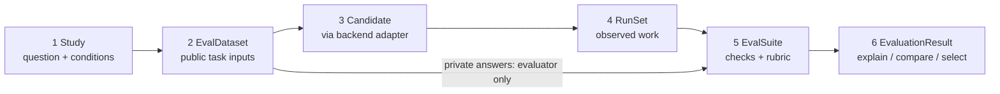

# Agent Eval Flow: six main library objects

Status: **revision 0.4 behavioral object model, implemented in the initial
library**; see [implementation scope](IMPLEMENTATION.md). The
[accepted unified assessment direction](UNIFIED_ASSESSMENT_FLOW.md) adds
candidate assessments beside run results, with shared evidence and decision
semantics. Those additions are not yet API or persisted-schema changes. The
six objects and lifecycle below describe the current behavioral branch.

The authoritative
field defaults, wire encoding and cross-record invariants are in
[Data contract 0.4](DATA_CONTRACT.md), with complete signatures in the
[typed contract](contracts/agent_eval_flow.pyi). This document explains the
domain semantics and examples. Revision 0.4 replaces older signatures involving
`MetricSpec.implementation`, run-only import iterables and exclusively
single-assignment execution. The proposed import remains `agent_eval_flow`.

The [level-2 architecture](LLD_LEVEL_2.md) assigns these records and runtime
interfaces to modules and services. The six domain objects remain; the native
job, imported-grade and batch-grading additions below supersede earlier module
signatures where they conflict with the revision 0.4 contract.

The [popular-agent red-team review](AGENT_COMPATIBILITY_RED_TEAM.md) supplies
real integration examples. Its cost and success examples are evaluation choices,
not reasons to impose one universal metric definition. The distinction below
governs the current proposal; live human pause/resume remains outside v0.

## Design principle: preserve facts, make interpretation replaceable

The library should let users define what good means. For the same captured run,
`selected_attempt_cost` may correctly return $0.10 and `workflow_cost` $0.45.
Likewise, a delivered patch can pass `patch_correct` and fail
`completed_before_deadline`. These are different measurements of the same facts.

| Library responsibility | User-defined evaluation responsibility |
| --- | --- |
| Retain supplied outputs, executions, errors, observations and source references | Choose which outputs/executions a metric measures |
| Expose evidence and reusable measurements to evaluation code | Define correctness, cost, latency, partial credit and human-handoff success |
| Store evaluator versions, parameters, units and coverage | Choose aggregation, exclusions, imputation and optimization priorities |
| Validate identities, types and references; keep captured facts unchanged | Interpret those facts and return a value with an explanation |

The resource helpers, linear rubric, threshold acceptance rule, reducers and
selection modes below are named conveniences with explicit behavior. They do
not define every valid evaluation. Custom metrics can inspect the complete
`Run`; derived metrics can combine existing measurements; custom reducers can
aggregate candidate runs without editing the core. An estimated or imputed
judgment does not rewrite a missing source observation as measured data.

## The whole library in six objects

| Pipeline step | Main object | Idea and goal | Contains |
| --- | --- | --- | --- |
| 1. Declare the experiment | **`Study`** | Define the question, candidates, tasks and execution conditions. | Dataset, candidates, suite, execution policy, planned comparisons |
| 2. Prepare task inputs | **`EvalDataset`** | Define the work and keep evaluator answers separate from agent inputs. | Ordinary keyed tables, input column lists, private reference tables |
| 3. Specify the agent backend | **`Candidate`** | Describe one complete agent configuration being tested. | Model, skills, flow, harness, tools, prompts, memory and backend reference |
| 4. Preserve outputs | **`RunSet`** | Record what happened for every assigned task and repetition. | `Run` records, child executions, outputs, artifacts, events, resources, errors |
| 5. Evaluate | **`EvalSuite`** | Define measurements, points, acceptance and aggregation. | Metric definitions, rubric, task requirements, summary definitions |
| 6. Inspect and choose | **`EvaluationResult`** | Explain performance, compare configurations and choose under your priorities. | Measurements, task scores, summaries, evidence; comparison and selection methods |

You normally **create** a dataset, candidates, a suite and an optional study.
The library **produces** the run set and evaluation result. Small records inside
them are fields and return values, not six more frameworks to learn.
`EvaluationPipeline` binds a study to runtime implementations and coordinates
these objects through one `eval()` or `aeval()` call. It is a runtime facade, not a seventh
serializable domain object.

OpenSRE and OpenKritt each get their own `Study`, `EvalDataset` and `EvalSuite`.
Their adapters return the same `RunSet` structure. Their scores stay separate.



## Read one lifecycle before the fields

```python
# API sketch: these objects would be constructed as specified below.
study = Study(
    id="sre-guidance-v1",
    project_id="opensre",
    question="Does diagnostic guidance improve incident diagnosis?",
    dataset=incidents,
    candidates={"A": baseline, "B": with_guidance},
    suite=sre_checks,
    execution=ExecutionPolicy(
        repetitions=3,
        budget=Budget(wall_time_s=120),
    ),
)

pipeline = EvaluationPipeline(
    study=study, backends=backends, evaluators=evaluators,
)
result = pipeline.eval()  # 20 incidents × 2 candidates × 3 repetitions = 120 assignments
runs = result.runs

result.explain("run-A-SRE006-1")
result.compare("A", "B", metrics=("accuracy", "mean_cost_usd"))
choice = result.select(cheapest_acceptable)
```

`EvaluationPipeline(study=..., ...)` uses keyword-only arguments: `study: Study`,
`evaluators: Mapping[str, MetricEvaluator]`, optional
`backends: Mapping[str, BackendAdapter] | None = None`,
`job_backends: Mapping[str, NativeJobAdapter] | None = None`,
`batch_evaluators: Mapping[str, BatchMetricEvaluator] | None = None`, and
`reducers: Mapping[str, SummaryReducer] | None = None`. Empty/omitted registries
mean no bindings; they are valid only when the chosen path needs none of those
implementations. Its read-only `study` property exposes the configured definition.
Construction performs no execution or grading and does not serialize or own the
supplied live clients.

`pipeline.eval(*, runs: RunSet | None = None) -> EvaluationResult` validates the
needed runtime registrations and metric dependencies before starting work.
Without `runs`, it coordinates fresh execution and evaluation. With `runs`, it
grades that capture without invoking a backend or filling missing assignments.
The data, candidates, assignment coverage and execution conditions must match
the study; a different suite is allowed without changing the capture's original
plan. The full study fingerprint is therefore not a rescoring compatibility key.
Each call returns a new result; fresh execution also creates a new run set and
run identities. There is no implicit cache, resume, saving or report generation.
`await pipeline.aeval(runs=...)` provides the same lifecycle and result contract
for asynchronous callers and native integrations. A running event loop uses
`aeval()`; `eval()` must not conceal nested loops or background-thread execution.
Cancelling a caller's wait does not establish that a native job has stopped.

`study.evaluate(backends=..., evaluators=...)` delegates to this same pipeline.
`suite.evaluate(...)` can grade imported runs without starting an agent.
None of `plan`, `compare`, `explain` or `select` starts a backend.

For one candidate, the `evaluate(candidate, data, metrics, *, backend,
evaluators, execution, ...)` convenience function builds the study and uses the
same pipeline internally.
Without an acceptance rule it reports measurements and leaves task acceptance
unknown; without summary definitions it returns task measurements without
candidate aggregates. This direct convenience path retains its synchronous
signature; whole jobs and asynchronous integrations use the configured pipeline.

The complete typed signatures, including constructor fields for the smaller
records, are in [agent_eval_flow.pyi](contracts/agent_eval_flow.pyi). It is a
design file, not working library code. Below are the main fields and methods.

## 1. Study — the experiment definition

| Constructor parameter | Type | Required / default | Meaning |
| --- | --- | --- | --- |
| `id` | `str` | Required | Name of this experiment definition |
| `project_id` | `str` | Required | Comparison boundary, such as `opensre` or `openkritt` |
| `question` | `str` | Required | What the experiment should answer |
| `dataset` | `EvalDataset` | Required | Fixed task sample |
| `candidates` | `Mapping[str, Candidate]` | Required | Candidate IDs mapped to their specifications |
| `suite` | `EvalSuite` | Required | Fixed checks, rubric and task acceptance |
| `execution` | `ExecutionPolicy` | Required | Repetitions, order, concurrency, limits and retries |
| `contrasts` | `tuple[Contrast, ...]` | `()` | Comparisons declared before seeing results |
| `environment` | `ComponentSpec \| None` | `None` | Shared environment specification; task-specific snapshots remain in the dataset |

```python
study.validate() -> ValidationReport
study.fingerprint() -> str
study.plan() -> RunPlan
study.run(*, backends: Mapping[str, BackendAdapter] | None = None,
          job_backends: Mapping[str, NativeJobAdapter] | None = None) -> RunSet
study.evaluate(*, backends: Mapping[str, BackendAdapter] | None = None,
               evaluators: Mapping[str, MetricEvaluator],
               reducers: Mapping[str, SummaryReducer] | None = None,
               job_backends: Mapping[str, NativeJobAdapter] | None = None,
               batch_evaluators: Mapping[str, BatchMetricEvaluator] | None = None) -> EvaluationResult
study.save(path: Path) -> None
Study.load(path: Path) -> Study
```

`ExecutionPolicy` has `budget: Budget`, `repetitions: int = 1`,
`max_concurrency: int = 1`, `order_seed: int | None = 0`, and
`infrastructure_retries: int = 0`, and
`native_jobs: tuple[NativeJobConfig, ...] = ()`. A `Budget` requires `wall_time_s: float`;
`max_tokens: int | None` and `max_cost_usd: Decimal | None` default to `None`.
`ExecutionPolicy.cost_scope: tuple[CostCategory, ...] = ("model",)` declares
which spending the standard resource view records and budgets. Conventional
categories are `model`, `tool`, and `compute`; custom string categories are
allowed. Use a nonempty tuple without duplicates. The default covers all
model calls in the candidate, including subagents, reviewers and selectors.
Reports must label that scope: model spend does not establish total operating
cost. Human minutes remain a separate measurement. Individual metrics may
select narrower or different evidence scopes without changing this execution
budget or relabelling the standard view.
Limits cover one complete assigned repetition, including retries and all
native sub-runs. Static `validate()` checks the specification. Runtime
preflight checks the supplied adapter's version and capabilities, including
enforcement of requested limits and resetting the declared initial state.
Unsupported conditions block execution before an agent starts.
A native timeout that stops waiting while a worker keeps running does not
enforce our wall-time limit. A native cost threshold checked after a call,
or excluding selection/review, does not enforce a hard cost ceiling. Such
adapters must report the limit unsupported unless an external controller can
enforce it; saved-run imports can still record the observed behavior.

`NativeJobConfig(id, backend, candidate_ids, native=None, verifiers=())` groups
candidates into a native job, including both arms of a paired skill study.
Candidate groups must be nonempty, refer to existing candidates and not overlap.
Each covered candidate's full `backend` reference equals the job's `backend`;
that integration resolves through `job_backends` only. Unlisted candidates use
the direct `backends` registry. The selected native integration owns trial
execution, repetition expansion and retries; the outer pipeline does not run
another scheduler around its trials. Native options cannot silently override
canonical candidate settings or execution limits.

`Study.plan()` materializes `PlannedJob(id, config, assignment_ids)` records in
`RunPlan.native_jobs`. Their IDs describe planned work, while fresh invocation
IDs identify actual captures. Each planned job contains exactly the assignments
for its configured candidates, and its configuration matches the execution
policy. The identity and capability rules in [Data contract 0.4](DATA_CONTRACT.md)
govern dispatch and capture reconciliation.

Each optional `VerifierSpec` declares a native grade channel, implementation,
parameters, private `reference_columns`, optional native settings and optional
verifier budget. It configures verification that the native runtime may perform
before environment cleanup. It does not grant the agent access to private
references, and its independent grading costs remain separate from agent costs.

A `Contrast` names a baseline, challenger, summary metrics and optionally the
expected changed configuration paths. The `RunPlan` preserves these contrasts
so they survive saving and loading. Unexpected differences are reported;
the library cannot infer that a trace proves causation. `order_seed` controls
reproducible scheduling order, not model determinism; `None` retains declared
order. Each repetition starts from the
declared initial state; ongoing memory studies can package a sequence as one task.

## 2. EvalDataset — tasks and their independent references

| Constructor parameter | Type | Required / default | Meaning |
| --- | --- | --- | --- |
| `id` | `str` | Required | Dataset identity |
| `units` | `DataTable` | Required | One row per root task |
| `unit_key` | `tuple[str, ...]` | Required | Root task key, e.g. `("task_id",)` or `("doc_id",)` |
| `input_columns` | `Mapping[str, tuple[str, ...]]` | Required | Explicit allowed columns for each public table; `"units"` names the root table |
| `records` | `Mapping[str, DataTable]` | Empty | Related rows: files, pages, polygons, snapshots or events |
| `references` | `Mapping[str, DataTable]` | Empty | Private answers, expected facts, bug IDs or oracle references |
| `cluster_by` | `tuple[str, ...] \| None` | `None` → `unit_key` | Group related tasks for uncertainty calculations, e.g. repository family |
| `description` | `str` | `""` | Human explanation |

A `DataTable` has `rows: tuple[Record, ...]`, `key: tuple[str, ...]` and
`schema: Mapping[str, Literal["str", "int", "float", "bool", "json"]]`.
A `Record` is an ordinary string-keyed JSON record. `Key` values are strings
or integers. Child tables include the root key and declare their own unique
row key. This preserves `doc_id/page/poly` without requiring a polygon class.

```python
EvalDataset.from_records(*, id, units, unit_key, input_columns,
                         records=None, references=None, cluster_by=None) -> EvalDataset
dataset.validate() -> ValidationReport
dataset.agent_input(unit: Key) -> AgentInput
dataset.select(units: Sequence[Key]) -> EvalDataset
dataset.fingerprint() -> str
dataset.save(path: Path) -> None
EvalDataset.load(path: Path) -> EvalDataset
```

`from_records` infers a table schema and validates keys; explicit `DataTable`
construction is available when schema inference is unsuitable. A future
`from_frame` adapter can accept pandas/Arrow without making either the core model.

For Kritt, one root task contains both V and P snapshots. They may live in a
related `snapshots` table keyed by `(task_id, snapshot_id)`. Two scans produce
**one task score**. A reference table keyed by `(task_id, bug_id)` holds B1/B2
and their independent checks. Only snapshot inputs go to the backend.

`agent_input()` returns a new `AgentInput(unit, tables)` containing only that
unit's rows and allowed public columns. It never includes `references`.
`select()` filters root, related and private tables to the selected units.
The adapter must also
keep private files and their parent directories outside the agent's accessible
workspace; a Python field name is not isolation by itself.

## 3. Candidate — a complete declared configuration

| Constructor parameter | Type | Required / default | Meaning |
| --- | --- | --- | --- |
| `id` | `str` | Required | Label such as `A` or `B` |
| `backend` | `VersionRef` | Required | Registered adapter name and revision |
| `components` | `Mapping[str, ComponentSpec]` | Required | Named parts of the complete system, including fixed parts |
| `settings` | `Mapping[str, JSONValue]` | Empty | Backend settings not represented by a component |
| `description` | `str` | `""` | What this configuration represents |
| `native` | `NativeConfig \| None` | `None` | Native behavioral options with an explicit integration schema revision |

`ComponentSpec` contains `kind`, `ref: VersionRef`, `params` and optional
`content: ArtifactRef`. Kinds include model, skill, flow, harness, tool, prompt,
memory and environment. Names can express multiple models or steps:
`model.investigate`, `model.diagnose`, `skill.rca`, `flow`, `harness`.

```python
candidate.validate() -> ValidationReport
candidate.derive(*, id: str, components=None, settings=None, native=...) -> Candidate
candidate.diff(other: Candidate) -> tuple[ConfigChange, ...]
candidate.fingerprint() -> str
```

`derive` returns a new candidate. Component changes replace whole named
components; a component value of `None` removes it. Settings update top-level
keys without silently merging nested dictionaries. Omitting `native` preserves
it; supplying a `NativeConfig` replaces it; explicit `None` clears it. `diff`
reports `add`, `remove` or `replace`, paths and before/after values, excluding
labels and descriptions. The operation distinguishes an absent field from an
explicit JSON null.

`NativeConfig` has required `schema_ref: VersionRef` with a resolved revision,
and `values: Record = {}`. It preserves supported native options without making
them untyped outer fields. Candidate native options describe behavior; job
options describe execution of that behavior. Client connections, credential
values and transport objects remain runtime bindings. Changing the capture
integration changes `Candidate.backend` and therefore its declared fingerprint.

For example, B copies A and adds `skill.rca`. C copies B and changes
`model.investigate`. These declare intended skill and model comparisons;
effective configuration must confirm whether other parts also changed.
Runtime adapters are supplied separately to `run`; credentials and Python
callables are not serialized inside the candidate.

The fingerprint identifies the **declared** configuration. Each execution
records its effective settings separately. A mutable model alias or an unknown
backend default cannot be represented as a proven pinned configuration.
Use component paths that include agent scope, such as
`agent.researcher.skill.citations`. Resolve inherited skills, model-dependent
prompts/tool sets, ordered middleware, auxiliary models and defaults before
the first action. Capture this manifest as evidence for `effective_config`,
and record runtime changes such as fallbacks on the affected executions/events.
The manifest uses `components` (scoped names to resolved spec records) and
`middleware_order` (agent names to ordered component-name lists). Missing
resolution is explicitly unknown. A model change that selects another harness
profile is a bundled change even if only one user setting was edited.

## 4. RunSet — recorded work, including unsuccessful work

| Field | Type | Meaning |
| --- | --- | --- |
| `id` | `str` | Capture identity |
| `plan` | `RunPlan` | Dataset identity, candidate specs, environment, execution policy and every assignment |
| `runs` | `tuple[Run, ...]` | Exactly one root record per assignment, including placeholders for unexecuted work |
| `importer`, `import_source` | `VersionRef \| None`, `ArtifactRef \| None` | Import implementation revision and source evidence, when imported |
| `native_jobs` | `tuple[NativeJobRecord, ...]` | Native invocation records and links to the planned assignments; default `()` |
| `native_grades` | `tuple[NativeGradeBundle, ...]` | Retained native grade channels and their grading activities; default `()` |
| `grading_inventory_complete` | `Observation[bool]` | Required completeness observation for grading capture; an incomplete export cannot establish a free evaluation |
| `projections` | `tuple[ProjectionReport, ...]` | Source format, mapper version, preserved sources and mapping omissions/issues; default `()` |
| `schema_version` | `str` | Serialization contract version; current proposal `"0.4"` |

Each `Assignment` identifies `(candidate, unit, repetition)`. Each `Run` has:

| Run field | Type | Meaning |
| --- | --- | --- |
| `id`, `assignment_id` | `str` | Run identity and link to the planned task |
| `cost_scope` | `tuple[CostCategory, ...]` | Plan's spending categories, preserved even when no executions were captured |
| `status` | `RunStatus` | `not_run`, `unobserved`, `running`, `awaiting_input`, `paused`, `completed`, `agent_error`, `timed_out`, `infrastructure_error`, `cancelled` |
| `output` | `JSONValue` | Final normalized output; may be text, a record or `None` |
| `output_state` | `Literal["available", "unavailable", "unknown"]` | Required availability fact, independent of execution status and correctness |
| `artifacts` | `Mapping[str, ArtifactRef]` | Named reports, findings, test outputs, rendered documents, etc. |
| `executions` | `tuple[Execution, ...]` | Native invocations and retries; Kritt can include V and P slots |
| `started_at`, `ended_at` | `datetime \| None` | UTC timestamps for the whole assigned execution |
| `environment` | `Observation[Record]` | Captured environment and initial-state facts |
| `execution_inventory_complete` | `Observation[bool]` | Whether capture accounts for all attempted work, including unsuccessful/unselected attempts |
| `output_sources` | `tuple[str, ...]` | IDs of executions that produced the delivered output; empty means origin unavailable |
| `native_refs` | `Mapping[str, str]` | Native run, conversation, thread or checkpoint references |
| `events` | `tuple[Event, ...]` | Optional timestamped actions and evidence links |
| `error` | `ErrorRecord \| None` | Terminal error when present |
| `job_id` | `str \| None` | Capture-local `NativeJobRecord.id`; `None` for a direct call |

```python
runs.validate() -> ValidationReport
runs.get(run_id: str) -> Run
runs.for_candidate(candidate_id: str) -> tuple[Run, ...]
runs.coverage(candidate_id: str | None = None) -> Coverage
runs.rows(kind: Literal["runs", "executions", "events"]) -> tuple[Record, ...]
run.resources() -> Resources
run.duration_s() -> Observation[float]
runs.save(path: Path) -> None
RunSet.load(path: Path) -> RunSet
RunSet.import_from(source: Path, *, plan: RunPlan, importer: RunImporter) -> RunSet
```

`output_state="available"` can accompany a valid JSON null or an empty findings
list. `unavailable` records confirmed absence; `unknown` means capture cannot
establish availability. The latter two use `output=None`. Execution status does
not determine this field: a timed-out run may already have delivered an artifact.

`Coverage` partitions planned runs into `completed`, `failed`, `unavailable`
and `pending`; these counts sum to `planned`. Failed statuses are `agent_error`,
`timed_out`, `infrastructure_error` and `cancelled`. Unavailable statuses are
`not_run` and `unobserved`; pending statuses are `running`, `awaiting_input` and
`paused`. This coverage use of unavailable describes run status, not
`output_state`. `resource_unknown` is an overlapping count, not a fifth partition.

`Event.source: EvidenceRef | None` links a projected event to its original
native trace. The trace remains an artifact in its own format; a projected event
is not a replacement trace language. Projection reports make omitted detail and
mapping issues inspectable.

The following defines the standard resource helpers, not mandatory cost or
latency metric definitions. An evaluator can also use selected executions,
event intervals, native artifacts or domain-specific resource records.

An `Execution` records its slot, retry number, parent, effective configuration,
timestamps, resources and error. Its `role` is `main`, `attempt`, `review`,
`selection`, `subagent`, `tool`, or `other` (default); `native_refs` preserves
backend identities. All resource charges are **exclusive** of children.
`run.resources()` sums them once, including failed and unselected executions.
An aggregate native total can be represented as one execution with inner detail
kept in artifacts, or decomposed into exclusive charges; never use both.
If the execution inventory is incomplete or unknown, full-run resource totals
remain unknown even if every exported execution has a known cost. An explicit
unknown execution can represent a known omitted reviewer/selector charge.
Inventory completeness requires observed `True`; an estimated complete
inventory is insufficient for a full total. An empty placeholder retains
`Run.cost_scope` so `resources()` can return correctly scoped unknown values.
`run.duration_s()` uses the root wall-clock interval, including retries and
cleanup; it does not sum overlapping child durations. An unconfirmed stop or
missing timestamps leaves duration unknown.

`Resources` holds typed observations of `cost_usd: Decimal`, input/output token
counts and human minutes, plus `cost_scope: tuple[CostCategory, ...]`.
Every execution must use the plan's cost scope; summing mixed scopes is invalid.
The root run's scope must match as well.
Known model charges cannot fill a cost field whose scope also requires unknown
compute/tool charges. Evidence may preserve the known subtotal. Evaluation
resources declare their own scope separately.
`Observation[T]` holds `value: T | None`,
`status: observed | estimated | unknown`, reason and evidence. Unknown cost
stays `None`. Empty or incomplete capture does not establish zero consumption.
Estimated values remain marked through aggregation.

One independent repetition remains one assignment even after three retries.
Native search attempts, critic loops and output selection stay inside that
assignment. `retry_index` counts infrastructure retries within a logical slot;
adaptive attempts get distinct slots and their actual configurations. A
selection event records the selector version, considered execution IDs and
selected IDs. `output_sources` must reference existing executions; the final
output need not come from the last attempt. Selection/review used to produce
the answer belongs to candidate cost. Independent grading belongs to evaluation
cost. Each assignment needs its own output/session namespace so an upstream
"skip existing result" feature cannot fabricate a fresh repetition.
The backend adapter owns retries under the policy; the coordinator does not
add a second retry loop. A recorder preserves partial evidence if the adapter
crashes. During capture, execution snapshots are updated by execution ID; event
IDs are unique. The final returned run is reconciled against that capture by ID,
never concatenated with it. Conflicting final facts are validation errors,
not extra charges. Completed snapshots are immutable.

`awaiting_input` and `paused` preserve a suspended workflow and its native
checkpoint references. They never imply completed delivery. V0 can capture
these states but has no general live resume API: execution support is limited
to autonomous or declared scripted episodes, plus saved-run imports. A
scripted human policy is versioned as a candidate component; simulated replies
and wait times must not be reported as observed human work. A later continuation
must keep the same assignment and cumulative resource history.

`environment` records `scopes`, a map of mutable state names (workspace,
store, checkpoint, browser profile, external service) to records containing
`expected_state`, `observed_state`, `namespace` and `reset_method` where relevant.
State identifiers/digests and reset evidence must support the declared initial
condition. A bare `reset=true`, a fresh thread ID, or a new browser profile does
not prove external stores/services were reset. Unknown state limits comparison
claims; requested verified isolation blocks execution when it cannot be met.

Imports must supply a plan: missing records become `unobserved`, since a missing
export does not prove the agent never ran. `not_run` requires evidence of actual
nonexecution. Duplicate or unplanned assignments are validation errors, and
unknown fields stay unknown.

`RunImporter.read(source, plan=...)` now returns an `ImportedCapture` containing
`runs`, required `grading_inventory_complete`, and optional `native_jobs`, `native_grades` and `projections`, replacing
the earlier `Iterable[Run]` signature. The importer preserves supplied native
evidence and grading records; `RunSet.import_from` validates and reconciles them
against the supplied plan. Native jobs use `NativeRunLink` to map run and
assignment identities to scoped native references, never output-list position.

## 5. EvalSuite — measurements, points and acceptance

| Constructor parameter | Type | Required / default | Meaning |
| --- | --- | --- | --- |
| `id`, `version` | `str` | Required | Scoring definition identity |
| `metrics` | `tuple[MetricSpec, ...]` | Required | Versioned measurement definitions |
| `acceptance` | `AcceptanceRule \| None` | `None` | Mandatory conditions for one task attempt; absence leaves acceptance unknown |
| `summaries` | `tuple[SummarySpec, ...]` | Required | Named candidate aggregates used by reports and selection |
| `rubric` | `Rubric \| None` | `None` | Optional points-based score; raw metrics work without one |
| `evaluation_cost_scope` | `tuple[CostCategory, ...]` | `("model",)` | Spending categories for grading resources, separate from the execution policy |

A `MetricSpec` has one required `source`, parameters, output type, role
(`quality`, `resource`, `diagnostic`), optional unit and
`depends_on: tuple[str, ...] = ()`. `source` replaces the earlier
`implementation` field; there is no simultaneous implicit callback and native
grade lookup for one metric.

| Metric source | Configuration | Work performed |
| --- | --- | --- |
| `EvaluatorSource` | Required `ref: VersionRef`; `mode="single"` or `"batch"` (default single); discriminator `kind="evaluator"` | Invoke the registered evaluator on saved run evidence |
| `NativeGradeSource` | Required `channel` and `native_metric`; optional `evaluator` and historical `activity_id`; discriminator `kind="native_grade"` | Select a retained native grade without invoking its verifier again |

Single evaluators return one task-level `Measurement` and optional detail rows
keyed by page, finding, file or step. Batch evaluators return those same
measurement records for identified requested runs; imported grades map to the
same measurement contract. Only the task-level value enters the main rubric. Domain-specific
reduction belongs to the versioned evaluator; the core never guesses whether
600 polygon checks should mean 600 tests.

A measurement records `run_id`, metric ID, value, status, observed/estimated
basis, reason, evidence, optional detail key and grading `activity_ids`. Status is `ok`, `missing`,
`error` or `not_applicable`. A known false answer is `ok` with value `False`;
a broken evaluator is `error`, not an agent failure.

Native grade selection preserves the original evaluator/configuration, activity
and evidence through `NativeGradeBundle`. Missing grades remain missing; they
do not cause the pipeline to launch an agent or verifier. Ambiguous historical
matches need explicit selection rather than an arbitrary latest result. Imported
grade sources cannot disguise configuration changes as a regrade: a fresh
evaluator source is required to perform new grading. A source's native grade
provenance does not make it independent ground truth.

Custom metric code receives the complete `Run` and can define selected-attempt
cost, total workflow cost, active latency, nonlinear scores, or a composite
success condition. Declared dependencies are evaluated once per run and exposed
as `EvaluationContext.measurements`; consumers do not need to rerun expensive
checks. Dependencies may name other declared metrics or primitive `run.*`
metrics. Cycles, unknown IDs and dependencies on the later `quality.score`
or `task.accepted` convenience outputs are invalid. Missing-input handling is
part of the consuming metric's definition and must be explained in its output.
A defined penalty for missing work is distinct from estimating its unknown
quality: both can be metrics, with the source missingness retained.

For example, `patch_correct` and `within_deadline` are separate metrics.
A custom `delivery_success` metric can combine them with AND, OR, partial credit
or other domain logic, reusing both measurements. A single acceptance threshold
can reference that composite. Arbitrary numeric score metrics can be reported,
summarized and optimized directly with `rubric=None`; the linear `Rubric` is
optional, not the limit of scoring expressiveness.

```python
suite.validate() -> ValidationReport
suite.fingerprint() -> str
suite.evaluate(*, dataset: EvalDataset, runs: RunSet,
               evaluators: Mapping[str, MetricEvaluator],
               reducers: Mapping[str, SummaryReducer] | None = None,
               batch_evaluators: Mapping[str, BatchMetricEvaluator] | None = None) -> EvaluationResult
```

Before scoring, dataset fingerprint and unit keys must match the run plan.
Evaluator-source revisions must be resolved; the single or batch registry
selected by `source.mode` must match those revisions. Native-source selection
validates the retained channel/metric/activity references. A suite version label
alone does not pin evaluator code.
This first contract rejects a different reference dataset instead of recording
new gold under old provenance. A new suite may rescore those same fixed inputs
and references. With `rubric=None`, gates and summaries referencing
`quality.score` are invalid; raw-metric evaluations do not invent a zero score.

This is the exact OpenSRE rubric from the diagram:

```python
rubric = Rubric(terms=(
    ScoreTerm(metric="cause_correct", points=50),
    ScoreTerm(metric="resource_correct", points=15),
    ScoreTerm(metric="facts_correct", points=20),
    ScoreTerm(metric="remedy_correct", points=15),
))
acceptance = AcceptanceRule(all_of=(
    Threshold(metric="quality.score", op=">=", value=80),
    Threshold(metric="cause_correct", op="==", value=True),
    Threshold(metric="run.completed", op="==", value=True),
    Threshold(metric="run.duration_s", op="<=", value=120),
    Threshold(metric="infrastructure_writes", op="==", value=0),
))
```

Metrics used by the linear `Rubric` helper must return a boolean or fraction in `[0, 1]`.
Contribution = metric value × declared points. A baseline returning
`False, True, True, False` scores `0 + 15 + 20 + 0 = 35`.
Any unknown/error/non-applicable scored term leaves the exact total unknown;
known contributions remain visible and weights are never silently redistributed.

The `AcceptanceRule.all_of` helper combines metric thresholds: a known failed
gate means fail, any unresolved gate means unknown, and all passing gates mean
pass. The core adds no hidden status-based gate. The rule applies to the saved
snapshot: for a pending run, passing a handoff or intermediate-artifact check
does not mean execution completed. A suite requiring terminal completion must
include that measurement explicitly. With no rule, acceptance remains unknown.
An agent error, cancellation, infrastructure error or timeout does not by
itself decide whether an already delivered artifact is correct. For example,
a submitted patch can pass independently verified tests after a budget stop;
a suite requiring timely normal completion must explicitly gate that behavior.
The OpenSRE rule above does so. A confirmed forbidden write remains a failure
even if infrastructure subsequently crashes.

`run.completed` describes normal terminal completion, not correctness. It is
false for confirmed error/timeout/cancellation and unknown for incomplete
capture or pending work. Preserve the native stopping reason in execution
events/errors; never relabel a budget stop as normal completion to pass a gate.
An appropriate human handoff can satisfy a chosen metric even while the
workflow remains pending. Reports preserve both the judgment and run status.

Built-in metric IDs are `run.completed`, `run.duration_s`, `run.cost_usd`,
`run.input_tokens`, `run.output_tokens`, `run.human_minutes`, `quality.score`
and `task.accepted`. These names identify the documented convenience definitions;
custom definitions use their own IDs and may coexist in the same suite. Acceptance
cannot depend on `task.accepted` itself. A missing required report on a
fully captured completed run can be a known failure; a report missing because
an export was incomplete is missing evidence. An evaluator may apply a declared
penalty or imputation, while preserving that evidence distinction and its reason.

Example summaries: `accuracy = rate(task.accepted)`,
`mean_cost_usd = mean(run.cost_usd)`,
`p95_duration_s = p95(run.duration_s)`,
`infra_writes = sum(infrastructure_writes)`. Accuracy uses fractions `[0, 1]`
in data and percentages in presentation. The built-in means/rates use all planned
attempts; equal repetitions give each task equal weight. A required missing,
error or non-applicable value leaves the exact aggregate unknown, while a
separate descriptive value over available rows and coverage counts stay visible.
Neither selection nor comparisons silently substitutes that helper's partial
value for its full-population definition.
Estimated basis propagates through score contributions, `quality.score`,
derived acceptance and summaries whenever the derived value depends on an
estimate. An estimated duration gate cannot turn into apparently observed accuracy.

`SummarySpec.reducer` can also be a resolved `VersionRef`, with serialized
`params`. Supply its implementation through the optional `reducers` registry
to `EvalSuite.evaluate`, `Study.evaluate`, or the convenience `evaluate`.
`SummaryReducer.reduce` receives all assignments, runs, measurements and task
scores for one candidate, including placeholders. Join `Run.assignment_id`
to `Assignment.id` to obtain task keys and repetition numbers; IDs are opaque.
It returns a `CandidateSummary` with
value/basis, source-status counts, included run IDs, excluded IDs with reasons,
and an explanation. IDs must partition that candidate's planned runs; counts
describe the source observations before exclusion or imputation.

A custom `mean_available` may return a known mean over 8 observed runs while
declaring 2 missing runs excluded. It can be compared and selected under that
explicit definition. A full-population estimate for the same 10 runs has a
different definition and estimated basis. Coverage stays visible in both cases.
This also permits grouped repetition statistics and other domain-specific
aggregates; no changes to the six major objects are needed.

## 6. EvaluationResult — explanation, comparison and choice

| Field | Type | Meaning |
| --- | --- | --- |
| `id`, `created_at` | `str`, `datetime` | Identity and UTC evaluation time |
| `runs` | `RunSet` | Original captured evidence and plan |
| `suite`, `suite_fingerprint` | `EvalSuite`, `str` | Exact scoring definition applied |
| `measurements` | `tuple[Measurement, ...]` | Task and detail-level values, errors and evidence |
| `task_scores` | `tuple[TaskScore, ...]` | Contributions, total score, task acceptance and gate reasons |
| `summaries` | `tuple[CandidateSummary, ...]` | Candidate aggregates with planned/observed/missing/error counts |
| `evaluation_resources` | `Resources` | Grading-resource total derived from unique retained activities, separate from agent execution |
| `activities` | `tuple[EvaluationActivity, ...]` | Grading invocations with identities, provenance, covered run IDs and exclusive resources; default `()` |
| `performed_activity_ids` | `tuple[str, ...]` | Subset performed by this result-producing pipeline call; default `()` |
| `performed_grading_inventory_complete` | `Observation[bool]` | Required completeness of newly attempted grading, separate from historical capture completeness |
| `schema_version` | `str` | Serialization contract version; current proposal `"0.4"` |

```python
result.summary() -> tuple[CandidateSummary, ...]
result.incremental_evaluation_resources() -> Resources
result.explain(run_id: str) -> Explanation
result.compare(baseline: str, challenger: str, *, metrics: Sequence[str],
               confidence: float | None = None) -> Comparison
result.select(policy: SelectionPolicy) -> Selection
result.report(path: Path, *, selection: Selection | None = None) -> Path
result.save(path: Path) -> None
EvaluationResult.load(path: Path) -> EvaluationResult
```

Grading resources belong to `EvaluationActivity`, not to every measurement it
produces. Each activity records its evaluator, configuration fingerprint,
covered run IDs, status, `phase` (`native_verifier` or `post_run`) and resources.
`Measurement.activity_ids` reference these records. A batch that grades ten
runs incurs one activity charge, including its detail rows. A retained native
grading invocation may supply several metrics while still representing one
activity. Repeated activity identities must describe the same facts; conflicting
copies are invalid. The total counts each activity once and preserves unknown
resource observations.

`evaluation_resources` describes the retained grading work represented by the
result. `incremental_evaluation_resources()` totals only `performed_activity_ids`:
fresh native verification and new post-run evaluation performed by this call.
Reading a saved verifier grade does not incur its historical charge again.
Returning a native grade and producing a normalized measurement from it are
references to one activity, not two grading operations. Agent execution resources
remain on the original runs. Aggregate native billing that does not separate
agent and verifier consumption cannot be silently allocated between them.

`NativeJobOutput` and `ImportedCapture` require a grading-inventory observation,
which flows into `RunSet.grading_inventory_complete`. False or unknown capture
completeness makes the full grading total unknown; an empty export is not proof
of zero expense. `performed_grading_inventory_complete` separately establishes
whether the incremental total is complete. Saved-run grading can have known
zero incremental expense even when historical grading usage is incomplete.
Activity references must resolve to records covering the measurement's run,
and performed IDs must be a distinct subset of retained activity IDs.

`explain` returns the contributions and source evidence behind a task score.
It does not claim that the trace proves why a component helped. `compare`
returns candidate configuration differences and challenger-minus-baseline
summary deltas. It compares candidates in this one project, dataset and scoring
version. It also inspects effective configuration records: unplanned runtime
differences or unresolved versions prevent labeling a contrast as an isolated
skill/model/flow effect, while descriptive differences remain available.
The proposed default uncertainty method resamples declared task clusters,
carrying their repetitions together. Comparisons show each summary's population
and exclusions; observed-subset comparisons cannot be described as the full
planned population or as paired over identical tasks when their IDs differ.
Interval estimation is an optional extension,
not needed for the first record/import/score implementation.
This method compares independently computed measurements; it does not invoke
a judge that reads two candidate answers together. Pairwise judging needs a
separate evaluator interface and is explicitly deferred.

`select` receives **candidate-level** requirements and preferences. These are
different from `EvalSuite.acceptance`, which defines success for a single task.

```python
cheapest_acceptable = SelectionPolicy(
    id="budget-first",
    requirements=(
        Threshold(metric="accuracy", op=">=", value=0.90),
        Threshold(metric="infra_writes", op="==", value=0),
    ),
    objectives=(ObjectiveTerm(metric="mean_cost_usd", direction="minimize"),),
)
choice = result.select(cheapest_acceptable)

# Same result; select for speed instead.
fastest_acceptable = SelectionPolicy(
    id="latency-first",
    requirements=cheapest_acceptable.requirements,
    objectives=(ObjectiveTerm(metric="p95_duration_s", direction="minimize"),),
)
fast_choice = result.select(fastest_acceptable)
```

The built-in `SelectionPolicy` has `id`, `requirements`, `objectives`,
`mode: lexicographic | weighted | pareto = "lexicographic"`, and
`allow_estimates: bool = False`. Unknown required metrics make a candidate's
eligibility unknown, so it is not selected. Every objective value must also be
available before that candidate can be ranked: unknown cost cannot win cheapest.
Estimates in requirements or objectives require explicit opt-in.
Every candidate remains in the returned table with its eligibility and reasons.
Ties remain ties; Pareto mode returns the nondominated set; no eligible candidate
returns `selected_ids=()` and `status="none_eligible"`.
These helpers rank the metrics and summaries the caller chose. A caller may
define an estimated objective or an observed-subset summary explicitly; that
does not overwrite unknown source measurements. Fully custom candidate-to-
candidate selection functions are an additional interface, not implemented
by these three modes.

For weighted mode, each `ObjectiveTerm` supplies positive `weight` and fixed
`bounds=(low, high)` in that summary's units. Maximize maps low→0 and high→1;
minimize reverses this mapping. Values are clipped to `[0, 1]`, weights are
normalized to sum to one, and preference is their weighted sum. Default weight
is 1; default bounds are `None` and are invalid for weighted mode. This score is
a preference over recorded results, not a replacement for the task rubric.

`report` writes a local HTML report. `save/load` uses a versioned manifest and
data files, never pickled executables. The result stores the actual suite used;
rescoring the same runs creates another result ID and leaves the old result intact.

## Small records and implementation boundaries

These are defined in full in the [typed contract](contracts/agent_eval_flow.pyi).
The most important distinction is between **serializable definitions** and
**runtime code**:

| Smaller object | Owner | Responsibility |
| --- | --- | --- |
| `ExecutionPolicy`, `Budget`, `Contrast`, `RunPlan`, `NativeJobConfig`, `PlannedJob`, `VerifierSpec` | Study | Assign work, declare comparisons, native jobs, verifier channels and execution limits |
| `DataTable`, `AgentInput`, `DatasetInfo` | EvalDataset | Keep rows, public projections and provenance |
| `ComponentSpec`, `VersionRef`, `ConfigChange`, `NativeConfig` | Candidate / shared | Record components, native options and declared changes |
| `Run`, `Execution`, `Resources`, `Observation`, `Event`, `ErrorRecord`, `NativeJobRecord`, `NativeRunLink`, `NativeGradeBundle`, `ProjectionReport` | RunSet | Preserve execution facts, native identities, imported grading and missingness |
| `MetricSpec`, `EvaluatorSource`, `NativeGradeSource`, `Rubric`, `ScoreTerm`, `AcceptanceRule`, `Threshold`, `SummarySpec` | EvalSuite | Define where measurements come from and how they become scores and summaries |
| `Measurement`, `EvaluationActivity`, `TaskScore`, `CandidateSummary`, `Explanation`, `Comparison`, `SelectionPolicy`, `Selection` | EvaluationResult / caller | Preserve grading lineage, inspect judgments and make an explicit choice |
| `ArtifactRef`, `EvidenceRef` | Shared | Point to content and its exact relevant location |
| `BackendAdapter`, `NativeJobAdapter`, `RunImporter`, `MetricEvaluator`, `BatchMetricEvaluator`, `SummaryReducer`, `RunRecorder`, `NativeJobRecorder` | Runtime registry | Execute, import, evaluate, aggregate, preserve partial capture |
| `RunRequest`, `NativeJobRequest`, `VerifierInput`, `NativeJobOutput`, `ImportedCapture`, `BatchMetricRequest`, `BatchMetricOutput` | Integration boundaries | Carry typed requests and outputs without introducing additional main domain objects |
| `EvaluationPipeline` | Runtime facade | Bind implementations and coordinate the six domain objects through `eval()` or `aeval()` |

`BackendAdapter.run(RunRequest, recorder=...) -> Run` receives a candidate and
public `AgentInput`, never an `EvalDataset`. It reports supported limits and
returns normalized evidence. `MetricEvaluator.compute(MetricSpec,
EvaluationContext, Run) -> MetricOutput` receives evaluator-only references.
Its output includes one task measurement, optional detail measurements and
evaluation resource use for that fresh callback. The engine creates its grading
activity. Runtime implementation revisions must match their registered
`VersionRef`.

`await NativeJobAdapter.run_job(request, recorder=...)` accepts a
`NativeJobRequest` containing fresh job/run-set IDs, a planned-job ID, its config
and the covered `RunRequest` records. These still contain only public agent
inputs. `VerifierInput` records separately carry projected private references
for a particular run and verifier. An adapter must advertise and validate the
private verifier channel when one is requested. The resulting `NativeJobOutput`
contains the job record, runs, retained native grades and projection reports.
Partial recording and final output are reconciled by identity, never appended
as duplicate independent executions.

`await BatchMetricEvaluator.compute_batch(request)` accepts a fresh activity
ID, one `MetricSpec` and a tuple of `EvaluationItem(run, context)` records.
Each context retains that run's inputs, private references and already computed
declared dependencies. `BatchMetricOutput` returns identified measurements and
one grading activity shared by the batch. Batch processing changes invocation
granularity, not the meaning of a task or its measurement keys.

All specification objects and completed record snapshots are immutable,
including nested mappings. `derive`, `select`, reruns and rescoring create new
objects. `validate()` is read-only; execution, scoring and loading reject
invalid keys, unknown metric references, inconsistent units and illegal values.
Repetitions/concurrency and limits must be positive; retries and recorded
resource counts may be zero but never negative. Numeric values must be finite
and IDs unique. Unit keys and cluster columns must exist; child keys include
the root key. Public/private table names must not collide, and input column
lists can reference public tables only.
Study candidate mapping keys must equal their `Candidate.id` values.
The proposed implementation uses Pydantic dataclasses for validation and
serialization while retaining ordinary `dataclasses.replace(...)` construction
of changed records. Replacement validates its owning record and subsequent
cross-record checks still apply. Generic `Observation[T]` values are validated
through their typed owner or a Pydantic `TypeAdapter(Observation[T])`; calling a
generic constructor alone does not establish its runtime type parameter.
Pydantic's frozen dataclass setting does not deeply freeze containers: immutable
nested snapshots remain an explicit implementation requirement.
Read-only `Sequence`/`Mapping` types permit ordinary JSON input containers;
constructors normalize stored containers into immutable representations.
Fields with optional mapping/tuple defaults use empty containers. Nullable
references and timestamps are not automatically optional constructor arguments;
required nullable fields must be supplied, as shown in the typed contract and
[Data contract 0.4](DATA_CONTRACT.md). Resource observations have no implicit zero
default. Revision strings and artifact hashes may be unavailable, but that fact
must remain explicit. Artifact bytes need hashes for claims of exact replay.
Serialization encodes timestamps as timezone-aware UTC strings and `Decimal`
values using the explicit decimal representation in the authoritative data
contract, without conversion to binary floating-point money. Native JSON text
and decimal metric values must remain distinguishable on load.

The first implementation should prove this lifecycle with records, one importer
and deterministic checks, then a second different backend. These signatures
describe a proposal, not verified compatibility. Live human resume, persistent
learning across assignments, unmanaged background workers, pairwise judges and
richer statistics remain deferred. The red-team review defines the evidence
needed before claiming supported full-system evaluation.
