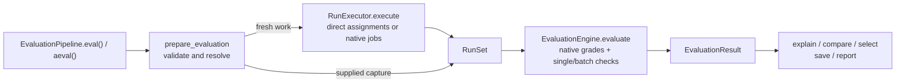

# Agent Eval Flow: LLD level 2

**Unified assessment LLD update — 9 September 2026:** the
[module index](lld/README.md) and [shared assessment contract](lld/ASSESSMENT_CONTRACT.md)
now specify the next extension at levels 3/4 across all eight modules. New
`AssessmentPipeline` / `AssessmentResult` wrappers compose configuration
inspection and existing behavioral evaluation, with independent branches,
snapshot binding and explicit gates. The index names the additional private
files and communication flow. These interfaces now have an initial implementation;
see the [assessment implementation guide](implementation/unified_assessment.md).
The v0.4 API is preserved. The level-2 tree and signatures below remain the historical
behavioral design, refined by those module pages and the current
[implementation checkpoint](IMPLEMENTATION.md).

**Status: proposed design; no production implementation.** This expands the
modules agreed in [levels 0 and 1](LLD_ARCHITECTURE.md), using the
[public contract](contracts/agent_eval_flow.pyi) and [E2E tests](../tests/e2e/README.md).

**Now expanded:** the [complete module LLD](lld/README.md) finishes levels 3/4,
written after [222 acceptance cases were recorded](../tests/BASELINE.md). It
supersedes private details below where refined: shared resource/grade ownership,
spooled process artifacts, optional adapter files and native-dialect preparation.

**Contract revision 0.4:** [DATA_CONTRACT.md](DATA_CONTRACT.md) is the authority
for configuration, input/output shapes, defaults and cross-record consistency.
The typed proposal specifies those shapes. This document assigns their work to
modules; it does not require a separate implementation file for each record.

The [communication graph](MODULE_COMMUNICATION.md) groups files by directory
and shows their request/result paths. The [LLD reuse audit](LLD_REUSE_RED_TEAM.md)
tests these boundaries against the original agent/skill/harness implementations
and papers. The agreed integration boundaries are reflected below; actual
dependency compatibility remains to be demonstrated.

The [integration recommendation](INTEGRATION_DECISION.md) now names proposed
dependency responsibilities using release, downstream-use and regression
evidence. This revision incorporates whole native jobs, asynchronous facade
execution and batch grading while keeping this LLD adjustable.

## The idea in under 200 words

The user configures `EvaluationPipeline` and calls `eval()` or awaits `aeval()`.
Internally, three stages do the work:

1. **Prepare:** validate the study, resolve implementations and check whether
   we can execute the declared experiment or grade the supplied runs.
2. **Execute:** send direct assignments or whole native jobs to their selected
   runtimes; collect outputs, original traces, native grades and failures.
3. **Evaluate:** reuse native grades or run single/batch checks, join measurements
   by run and metric, account for grading activities once, and return the result.

The remaining modules provide records, native integrations, result inspection,
saving and reporting. Users do not configure these internal services separately.
Custom evaluators and reducers continue to decide what the evidence means.

Level 2 names the files, services, their inputs/outputs and state ownership.
Level 3 will define method behavior and data exchanges; level 4 will finish
algorithms, persistence and failure details. The tree below is planned, not
code that has already been implemented.

## One call, with an explicit coordinator

```python
pipeline = EvaluationPipeline(
    study=study, backends=backends, evaluators=evaluators, reducers=reducers,
    job_backends=job_backends, batch_evaluators=batch_evaluators,
)
result = pipeline.eval()
```



`Study.evaluate()` and the module-level `evaluate()` build/use this facade.
`Study.run()` uses the execution services directly; `EvalSuite.evaluate()` uses
the evaluation services directly. These paths share stage implementations.
No stage calls the facade back, and result inspection has no runtime registry.

## Planned repository tree

Each file below is a level-2 implementation unit. A file may contain simple
functions; it does not require a service class or factory for every operation.
The eight module boundaries remain those agreed at level 1.

```text
src/agent_eval_flow/
├── __init__.py                   public exports only
├── pipeline/
│   ├── api.py                    EvaluationPipeline and evaluate shortcut
│   ├── bindings.py               snapshot runtime registrations
│   └── preflight.py              coordinate preparation and capture compatibility
├── objects/
│   ├── study.py                  Study, execution policy and plan records
│   ├── dataset.py                EvalDataset, DataTable and input projection
│   ├── candidate.py              Candidate, components and configuration differences
│   ├── runset.py                 captures, native jobs/grades, executions and coverage
│   ├── suite.py                  EvalSuite and metric/scoring/summary specifications
│   ├── result.py                 EvaluationResult and returned result records
│   ├── values.py                 shared values, observations and evidence references
│   ├── protocols.py              direct/job/import/batch and callback boundaries
│   ├── validation.py             structural checks and ValidationReport
│   ├── identity.py               canonical fingerprints and immutable value helpers
│   └── errors.py                 named library exceptions
├── execution/
│   ├── planning.py               build a deterministic assignment plan
│   ├── preflight.py              resolve backend versions and required capabilities
│   ├── runner.py                 dispatch direct calls or delegate whole native jobs
│   ├── capture.py                reconcile run/job recorders and native-grade captures
│   └── importing.py              ImportedCapture mapping and assignment coverage
├── evaluation/
│   ├── compiler.py               resolve the metric graph and extension versions
│   ├── engine.py                 native grades, single/batch checks and grading activities
│   ├── primitives.py             documented run.* convenience measurements
│   ├── scoring.py                optional rubric and acceptance helpers
│   └── aggregation.py            built-in and custom candidate summaries
├── results/
│   ├── query.py                  summary access and explanations
│   ├── comparison.py             candidate differences and comparison limitations
│   └── selection.py              requirements and optimization preferences
├── adapters/
│   ├── codex.py                  CodexBackend and its native capture mapping
│   ├── claude_code.py            ClaudeCodeBackend and its native capture mapping
│   ├── opensre.py                OpenSREBackend and its native capture mapping
│   ├── openkritt.py              OpenKrittBackend and its native capture mapping
│   ├── process.py               AnyIO process primitives for direct integrations
│   └── worker.py                prepared worker transport and native-job boundary
├── storage/
│   ├── manifests.py              save/load the supported document roots
│   ├── codec.py                  typed JSON encoding and schema handling
│   └── artifacts.py              local evidence cache and integrity checks
└── reporting/
    └── html.py                   render an existing result and optional selection
```

`__init__.py` files needed for packaging are omitted inside the modules. Concrete
adapter constructors and native client calls remain for the deeper design.
They must follow the [runtime profiles](../tests/e2e/PROFILES.md); this tree does
not claim working integrations or add support to an upstream agent.

Harbor job, SkillEvaluator import and NAT batch integration implementations live
under the existing `adapters/` boundary; their concrete packaging is deferred.
The six native/process files above are the earlier explicit examples, not an
exhaustive integration catalog. Keep dependencies optional and version-pinned
at the integration/environment edge. Do not recreate a native scheduler in
`runner.py` or create one new core module for every integration record.

## 1. Pipeline: own the complete request

| File / owner | Main interface | Responsibility |
| --- | --- | --- |
| `api.py` / `EvaluationPipeline` | `eval(*, runs: RunSet \| None = None) -> EvaluationResult`; async `aeval` with the same arguments/result | Prepare, execute when needed, evaluate, return. Reject synchronous entry from an active event loop. No independent retry loop, automatic save or hidden cache. |
| `bindings.py` / `RuntimeBindings` | `snapshot(backends, job_backends, evaluators, batch_evaluators, reducers) -> RuntimeBindings` | Copy the supplied maps; retain implementation objects by reference. No dynamic plugin discovery. |
| `preflight.py` | `prepare_evaluation(study: Study, bindings: RuntimeBindings, runs: RunSet \| None) -> PreparedEvaluation` | Validate definitions; compile evaluation; prepare fresh execution or validate supplied capture. |
| `preflight.py` | `check_capture(study: Study, runs: RunSet) -> ValidationReport` | Check experiment compatibility without changing the captured plan. |

These are internal prepared records, not new persisted domain objects:

| Record | Fields |
| --- | --- |
| `RuntimeBindings` | `backends: Mapping[str, BackendAdapter]`, `job_backends: Mapping[str, NativeJobAdapter]`, `evaluators: Mapping[str, MetricEvaluator]`, `batch_evaluators: Mapping[str, BatchMetricEvaluator]`, `reducers: Mapping[str, SummaryReducer]` |
| `PreparedEvaluation` | `dataset: EvalDataset`, `evaluation: CompiledEvaluation`, `source: PreparedExecution \| RunSet` |

Construction stores the study and bindings only. Preparation happens on each
`eval()` or `aeval()` call, so a reused facade has fresh execution/evaluation state. The
binding snapshot freezes names and object references, not the internals of a
caller-owned client. Replacing a registry entry requires a new facade; callers
must not mutate implementations while an evaluation is running.

All statically checkable configuration and extension references must pass
before backend work. Capability queries declare ability; they cannot guarantee
credentials, native services or candidate-specific prerequisites will succeed
later. Runtime failures still need capture.

### Saved-run compatibility

`eval(runs=...)` never consults backend bindings or fills gaps by execution.
Preparation checks:

| Must match | Deliberately excluded from matching |
| --- | --- |
| Project ID; dataset fingerprint and unit keys, including the fixed references in v0 | Study ID/question and full study fingerprint |
| Candidate IDs and candidate fingerprints | Suite, rubric, acceptance, summaries and contrasts |
| Planned `(candidate_id, unit key, repetition)` coverage | Newly generated assignment/run IDs |
| Recorded execution policy and declared shared environment | Whether every captured run completed successfully |

Compare assignment meaning instead of regenerating opaque IDs and demanding
ID equality. Validate the supplied run set structurally and retain its original
plan, assignment IDs and run IDs. An `unobserved` placeholder is valid coverage,
not permission to launch a missing task. Changing the suite is supported;
changing the reference dataset remains outside this v0 contract.

## 2. Objects: definitions and structural invariants

The [data contract](DATA_CONTRACT.md) and [typed proposal](contracts/agent_eval_flow.pyi)
are the authority for current fields/defaults; the
[object model](LIBRARY_OBJECT_MODEL.md) explains the six domain responsibilities.
Revision 0.4 expands persisted shapes. This split gives each record family a home:

| Owner | Records and main work |
| --- | --- |
| `study.py` | `Study`, budgets/policy, `NativeJobConfig`, `VerifierSpec`, `PlannedJob`, contrasts, assignments and plans; delegate `plan/run/evaluate` to their owning services. |
| `dataset.py` | `DataTable`, `EvalDataset`, `AgentInput`; `agent_input(unit) -> AgentInput`, selection, table keys and public column projection. |
| `candidate.py` | `Candidate`, `ComponentSpec`, `ConfigChange`; derive a new definition and compute declared changes. |
| `runset.py` | `RunSet`, runs/executions/events, `NativeJobRecord`, `NativeRunLink`, `NativeGradeBundle`, `NativeGrade`, `ProjectionReport`, coverage and errors; capture joins and resource/duration helpers. |
| `suite.py` | `EvalSuite`, `MetricSpec`, `EvaluatorSource`, `NativeGradeSource`, rubric/acceptance/summary specifications; declarations, not evaluator instances. |
| `result.py` | `EvaluationResult`, measurements, task scores, summaries, comparisons, selections and explanations; methods delegate to result/storage/report services. |
| `values.py` | JSON/key aliases, `VersionRef`, `NativeConfig`, observations, artifact/evidence references, `Resources` and shared `EvaluationActivity` records. |
| `protocols.py` | `BackendAdapter`, `NativeJobAdapter`, `RunImporter`, run/job recorders, single/batch evaluators and reducers; requests, contexts, `ImportedCapture` and adapter output records. |
| `validation.py` | `validate(value) -> ValidationReport`; keys, types, references, scopes and immutable-record consistency. |
| `identity.py` | `fingerprint(value) -> str` and internal deep-freeze helpers; one canonical representation shared by fingerprints and persistence. |

Validation checks that a metric returned a value of its declared type and that
evidence references and record identities are structurally valid. An evaluator
may introduce its own evidence artifacts; they need not already appear in
`Run.artifacts`. Validation does not decide whether the metric is a good measure
of quality. IDs are opaque; consumers join on explicit fields.

Definitions and returned records are deeply immutable. Mutable execution state
lives in the runtime services below. To avoid import cycles, object methods
delegate at call time; services work directly with records instead of calling
the same public delegating method back. Type-only cross-references do not load
native SDKs. `identity.py` supplies canonical value handling without importing
the storage or adapter modules.

## 3. Execution: produce a faithful RunSet

| File / owner | Main interface | Responsibility |
| --- | --- | --- |
| `planning.py` | `build_plan(study: Study) -> RunPlan` | Deterministic candidate × task × repetition assignments plus declared `PlannedJob` groups. No runtime calls. |
| `preflight.py` | `prepare_execution(study, backends, job_backends) -> PreparedExecution` | Resolve direct/job revisions; check limits, reset, fixed repetitions and private verifier capabilities. |
| `runner.py` / `RunExecutor` | async `execute(prepared: PreparedExecution) -> RunSet` | Allocate fresh capture/run/job IDs; dispatch direct assignments and delegate native jobs; reconcile one run per assignment. |
| `capture.py` / `CaptureBuffer` and job recorder | `RunRecorder` / `NativeJobRecorder` methods; final reconciliation of `Run` / `NativeJobOutput` | Preserve partial/final evidence, grade bundles and projection records by ID. |
| `importing.py` | `import_runs(source: Path, plan: RunPlan, importer: RunImporter) -> RunSet` | Reconcile the returned `ImportedCapture`, including native jobs/grades and absent assignment coverage; no launch. |

`PreparedExecution` contains `plan: RunPlan`, `dataset: EvalDataset`,
`backends: Mapping[str, BackendAdapter]` and
`job_backends: Mapping[str, NativeJobAdapter]` resolved for that plan. The original
dataset is needed internally because `RunPlan` holds only `DatasetInfo`.
The executor builds `RunRequest` using `dataset.agent_input(assignment.unit)`;
the full dataset and private references never enter that agent request. A
`NativeJobRequest` groups those public requests and carries separately projected
`VerifierInput` records. A declared private verifier channel must preserve the
agent/verifier separation; unsupported configurations fail preflight.

Each assignment gets one mutable `CaptureBuffer`, initialized with its
`RunRequest`. It freezes after finalization. Recorder snapshots and the returned
run share execution/event identities; they are reconciled, never concatenated
as extra charges. Completed snapshots cannot be rewritten. Contradictory facts
are capture validation errors. Imports use the same structural run validators
and coverage rules, with absent assignments represented as `unobserved`.
`NativeJobRecord`, `NativeRunLink`, `Run.job_id` and planned job/assignment IDs
are checked together. A whole-job result cannot silently add extra trials or
drop planned assignments. Grade/activity IDs and projection evidence are also
validated before the capture becomes immutable.

The executor calls a direct backend once per direct assignment or a native-job
adapter once per declared job. **The selected runtime owns its native trial
expansion, retries, timeout enforcement, stopping and cleanup.** Harbor or
SkillEvaluator therefore does not sit inside a second per-trial scheduler.
Declared repetitions and capabilities must match; native options cannot quietly
double trial counts. Direct backend instances must handle independent concurrent
requests or serialize internally; they must not share a request's recorder or
workspace with another request. In v0, declared native jobs and the direct
assignment group dispatch sequentially. `max_concurrency` bounds assignments in
the active group; a native runtime enforces that limit inside its own job and
reports effective configuration. The core does not schedule its trials again.

An ordinary adapter runtime exception becomes an `infrastructure_error` run
with recorded evidence retained and unobserved fields left unknown. A returned
agent error or timeout remains its declared run status. A capture protocol
violation is not disguised as an agent failure. `KeyboardInterrupt` and
`SystemExit` are not converted into agent judgments. A partial native-job failure
retains captured runs and grades while reconciling absent outcomes. Async entry
does not introduce a universal cancellation/resume promise: stopping the caller's
wait cannot prove a remote worker stopped.

## 4. Evaluation: execute the user's measurement definitions

| File / owner | Main interface | Responsibility |
| --- | --- | --- |
| `compiler.py` | `compile_suite(suite, evaluators, batch_evaluators, reducers) -> CompiledEvaluation` | Resolve metric sources/revisions, validate native selectors and order dependencies with `graphlib` before execution. |
| `engine.py` / `EvaluationEngine` | async evaluation over compiled definitions, dataset, RunSet and IDs of native grading activities newly performed in this pipeline call | Select native grades, build contexts, run single/batch checks, validate identified outputs and account for grading activities. |
| `primitives.py` | `measure_run(run: Run, metric_id: str) -> Measurement` | Implement documented `run.*` helper definitions over saved facts. |
| `scoring.py` | `score_task(suite: EvalSuite, run_id: str, measurements: Mapping[str, Measurement]) -> TaskScore` | Optional rubric and acceptance evaluation, including explicit reasons and basis. |
| `aggregation.py` | `summarize_candidate(compiled, candidate_id, assignments, runs, measurements, task_scores) -> tuple[CandidateSummary, ...]` | Invoke built-in reducers or the resolved `SummaryReducer` with complete candidate coverage. |

For `summarize_candidate`, the inputs respectively have types
`CompiledEvaluation`, `str`, `tuple[Assignment, ...]`, `tuple[Run, ...]`,
`tuple[Measurement, ...]` and `tuple[TaskScore, ...]`.

`CompiledEvaluation` holds `suite: EvalSuite`, `metric_order: tuple[str, ...]`,
`primitive_ids: tuple[str, ...]`, resolved
`evaluators: Mapping[str, MetricEvaluator]`,
`batch_evaluators: Mapping[str, BatchMetricEvaluator]` and
`reducers: Mapping[str, SummaryReducer]`. It lasts for one evaluation call and
is never serialized as evaluator code. Native selectors remain in the suite's
`MetricSpec.source`; the prepared record contains no cached measurements.

Compilation rejects cycles, unknown IDs, duplicate definitions, unresolved or
mismatched extension revisions, and invalid rubric/gate/summary references.
Primitive `run.*` dependencies resolve without user `MetricSpec` entries.
`quality.score` and `task.accepted` are later convenience outputs: custom metric
dependencies cannot reference them. Their valid scoring/summary uses follow
the object contract. Reserved helper IDs cannot be silently replaced.

The engine keeps a per-call, per-run measurement map. Each requested metric
produces one task measurement per run, through its declared source:

- `EvaluatorSource(mode="single")` calls the existing `MetricEvaluator.compute`.
- `EvaluatorSource(mode="batch")` sends one `BatchMetricRequest` containing the
  complete run/context sequence for that metric. NAT is not invoked once per
  sample. The returned activity ID/configuration/run IDs must match the request.
- `NativeGradeSource` selects retained observations by channel/native metric and
  any specified evaluator/activity. Ambiguous matches are errors; absent grades
  remain missing. No verifier is rerun simply to copy its existing value.

Contexts contain public inputs, private reference rows, only declared dependency
measurements, relevant native-job evidence and the suite's evaluation cost scope.
Missing/error dependency statuses reach consuming callbacks; the core does not
impose a skip, penalty or imputation policy on them.

`MetricOutput` must identify the current run and metric, provide one task value,
and use explicit keys for optional diagnostic rows. These rows explain the task;
they do not become independent task assignments. Scoring consumes task values,
then publishes `quality.score`/`task.accepted` where defined for aggregation.
Custom reducers receive every candidate assignment, including unavailable runs.
Validate their returned IDs, source counts and inclusion/exclusion partition;
retain their declared aggregation meaning.

Callback errors belong to evaluation, and never rewrite `Run.status`. The engine
owns conversion of failed/invalid metric outputs to evaluator-error measurements.
Aggregation owns reporting a reducer failure as an unavailable summary with a
reason, preserving source counts. Continuation details are a level-3 decision.
Unavailable callback resource usage remains unknown; it is not zero spend.

`EvaluationActivity` owns grader-only resources. A single callback is normalized
to one activity; a batch returns one shared activity referenced by its rows.
The result retains all captured native grading activities plus newly attempted
grading activities, deduplicated by ID, including failures without successful
rows. `evaluation_resources` covers this complete grading activity set;
`performed_activity_ids` distinguishes work performed by this invocation for
`incremental_evaluation_resources()`. Fresh native verification in `eval()` counts
as newly performed; retained verification in `eval(runs=saved)` does not. Agent
usage remains on the original executions even if a native regrade file repeats
it. Scope mismatches and inseparable native totals follow the data contract rather
than being silently allocated. This accounting does not create a cost ledger
or another execution scheduler.

Capture/importing preserve required `grading_inventory_complete` observations
from native outputs/import envelopes into `RunSet`. Grading also records
`EvaluationResult.performed_grading_inventory_complete`. All-grading totals
require complete retained and performed inventories; incremental totals need
only the performed inventory. Incomplete exports therefore remain unknown
even if their activity list is empty. Record validators check activity/run
references and these rules again when loading stored captures/results.

## 5. Results: consume stored measurements

| File | Main interface | Responsibility |
| --- | --- | --- |
| `query.py` | `explain_run(result: EvaluationResult, run_id: str) -> Explanation` | Join task score, measurements and evidence. `summary()` reads the stored summary tuple. |
| `comparison.py` | `compare_candidates(result, baseline: str, challenger: str, metrics: Sequence[str], confidence: float \| None) -> Comparison` | Compare named candidate summaries, configurations and measured populations. |
| `selection.py` | `select_candidates(result: EvaluationResult, policy: SelectionPolicy) -> Selection` | Apply candidate requirements and lexicographic, weighted or Pareto preferences. |

The `result` parameter in comparison also has type `EvaluationResult`. These
operations use persisted records only: no backend, evaluator or reducer callback
is supplied. Changed preferences use the same summaries. Changed metrics use a
new evaluation of saved runs through the pipeline.

Comparisons preserve unknown/estimated values and report population exclusions
and unplanned effective configuration differences. A descriptive delta does not
prove that one changed component caused it. Selection has no hidden gate based
on native run status; it follows the supplied requirements and objectives.

Confidence intervals remain deferred in v0. A valid requested confidence must
produce `interval=None` with an explicit unavailable note/limitation until a
recorded interval method exists. Reading a saved result must not call a custom
reducer again to invent an interval.

## 6. Adapters: retain native execution evidence

`CodexBackend`, `ClaudeCodeBackend`, `OpenSREBackend` and `OpenKrittBackend`
implement the existing `BackendAdapter` interface:

```python
ref: VersionRef
capabilities() -> BackendCapabilities
run(request: RunRequest, *, recorder: RunRecorder) -> Run
```

Each native module owns its launch/request mapping, native output mapping,
session IDs, evidence naming and usage observations. A native importer implements
`RunImporter.read(source, plan=...) -> ImportedCapture`, returning runs together
with native-job records, retained grade bundles and projection reports. It does
not launch a runtime. The initial tests exercise these seams without claiming a
complete importer for every upstream format.

The optional whole-job boundary is
`await NativeJobAdapter.run_job(request: NativeJobRequest, recorder=...) -> NativeJobOutput`.
Harbor owns native trials, environments, lifecycle and verifier execution;
SkillEvaluator imports its saved paired study first and later delegates execution
in its compatible environment. The optional grading boundary is
`await BatchMetricEvaluator.compute_batch(request: BatchMetricRequest) -> BatchMetricOutput`.
NAT receives the full supplied sequence and returns identified outcomes through
that boundary. Neither integration requires replacing the user's harness.

Preserve ATIF or other native trace artifacts unchanged. Native validators remain
responsible for their formats. `Event.source` and `ProjectionReport` document
normalized views, mapper revisions and omitted fields; a projected view is not a
new complete trajectory language. Native configuration is passed explicitly and
unsupported options are rejected instead of discarded.

| Internal component | Interface boundary and lifetime |
| --- | --- |
| `process.py` / `ProcessSupervisor` | `execute(argv: Sequence[str], stdin: bytes, workspace: Path, wall_time_s: float) -> NativeProcessCapture`; compose AnyIO process primitives for direct adapters and verify the profile's termination behavior. Native-job lifecycle stays in its native runtime. |
| `process.py` / `NativeProcessCapture` | Raw `stdout: bytes`, `stderr: bytes`, `exit_code: int \| None`, `started_at: datetime`, `ended_at: datetime \| None`, `stop_confirmed: bool`. Native agent IDs are parsed by the native mapper, not invented as process IDs. |
| `worker.py` / `PreparedWorkerClient` | Transport the selected direct or native-job request to its version-pinned prepared worker, retain native IDs and return the corresponding capture. Do not expand native trials or implement another remote scheduler. |

`PreparedWorkerClient` is bound to deployment identity and the selected native
adapter during profile construction. The outer native backend implements the
public direct or native-job protocol and delegates remote work to this client;
its revision and capabilities must describe the selected adapter actually
installed on the worker. The worker invokes that adapter locally and does not
recursively dispatch through the remote transport again.

The transport stages declared public input assets, skill/tool files and fixture
directories as well as JSON. A staging map resolves caller paths on the worker;
it preserves the declared candidate fingerprint and records resolved worker
paths as effective configuration. Private references are never staged into the
agent workspace; an explicitly declared verifier can receive its selected
references only through the native job's supported private channel.
Materialization updates all normalized artifact/evidence references consistently,
including events and observation/error evidence, while retaining hashes, record
IDs and original remote locations as provenance. Updating only `Run.artifacts`
would leave explanation links broken. Worker serialization/authentication,
path mapping and stop protocol details belong to levels 3/4. Use process
supervision for actual processes; OpenKritt's service scan API retains its own
request/poll/stop logic.

Native agents keep their own model-provider logic. The small Vertex harness is
test-owned under `tests/integrations/vertex_toy.py`; it uses an explicitly bound
Vertex client. That toy flow does not become a general agent framework inside
this library. There is no compulsory model wrapper around every native agent.

The caller owns supplied client connections. The adapter owns each invocation's
workspace, scan/process namespace and cleanup. Its evidence cache must outlive
per-run cleanup. Hosting on GCP and selecting Vertex remain independent choices.
OpenSRE and OpenKritt receive separate studies and separate results.

## 7. Storage and reporting: useful after execution ends

| Owner | Main interface | Responsibility |
| --- | --- | --- |
| `manifests.py` / `ManifestStore` | `save(value: PersistedRoot, path: Path) -> None`; `load(path: Path, expected_type: type[T]) -> T` | Read/write supported roots and validate schema/type. |
| `codec.py` / `RecordCodec` | `encode(value: PersistedRoot) -> Record`; `decode(record: Record, expected_type: type[T]) -> T` | Pydantic-backed schemas and validation with the contract's explicit Decimal/UTC/value encodings and cross-record checks. |
| `artifacts.py` / `ArtifactCache` | `put_bytes(data: bytes, media_type: str) -> ArtifactRef`; `resolve_local(ref: ArtifactRef) -> Path` | Store evidence in a configured local root; resolve local paths and check supplied hashes. |
| `html.py` / `HtmlReportRenderer` | `write(result: EvaluationResult, path: Path, selection: Selection \| None = None) -> Path` | Use Jinja2 to render recorded outputs, summaries, reasons, resource scopes and evidence links. |

Here `PersistedRoot` means `EvalDataset | Study | RunSet | EvaluationResult`;
`T` is restricted to those roots. Candidate and suite records are serialized
inside the owning roots. Persist native configurations, job/assignment links,
grade bundles, original artifact references, metric-source discriminators and
grading activity identities with those roots. A store/codec does not recreate runtime implementations
from names in a file or import optional SDKs to read a result.

V0 save/load guarantees **records and artifact references**, with hashes when
provided. It does not yet promise a portable bundle containing every referenced
file. The E2Es reload while the original evidence cache exists. Missing artifact
bytes must not make stored measurements unreadable or initiate network access;
explicit artifact resolution can report the missing file. Live adapters must
materialize evidence before returning when their profile requires local files.

The renderer consumes stored records, checks that an optional selection belongs
to the result, and treats output text as data. It does not fetch remote evidence
or execute evaluation code. Atomic saves, schema migrations, cache retention and
the exact HTML structure remain for deeper design.

## State, failures and dependency ownership

| Lifetime | Owner and contents |
| --- | --- |
| Durable definition/evidence | Six domain objects and their immutable subrecords. |
| Configured facade | Study plus copied registry bindings; caller-owned implementations remain references. |
| One `eval()` / `aeval()` | Prepared records, dispatch state, measurement maps and newly performed grading IDs; no hidden reuse across calls. |
| One assignment or native job | Mutable recorder and retained native capture; direct adapter owns its invocation, native runtime owns its job lifecycle and trial history. |
| After the call | Returned immutable records and retained artifact bytes; result operations need no live clients. |

The facade provides synchronous `eval()` and asynchronous `aeval()` over one
coordination path. Synchronous entry rejects an active event loop before work;
it does not run async integrations on a hidden background thread. V0 supports
sequential reuse; overlapping calls on the same pipeline remain unsupported.
Native runtimes and batch evaluators own concurrency inside their invocation.
Ordinary evaluator/reducer callbacks remain sequential; sharing clients between
pipelines requires those clients to support that use. Cancellation of an async
wait does not certify native process or job termination.

The proposed exception family lives in `objects/errors.py` and is exported at
the package root. `AgentEvalFlowError` is the base. `ValidationError` carries a
`report: ValidationReport`; the three validation subclasses below inherit it.
The names also appear in the public typed proposal.

| Failure | Owner and representation |
| --- | --- |
| Invalid data inspected through `ValidationReport.raise_for_errors()` | `ValidationError`. |
| Bad study, unresolved extension, invalid graph or unsupported capability during preparation | `ConfigurationError`; no backend work has started. |
| Supplied capture belongs to different execution inputs/conditions | `CaptureCompatibilityError`; no backend or metric work. |
| Duplicate/unplanned runs, invalid native mapping or contradictory final capture | `CaptureValidationError`; retain available evidence, do not manufacture success. |
| Native agent error, timeout or ordinary adapter runtime failure | A `Run` with the appropriate status and evidence; still available to metrics. |
| Evaluator/reducer callback failure | Evaluation-layer unavailable/error output with reason; original capture unchanged. |
| Manifest/type/codec/artifact I/O failure | `StorageError`; do not rerun work or substitute an empty result. |

Do not catch a capture-contract exception as an ordinary adapter runtime error.
How partial capture is attached to a raised error, exact error codes, and cleanup
under interruption are specified at levels 3/4. An in-memory recorder is not a
promise of crash-durable capture.

The dependency rule is: `pipeline` composes `execution` and `evaluation`; all
use `objects`. `results` reads objects; `reporting` uses result queries;
`storage` uses the codec and object contracts. Optional adapters depend on
protocols and their native libraries. Core stage modules never import a concrete
native adapter. Runtime client construction stays at the caller/profile edge.

## Supporting repository areas

| Area | Level-2 plan |
| --- | --- |
| `tests/e2e/` | Keep the existing public acceptance tests, fixture harness and consumer assertions. No substitute evaluation engine. |
| `tests/integrations/` | Future `codex.py`, `claude_code.py`, `vertex_toy.py`, `opensre.py`, `openkritt.py` factories with `make_backend(config: dict, *, workspace: Path) -> BackendAdapter`. Names are test wiring, not public plugin APIs. |
| `tests/unit/` | Future focused checks for structural validation, graph resolution, reconciliation and codecs as those details are implemented. |
| `examples/toy/` | Planned `evaluate.py` demonstrates configure/eval/inspect. |
| `examples/opensre/`, `examples/openkritt/` | Separate planned `evaluate.py` examples using their own data, candidates and suites. |
| `infra/gcp/` | Planned worker image definition and setup/cleanup runbooks. Chosen deployment mechanism and commands remain for levels 3/4; library calls never provision it. |
| `docs/` | This design and the public typed proposal; deeper designs link back to these boundaries. |

## Test traceability and the next step

| Existing cases | Level-2 owners |
| --- | --- |
| T01–T04: plain/skill/tool/flow to usable result | Pipeline, input projection, executor/capture, engine, reducers, result services, store and renderer. |
| T05: saved-run rescoring | Capture compatibility, suite compiler and engine; backend bindings absent. |
| T06: process failure/timeout | Adapter supervision, recorder and executor; metrics still receive the failed run. |
| T07: imported missing assignment | Importing, structural validation and grading with no new execution. |
| T08: live toy profiles | Explicit factories and native adapter/Vertex test harness evidence mapping. |
| T09/T10: OpenSRE/OpenKritt on GCP | Separate native adapters, prepared worker connection and local artifact materialization. |
| T11: extension preflight | Pipeline preparation and suite compilation before execution. |
| T12/T13: fresh reuse and shortcut | Facade state lifetime and shared coordination. |
| Four data-contract cases: native jobs, rich imports, batch grades and invalid records | Native-job preparation/capture; ImportedCapture joins; source resolution, grading activity accounting and structural validation. |

The revised acceptance inventory contains 31 cases: 17 offline cases expected
to remain RED on the missing production package and 14 opt-in live cases skipped.
The [baseline](../tests/e2e/BASELINE.md) records verification; collection does not
prove these services. Runtime callback failures, incompatible captures, concurrent dispatch,
interrupt/stop behavior, corrupt manifests and artifact relocation still need
focused specifications and checks; they are not established by this E2E count.

**Before implementation:** retain the [integration decision](INTEGRATION_DECISION.md)
and revision-0.4 [data contract](DATA_CONTRACT.md) as the ownership and consistency
baseline. Prove selected native-job, rich-import and batch-evaluation mappings
against actual compatible dependency versions. The expanded records establish
these seams; they do not establish working integrations.

**Then level 3**, starting at `EvaluationPipeline.eval()`: define exact method
contracts and transitions through preparation, execution and evaluation; the
request/result shapes crossing native boundaries; and validation/error behavior.
Keep the simple user-facing entry point and six domain responsibilities while
allowing evidenced adjustments to their fields and integration behavior.
