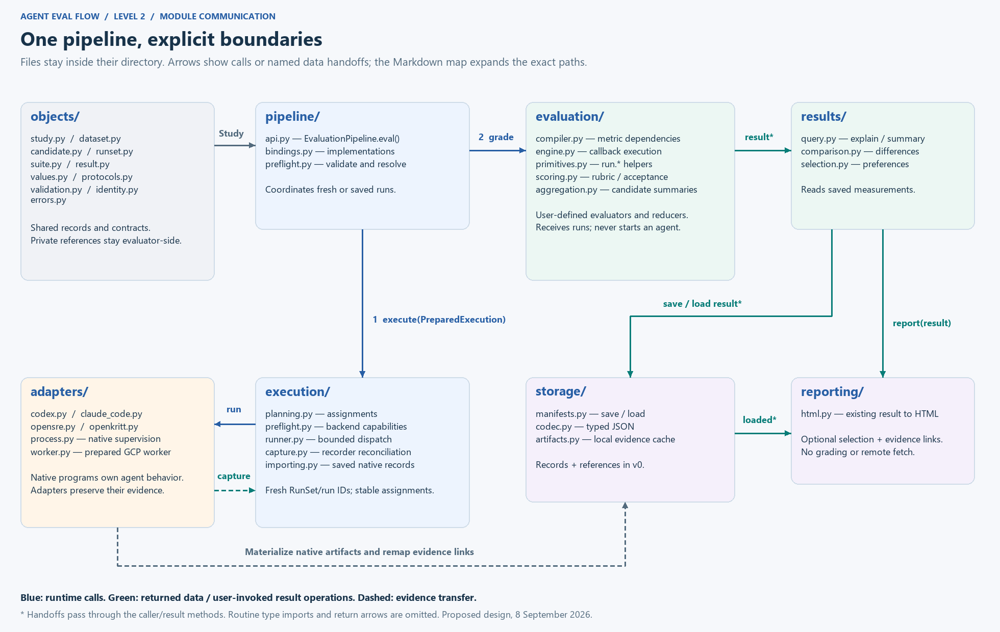
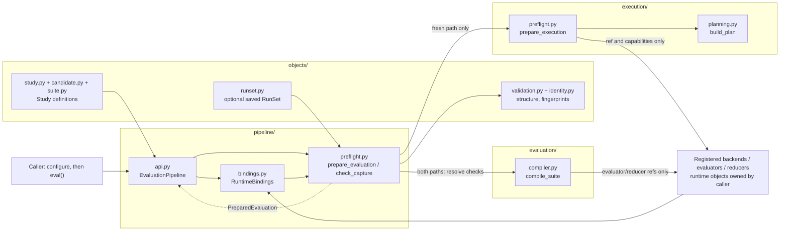
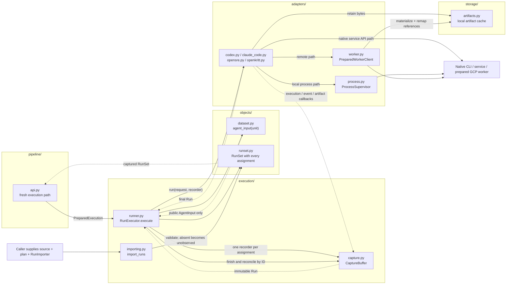
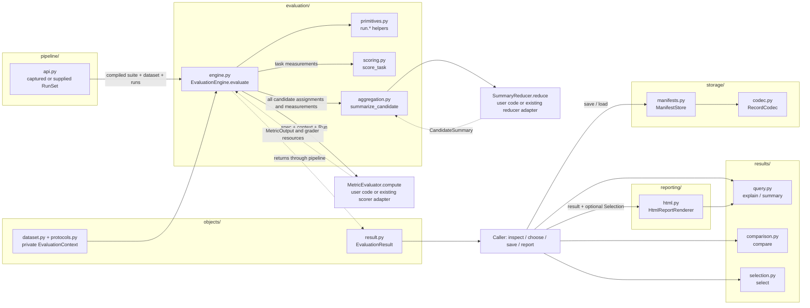

# Agent Eval Flow: module communication map

**Accepted design extension, 9 September 2026:** start with the
[unified assessment flow](UNIFIED_ASSESSMENT_FLOW.md) for the new parallel
configuration-inspection and behavioral-evaluation branches. They share a frozen
candidate and produce scoped assessments for explicit decisions. Inspection
blocks execution only when a policy declares that dependency. This extension is
not implemented and does not replace revision-0.4 interfaces. The diagrams on
this page describe the earlier behavioral branch only. For the detailed new
call graph, use [one assessment invocation through the modules](lld/README.md#one-assessment-invocation-through-the-modules)
and the [shared assessment contract](lld/ASSESSMENT_CONTRACT.md).

For the final-review design, use the [current grouped communication graph](lld/README.md#communication-grouped-by-directory)
and eight detailed module pages. The generated image/draw.io assets below
preserve the earlier level-2 view.

**Proposed level-2 design, 8 September 2026.** Files from the same directory
are grouped together. This graph records the earlier per-assignment design.
The [revision-0.4 data contract](DATA_CONTRACT.md) and updated
[level-2 architecture](LLD_LEVEL_2.md) supersede its request/output signatures.

The later [integration proposal](INTEGRATION_DECISION.md#how-the-proposed-pieces-connect)
shows how existing libraries could sit underneath the common interface. Its
native-job and batch-grading changes are now defined in revision 0.4, but are
not drawn in this earlier graph. Implementation-status statements in this
historical map are superseded by [current implementation status](IMPLEMENTATION.md).

Start with the overview, then use the three detailed graphs for exact calls.
Solid arrows are calls/data passed forward; dashed arrows are returned records
or recorder callbacks. This is a communication map, not a Python import graph.
Everything except the explicitly shown native process/worker boundary is
ordinary in-process library code, not a separate service deployment.

[Zoomable SVG](diagrams/module-communication.svg) ·
[Editable draw.io](diagrams/module-communication.drawio) ·
[Diagram generator](diagrams/build_module_map.py) ·
[Full level-2 responsibilities](LLD_LEVEL_2.md)

The overview compresses caller handoffs: an engine returns the result to the
caller, who invokes result methods. It does not directly call `results/` or
save/report automatically. `objects/` supplies contracts throughout; routine
type imports are omitted to keep the graph readable.

## 1. Prepare: definitions become a runnable or gradeable request

No agent or metric callback executes here. Saved-run preparation validates
compatibility without requiring a backend. The entire study fingerprint is
not its matching key: changing only the suite is allowed. Runtime capability
checks do not guarantee that a later network request or native process succeeds.

## 2. Execute or import: public inputs become captured evidence

The three native paths are alternatives. A prepared worker invokes the selected
adapter locally; it does not recursively launch another remote worker. Native
importers are supplied through `RunImporter`; not every adapter requires one
in v0. Imports reuse capture validators without calling an agent. A pending
or missing run remains available to the chosen evaluators.

## 3. Evaluate, inspect and save: evidence becomes usable results

The compiler's output was prepared in graph 1. The engine reuses each dependency
measurement within this call; result access invokes no evaluator. Saving and
loading preserve records and references. Loading does not connect to a backend
or fetch unavailable evidence files.

## Communication contracts to review at level 3

| Sender → receiver | Data / operation | Who owns execution? |
| --- | --- | --- |
| Caller → pipeline | `Study` and registries; `eval(runs=None)` | Pipeline coordinates the chosen path. |
| Pipeline → execution | `PreparedExecution` → `RunSet` | Executor dispatches; native adapter owns retries and stopping. |
| Executor → native adapter | `RunRequest` plus one `RunRecorder` → `Run` | Executor calls the adapter once; adapter owns declared native attempts and retries. |
| Adapter → recorder | `Execution`, `Event`, named `ArtifactRef` | CaptureBuffer reconciles identities, not metric meanings. |
| Pipeline → evaluation | `CompiledEvaluation`, dataset, `RunSet` → result | Engine runs the checks; no agent invocation. |
| Engine → metric | `MetricSpec`, `EvaluationContext`, `Run` → `MetricOutput` | Metric owns its declared measurement computation. |
| Aggregation → reducer | Candidate assignments, runs, measurements, scores → summary | Reducer owns the declared aggregation. |
| Result methods → results | Stored result plus IDs or `SelectionPolicy` | Pure record operations; no callbacks. |
| Object save/load → storage | Supported root and filesystem path | Store/codec own record encoding, not a runtime session. |
| Result report → reporting | Result, output path, optional selection | Renderer produces HTML from saved facts. |

`values.py`, `errors.py` and the protocol definitions are shared contracts,
not independent runtime services. Most of the code in this graph does not
exist yet. See the [build-versus-reuse review](ARCHITECTURE_REUSE_REVIEW.md)
before interpreting every box as a subsystem we should implement ourselves.
