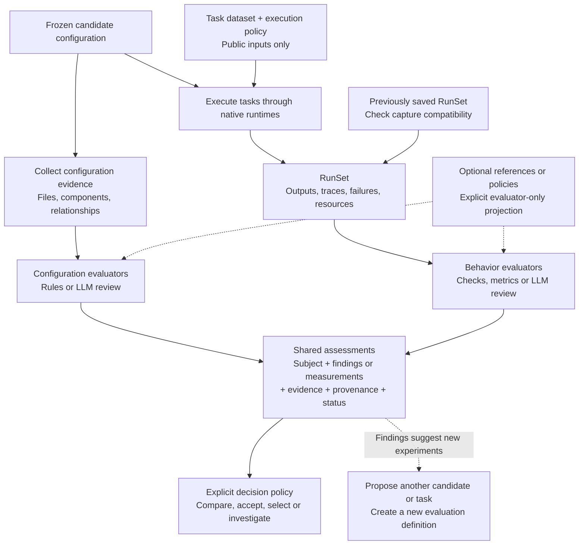

# Agent Eval Flow: unified assessment flow

**Accepted design direction — implemented initially in package 0.5.**
Configuration inspection and behavioral evaluation are peer branches that
produce assessments of the same candidate. This extends the product vision;
the [revision 0.4 API and saved-data contract](DATA_CONTRACT.md) remain unchanged. The extension uses its own v0.1 format and public
`AssessmentPipeline` entry point; see the
[implementation guide](implementation/unified_assessment.md) for runnable examples.

**LLD follow-through:** the [shared assessment contract](lld/ASSESSMENT_CONTRACT.md)
and [eight module specifications](lld/README.md) now define the extension's
records, facade, snapshot binding, parallel scheduling, failure handling,
scoped decisions and separate persistence format. They add explicit
design interfaces while preserving the current v0.4 API.

## The unified flow

Start with a frozen candidate configuration. Collect evidence from its files
and, when requested, from tasks executed through its native runtime. Evaluate
either kind of evidence using versioned checks, with references only when a
check needs them. Retain the resulting findings and measurements together with
their scope, provenance and uncertainty. Apply a separate decision policy.



These are independent branches, not a mandatory scan-then-run sequence.
Configuration evaluation can finish before, during or after behavioral work.
Behavioral evaluators wait for their required capture; reused capture starts
no agent. A policy may explicitly require an inspection gate before execution,
in which case that gate adds a dependency. Construction and planning remain
inert, and native runtimes retain their agent loops and job scheduling.

The target design supports configuration-only, behavior-only and combined
evaluation. Configuration-only work does not require an invented dataset,
assignment or agent run. The current v0.4 pipeline still requires its existing
run-oriented study; the migration below adds the new path alongside it.

## One assessment model, several evaluation methods

```text
Subject + Evidence + Versioned Evaluator + Optional References
                         -> Assessment
                         -> Decision Policy
```

| Concept | Responsibility |
| --- | --- |
| Subject | Identify what the conclusion describes: a candidate snapshot, a component within it, an identified run, or an explicitly defined study population. Use immutable identities and fingerprints, not names alone. |
| Evidence | Retain configuration artifacts or captured runtime data, their sources, collection version, scope and completeness. Relationships inferred from files remain distinct from observed runtime events. |
| Evaluator | Declare its revision, parameters, required evidence, reference inputs, subject scope and dependencies. Deterministic rules, custom metrics and LLM judges use this boundary. |
| Assessment | Keep typed measurements and structured findings, explanations, evidence links and evaluator provenance. Numeric scoring is optional; findings can stand on their own. |
| Evaluation activity | Identify the actual evaluator invocation and its resources once, even when it produces several findings or describes several subjects. |
| Decision policy | Decide which assessments justify acceptance, selection, blocking or investigation, with explicit treatment of unknowns and missing coverage. Record the policy version separately. |

An assessment distinguishes three questions: did the evaluator complete, what
did it conclude, and what evidence supports that conclusion? An invocation
error is not a failed candidate. A completed scan with no findings is not proof
of safety. Finding severity, evidence strength and eligibility to block work
are separate properties; a judge's confidence statement is not calibration.

Reference-based versus reference-free evaluation is independent of static
versus dynamic evidence. These are evaluation modes, not supervised and
unsupervised model training. Our current callbacks already permit empty
reference tables; the missing capability is assessment outside a task run.

| Evidence examined | With specific references | Without case-specific answers |
| --- | --- | --- |
| Configuration | Check a setup against a required configuration or policy. | Find broken references, conflicting instructions or suspicious relationships using general criteria. |
| Execution | Compare outputs with known answers, bugs or expected outcomes. | Inspect repeated failed actions, tool-use patterns or trace consistency using general criteria. |

## Shared result semantics

- **Preserve the subject.** A candidate finding is recorded once per applicable
  configuration assessment. Linking it to 100 task runs does not produce 100
  independent observations. Component details do not become extra trials.
- **Preserve the basis of each claim.** Detecting a credential reference is an
  observation about a file; possible exfiltration is an inference. Neither is
  an observed runtime leak. Runtime observations also require explicit scope.
- **Preserve coverage and failures.** Retain requested checks, skipped or
  unsupported inputs, parse failures and partial collection. Absence of a
  finding cannot silently turn incomplete inspection into a pass.
- **Preserve privacy boundaries.** Project only the references needed by each
  evaluator. Private expected outcomes do not enter agent inputs or unrelated
  configuration reviewers, including remote LLM reviewers.
- **Preserve resource ownership.** Count each collection/evaluation activity
  once. Keep agent execution, inspection and grading costs distinguishable;
  unavailable usage remains unknown. Reusing an assessment does not charge its
  historical activity again as newly performed work.
- **Make combination explicit.** Shared storage and reporting do not imply one
  aggregate score. A policy can require a configuration check and an outcome
  threshold independently. Advisory findings do not silently reduce task
  success rates or compensate for failed acceptance requirements.
- **Keep interpretations replaceable.** New evaluator definitions produce new
  assessments over compatible saved evidence. New decision priorities reuse
  existing assessments. Changed candidate behavior requires a new candidate
  snapshot and fresh behavioral evidence for that candidate.

Both branches must identify the same intended candidate snapshot. Capture
resolved files and relevant configuration context, including source-tool and
scope information; a mutable directory path is not a snapshot. Native effective
settings remain separately observed evidence. Missing configuration context or
configuration drift is retained and qualifies the conclusions.

If reuse is enabled, its key includes subject and evidence fingerprints,
collector/evaluator revisions, parameters and relevant reference/context
versions. A candidate ID alone cannot justify reuse. Inputs must be retained
well enough to support a claimed reevaluation; a summary report is not always
sufficient to rerun its underlying checks.

## One example through both branches

This example is hypothetical, not a benchmark result.

1. Configuration inspection reports that two skill descriptions may overlap.
   The finding describes a candidate and cites the two descriptions.
2. A captured task run records that the agent selected skill B. This is an
   observed action in that run, not yet a judgment that B was wrong.
3. A reference-based evaluator determines that the delivered answer failed the
   task's requirements. It cites the output and evaluator reference evidence.
4. The shared report links these assessments through candidate/run identity.
   Their coexistence suggests a hypothesis; it does not establish causation.
5. A new experiment compares the original candidate with revised descriptions
   on declared tasks. Its results can test whether the change helped on those
   tasks. Creating that experiment is an explicit workflow step, not an
   automatic mutation of the completed study or an unbounded optimization loop.

OpenSRE and OpenKritt remain separate studies with their own task definitions
and decision policies. This shared assessment model does not give their quality
scores a common meaning or create a cross-project leaderboard.

## Relationship to the current implementation

The existing six objects remain the behavioral evaluation path. The first
integration should add candidate assessments beside its `EvaluationResult`,
joined by candidate fingerprint in a shared assessment/report layer. Preserve
the current `RunSet` and its complete assignment inventory. A configuration
scan must not masquerade as an agent task to fit a run-only interface.

| Current boundary | Required design extension |
| --- | --- |
| `Candidate` / `ComponentSpec` | Associate captured configuration evidence and its resolved scope with the declared candidate fingerprint. |
| `Study` / `EvalDataset` | Retain the existing task study; the proposed outer AssessmentPlan defines configuration-only work without fabricated tasks. |
| `EvalSuite` / evaluator callbacks | Add scope-appropriate requests, evidence requirements and outputs. Current callbacks receiving a `Run` continue to serve the behavioral path. |
| `Measurement.run_id` / `MetricOutput.task` | Add candidate assessment records with explicit subjects; do not merely make `run_id` optional and lose identity guarantees. |
| `EvaluationActivity.run_ids` / phases | Represent configuration evaluation subjects and activity ownership alongside existing native-verifier/post-run activities. |
| `EvaluationResult.runs` | Compose current run results with companion candidate assessments; support a configuration-only result in the outer layer. |
| Storage, validation, summaries and selection | Define versioned joins, coverage, evidence provenance and scope-aware policies before generalizing existing persisted records. |

The [next-extension contract](lld/ASSESSMENT_CONTRACT.md) now specifies an outer
`AssessmentPlan` / `AssessmentResult` and `AssessmentPipeline`, including the
configuration-only path and companion result composition. These are proposed
interfaces; production constructors and the typed v0.4 API remain unchanged.

This is broader than adding a `scope` field to `MetricSpec`. The
[typed v0.4 contract](contracts/agent_eval_flow.pyi) and production constructors
do not yet expose these extensions. The [module design index](lld/README.md)
records their relationship to the existing module boundaries.

## Initial integration and verification

Use harness-eval as an optional configuration-inspection provider. Its adapter
should preserve the original JSON/SARIF report, scanner revision, selected
rules, exclusions/suppressions, scope and invocation outcome, then normalize
findings into candidate assessments. Core semantics should also support another
scanner or caller-owned checks; adopting this flow does not install or require
harness-eval.

Its configuration/reference graph is evidence for configuration assessments,
not a replacement for the execution lineage in a `RunSet`. Its built-in
verdicts remain attributed provider judgments, not our universal acceptance
policy. The reviewed source is pinned at
[`51070d5`](https://github.com/redhat-community-ai-tools/harness-eval/tree/51070d5f3374aaf740b234fa068a491133ba10de).

Before implementing a common persisted contract, verify that:

1. Configuration-only assessment produces no fake task runs and retains failed
   or partial scans.
2. Both branches can run independently against the same snapshot; an explicit
   blocking policy adds an intentional execution dependency.
3. Candidate findings and shared activity costs remain single observations
   when joined to multiple runs.
4. Save/load preserves raw reports, evidence basis, evaluator versions,
   reference projections and unknown/error states.
5. Reassessment uses saved compatible evidence without starting agents, and
   changed selection policies invoke neither scanners nor graders.
6. Existing v0.4 run results and acceptance tests retain their current meaning.

The provider's [Apache 2.0 license](https://github.com/redhat-community-ai-tools/harness-eval/blob/51070d5f3374aaf740b234fa068a491133ba10de/LICENSE)
permits integration and modification subject to its terms. Redistribution of
their code requires the license and applicable notices, marking modified
files, and retaining applicable NOTICE content if supplied. Any bundled
third-party dependencies retain their own license terms. This design update
copies no upstream implementation and changes no project license.
