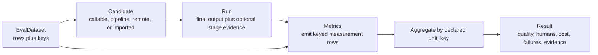
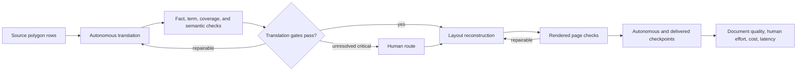
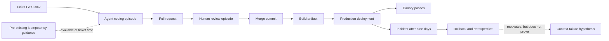
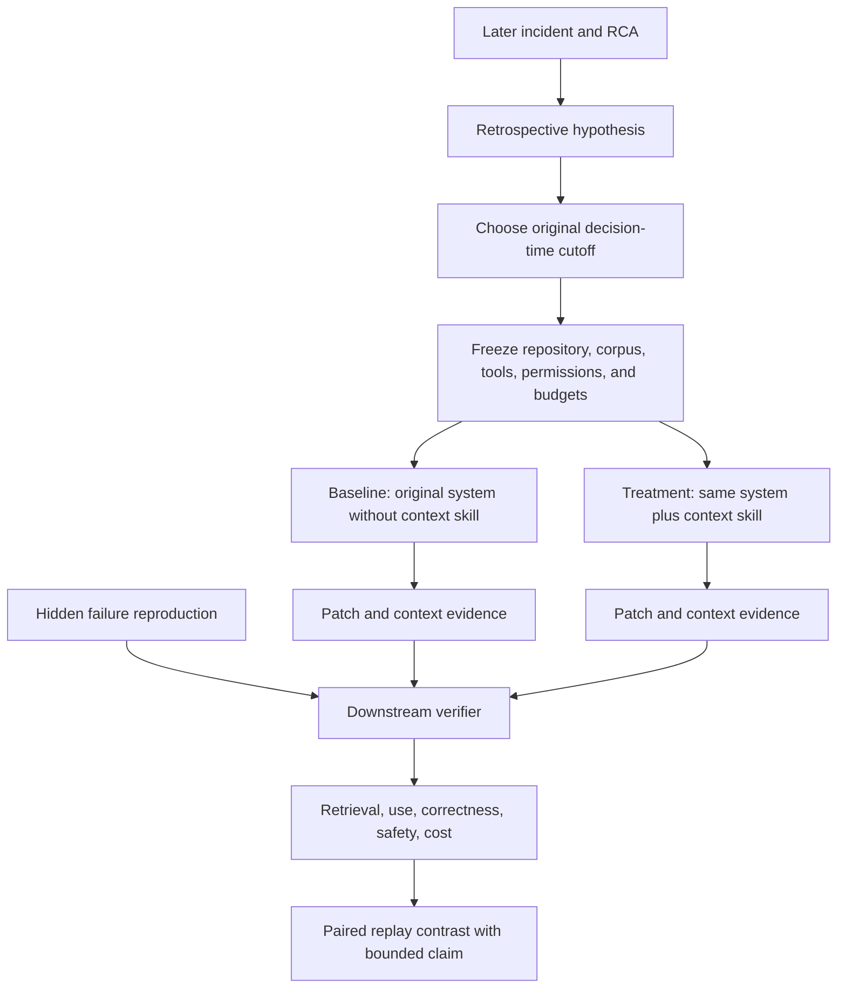
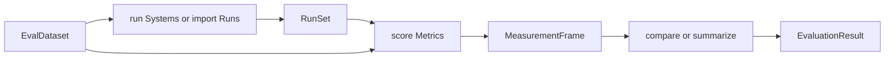
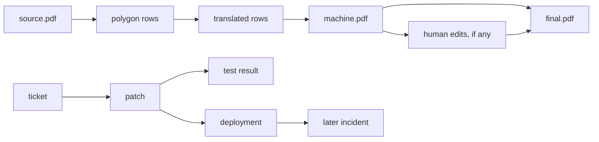
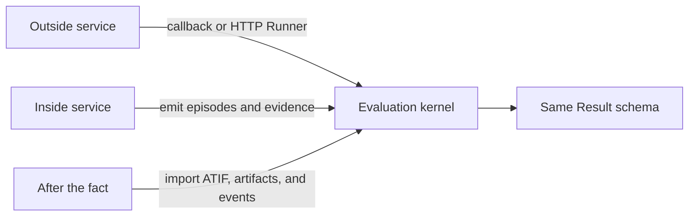

# Agent Eval Flow: workflow evaluation model

Status: working design, 2026-09-05

For current object names, constructor fields and method signatures, use the
[six-object contract](LIBRARY_OBJECT_MODEL.md). This document preserves the
workflow reasoning; its earlier API sketches are background, not the current contract.

Project name: **Agent Eval Flow**. Proposed Python import: `agent_eval_flow`.
The candidate is a complete agent system, including its model and harness.
Skills are one component that an experiment can vary. The
[visual pipeline](AGENT_EVAL_FLOW_VISION.md) shows separate OpenSRE and OpenKritt
studies, explicit score breakdowns, and configurable selection objectives. The
[layered explanation](AGENT_EVAL_FLOW_REVIEW.md) introduces the proposal before
the technical details.

Current direction: use outcome and process evidence to identify which skills,
flows, models, and harness configurations perform better, including their
interactions. OpenSRE and OpenKritt are the selected real-world testbeds; see
[the comparison with current work](WHAT_AGENT_EVAL_FLOW_ADDS.md). The tender
example remains an illustration of how measurements support that comparison.

This document refines the original prompt-response model using two real systems:
a multilingual tender-document workflow and a ticket-to-production DevOps
workflow. The examples are concrete, but the objects are deliberately generic.

## 1. Start with the smallest useful call

The ordinary user should not have to author an ontology or probability
distribution. The minimum useful API is:

```python
result = evaluate(
    candidate=my_system,
    data=my_eval_data,
    metrics=[quality, human_effort, cost],
)
```

This requires four ideas only:

1. `EvalDataset`: records plus their keys and optional targets.
2. `Candidate`: something that can process one evaluation unit, or imported
   outputs from something that already did.
3. `Metric`: a function that turns data and evidence into measurement rows.
4. `Result`: the measurements, summaries, failures, evidence links, and display
   methods.

Everything else is an optional layer required by a particular question:

| Need | Optional object |
| --- | --- |
| Compare a skill, model, tool, or pipeline revision fairly | `Study`, `Arm`, `Contrast`, `Design` |
| Make a claim beyond the supplied dataset | `PopulationSpec` and sampling weights |
| Inspect intermediate pipeline stages | `StageRecord` and `ArtifactRef` |
| Combine polygons, pages, or events without fake sample inflation | `unit_key`, row keys, and `AggregationPlan` |
| Include human review or several agent sessions | `Episode` records |
| Measure after deployment | `OutcomeWindow` and as-of result revisions |

`PopulationSpec`—formerly called `WorkItemDistribution`—is explicitly
optional. If it is absent, the result says only:

> These are the measurements on this supplied evaluation dataset.

If it is present and the sampling assumptions are defensible, the result may
also estimate performance for that target population. The library records the
claim scope; it does not pretend a hand-curated dataset is a random sample.

## 2. The practical data model

### 2.1 Rows and keys, not mandatory domain classes

The user's existing tender data has the correct starting shape:

```text
doc_id | page | poly | ...input fields... | ...optional target fields...
```

Agent Eval Flow should preserve that shape. A dataset declares:

- `row_key`: the fields that uniquely identify a record;
- `unit_key`: the root unit assigned to a candidate and treated as independent
  in comparison statistics;
- input columns and artifact references;
- optional target/reference columns; and
- optional group, weight, split, and privacy columns.

```python
tenders = EvalDataset.from_frame(
    polygons_df,
    row_key=("doc_id", "page", "poly"),
    unit_key=("doc_id",),
    inputs=("source_text", "kind", "bbox", "source_pdf"),
    targets=(),                       # no full golden translation
    groups=("source_lang", "risk"),
)
```

`doc_id` is the evaluation and statistical unit. `(doc_id, page, poly)` is the
measurement grain. No `WorkItem` object is required in user code; a grouped
unit view can be created internally when a candidate runs.

For data with different grains, the dataset may contain named related tables:

```python
tenders = EvalDataset.from_frames(
    units=documents_df,               # one row per doc_id
    records={"polygons": polygons_df},
    unit_key=("doc_id",),
    row_keys={"polygons": ("doc_id", "page", "poly")},
)
```

This is enough for documents, videos with frames, conversations with turns,
repositories with files, and tickets with lifecycle events. Domain adapters can
add convenience schemas without changing the core.

### 2.2 The execution-to-result path



The candidate can be used four ways:

```python
CallableCandidate(fn)          # run a Python callable
Pipeline([...])                # compose an evaluation harness locally
RemoteCandidate(url=...)       # call an existing service
ImportedRuns.from_atif(...)    # do not execute; grade existing evidence
```

The project borrows scikit-learn's stable contracts, composition, cloning,
parameter inspection, and result ergonomics—not necessarily its exact
`fit/predict` verbs. The natural evaluation verbs are `run`, `measure`,
`compare`, and `report`. Metrics that learn calibration parameters may expose
`fit(calibration_data)` before they are frozen and used on the test set.

### 2.3 Comparative claims are an added layer

For a declared intervention $A \in \{0,1\}$, root unit $U$, and final outcome
$Y$, a paired comparison on a supplied dataset $C$ estimates:

```math
\widehat{\tau}_C =
\frac{\sum_{i=1}^{n} q_i\left(Y(u_i,1)-Y(u_i,0)\right)}
     {\sum_{i=1}^{n} q_i}.
```

Only if a target population $D$ and sampling argument are supplied does the
broader estimand become relevant:

```math
\tau_D = \mathbb{E}_{U \sim D}[Y(U,1)-Y(U,0)].
```

Polygons, pages, agent events, and repeated attempts remain measurements nested
inside $u_i$; they do not silently become independent samples.

## 3. Worked case: multilingual tender documents

### 3.1 The decision

Assume a team receives multilingual digital and scanned tenders whose geometry
and hierarchy are contractual information. The workflow uses OCR and visual
segmentation, builds a document-region tree, translates large regions, validates
the translations without requiring a full golden document, reconstructs the
original layout, and sends uncertain or high-risk regions to humans.

The decision is not merely “which translation model is better?” It can be:

> On held-out tender documents, does a ReAct agent with
> `document-context-skill-v2` reduce critical document defects and human review
> time, without increasing cost beyond the declared budget?

### 3.2 The production-shaped flow

```mermaid
flowchart LR
    PDF["Source tender PDF"] --> EX["Native extraction or OCR"]
    PDF --> SG["Visual region proposals"]
    EX --> HT["Hierarchy and reading-order builder"]
    SG --> HT
    HT --> RT["Document region tree"]
    RT --> TR["Context-aware region translation"]
    TR --> QE["Terminology, entity, number, omission, and QE checks"]
    QE -->|"bounded repair"| TR
    QE -->|"critical or uncertain"| HR["Human review"]
    TR --> RC["Layout reconstruction"]
    HR --> RC
    RC --> RV["Rendered-page validation"]
    RV -->|"overflow or collision"| RC
    RV --> OUT["Translated PDF and evidence bundle"]
```



SAM-like masks are region proposals, not a complete document model. Semantic
types, containment, table structure, and reading order are separate artifacts.
A ReAct agent orchestrates typed tools and bounded repairs; it does not turn an
opaque PDF into an equally opaque final answer.

### 3.3 The actual input is `doc_id, page, poly`

The example starts with the structure that existed in the original system. The
rows below are illustrative fixtures, not benchmark results:

| `doc_id` | `page` | `poly` | Kind | Bounding box, px | Original French | Risk |
| --- | ---: | ---: | --- | --- | --- | --- |
| `TND-017` | 3 | 41 | heading | `[118,92,1118,152]` | `Date limite de remise des offres : 15/09/2026 à 12 h 00` | deadline |
| `TND-017` | 3 | 42 | key-value | `[118,171,710,220]` | `Cautionnement provisoire : 250 000 EUR` | money, critical |
| `TND-017` | 7 | 112 | paragraph | `[92,610,1126,690]` | `Réhabilitation de deux ouvrages d'art au PK 18+400` | terminology |
| `TND-017` | 9 | 205 | paragraph | `[94,812,1128,872]` | `Le titulaire dispose de dix-huit (18) mois à compter de l'ordre de service.` | duration, layout |

The corresponding dataset declaration is small:

```python
tenders = EvalDataset.from_parquet(
    "tender_polygons.parquet",
    row_key=("doc_id", "page", "poly"),
    unit_key=("doc_id",),
    inputs=("source_text", "kind", "bbox", "source_pdf"),
    targets=(),  # no full golden translation
)
```

The source table remains the main data structure. Page and polygon do not need
to become elaborate core objects.

### 3.4 What the agent actually does

Both experimental arms get the same source rows, model, OCR, renderer,
glossary, tools, and budgets. Only availability of
`tender-document-skill-v2` changes.

```text
Baseline agent                       Agent with skill
--------------                       ----------------
read polygon                         read polygon and nearby context
call translator                      call translator
write translated polygon             run fact, terminology, and semantic checks
assemble page                         retrieve supporting context when needed
render document                       repair bounded translation failures
finish                               assemble and render page
                                     inspect overflow and collision evidence
                                     repair bounded layout failures
                                     finish or route unresolved risk to a human
```

The following is one literal trace for polygon 112:

```text
e301 AGENT.SELECT     key={doc_id:TND-017,page:7,poly:112}
e302 AGENT.CALL       tool=translator
                      input="Réhabilitation de deux ouvrages d'art au PK 18+400"
e303 AGENT.WRITE      text="Restoration of two works of art at chainage 18+400"
e304 CHECK.COMPUTE    metric=mandated_term_match value=0 status=fail
e305 AGENT.RETRIEVE   query="ouvrage d'art civil engineering"
                      corpus=project_glossary
                      hit=glossary.csv#row-203
e306 AGENT.READ       ref=glossary.csv#row-203
                      content="ouvrage d'art -> civil-engineering structure"
e307 AGENT.CALL       tool=translator context_refs=[glossary.csv#row-203]
e308 AGENT.WRITE      text="Rehabilitation of two civil-engineering structures at chainage 18+400"
e309 CHECK.COMPUTE    metric=mandated_term_match value=1 status=pass
e310 CHECK.COMPUTE    metric=semantic_qe value=0.98 status=pass
e311 AGENT.ACCEPT     key={doc_id:TND-017,page:7,poly:112} human=false
```

For polygon 205, the translation is already correct; the rendered geometry is
not:

```text
e411 AGENT.WRITE      text="The contractor has eighteen (18) months from the notice to proceed."
e412 SYSTEM.RENDER    page=9 renderer=layout-engine-v3
e413 CHECK.COMPUTE    metric=overflow_ratio value=0.180 status=fail
e414 AGENT.CALL       tool=reflow_text constraints={min_font_pt:8.0}
e415 SYSTEM.RENDER    page=9 renderer=layout-engine-v3
e416 CHECK.COMPUTE    metric=overflow_ratio value=0.000 status=pass
e417 CHECK.COMPUTE    metric=minimum_font_pt value=8.4 status=pass
e418 AGENT.ACCEPT     key={doc_id:TND-017,page:9,poly:205} human=false
```

These event rows answer “what did the agent select, retrieve, read, write, run,
and repair?” Input/output references are sufficient to derive lineage. A user
does not have to manually construct an `EvidenceGraph`.

### 3.5 Four concrete polygon outcomes

| Poly | Autonomous attempt 1 | Detected issue | Agent repair | Final measurements |
| ---: | --- | --- | --- | --- |
| 41 | `Submission deadline: 15 September 2026 at 12:00` | None | Accept | semantic `0.99`; date `1`; overflow `0`; pass |
| 42 | `Bid bond: EUR 25,000` | One zero was lost: source `250000 EUR`, target `25000 EUR` | Preserve extracted monetary fact and retry: `Bid bond: EUR 250,000` | semantic `0.96→0.99`; amount `0→1`; pass |
| 112 | `Restoration of two works of art at chainage 18+400` | Wrong domain sense for `ouvrage d'art` | Retrieve glossary row and rewrite | semantic `0.71→0.98`; mandated term `0→1`; pass |
| 205 | Correct translation, but it extends outside the polygon | Rendered glyph overflow `18%` | Reflow at `8.4 pt`; translation unchanged | duration `1`; overflow `0.18→0`; font gate pass |

A stored output does not need a universal graph-shaped JSON document. It can be
an ordinary keyed record with attempts:

```yaml
doc_id: TND-017
page: 3
poly: 42
run_id: skill-v2-run-0081
source:
  text: "Cautionnement provisoire : 250 000 EUR"
  bbox_px: [118, 171, 710, 220]
  risk: critical_money
attempts:
  - attempt: 1
    translated_text: "Bid bond: EUR 25,000"
    measurements:
      semantic_qe: 0.96
      critical_fact_preservation: 0.0
    finding:
      code: amount_changed
      expected: {kind: money, value: 250000, currency: EUR}
      observed: {kind: money, value: 25000, currency: EUR}
    action: retry
  - attempt: 2
    translated_text: "Bid bond: EUR 250,000"
    measurements:
      semantic_qe: 0.99
      critical_fact_preservation: 1.0
      overflow_ratio: 0.0
    action: accept
final:
  human_routed: false
  cost_usd: 0.0039
  latency_ms: 1840
```

This example also shows why one LLM-judge number is unsafe: attempt 1 receives a
strong semantic score of `0.96` while changing the bid bond by a factor of ten.
The deterministic critical-fact gate catches the actual failure.

### 3.6 What is measured, step by step



1. At each polygon, measure source coverage, facts, terminology, semantic
   quality, and translation attempts.
2. At each page, render the actual pixels and measure clipping, overflow,
   collisions, reading order, and minimum font size.
3. Before human intervention, freeze the autonomous output and its quality.
4. Record every production human route, edit, and active minute.
5. Preserve the delivered output separately from the autonomous output.
6. At document level, apply quality gates first. Only among feasible documents
   compare human effort, cost, and latency.

The metric output stays tidy and keyed like the input:

| Run | `doc_id` | Page | Poly | Checkpoint | Metric | Value | Pass | Evidence |
| --- | --- | ---: | ---: | --- | --- | ---: | --- | --- |
| `base-0041` | `TND-017` | 3 | 42 | autonomous | `critical_fact_match` | 0.00 | no | attempt-1.json |
| `skill-0081` | `TND-017` | 3 | 42 | autonomous | `critical_fact_match` | 1.00 | yes | attempt-2.json |
| `base-0041` | `TND-017` | 7 | 112 | autonomous | `mandated_term_match` | 0.00 | no | target-v1.txt |
| `skill-0081` | `TND-017` | 7 | 112 | autonomous | `mandated_term_match` | 1.00 | yes | target-v2.txt |
| `base-0041` | `TND-017` | 9 | 205 | autonomous | `overflow_ratio` | 0.18 | no | page-9-v1.png |
| `skill-0081` | `TND-017` | 9 | 205 | autonomous | `overflow_ratio` | 0.00 | yes | page-9-v2.png |

The statistical comparison still groups these rows by `doc_id`. Six hundred
polygon measurements explain one document; they are not 600 independent
tenders.

### 3.7 What “good” means

A good result is not the largest average score. It is:

> A correct, complete, well-rendered translated document, produced with zero
> production human touches, at the lowest cost among systems satisfying every
> quality gate.

```python
quality_pass = (
    translated_pdf_rendered
    and required_polygons_present == total_required_polygons
    and critical_facts_correct == total_critical_facts
    and unresolved_critical_translation_errors == 0
    and clipped_critical_polygons == 0
    and page_render_failures == 0
)

fully_autonomous = quality_pass and production_human_routes == 0
winner = min(
    (candidate for candidate in candidates if candidate.fully_autonomous),
    key=lambda candidate: candidate.total_cost_usd,
)
```

Quality and zero-human operation are constraints. Cost is optimized afterward;
a cheap run cannot compensate for a wrong monetary value.

An illustrative result for one 42-page document is:

```yaml
doc_id: TND-017
output_pdf: artifact://runs/skill-v2-run-0081/TND-017-en.pdf@sha256:...
required_polygons: 612
translated_and_aligned_polygons: 612
critical_facts: {correct: 139, total: 139}
mandated_terms: {correct: 87, total: 87}
semantic_qe: {mean: 0.972, p05: 0.925}
render:
  pages_passed: 42
  pages_total: 42
  clipped_critical_polygons: 0
  unresolved_collisions: 0
production_human_routes: 0
production_human_minutes: 0
translation_attempts: 630
layout_repairs: 4
total_cost_usd: 1.84
wall_time_seconds: 454
quality_pass: true
fully_autonomous: true
```

A candidate comparison should therefore look like constrained selection, not a
single blended score:

| Candidate | Autonomous gates | Delivered PDF | Human routes | Human minutes | Cost | Decision |
| --- | --- | --- | ---: | ---: | ---: | --- |
| Small model, no skill | fail | pass after correction | 31 | 74 | `$1.29` | infeasible |
| Small model + skill v2 | pass | pass | 0 | 0 | `$1.84` | selected |
| Large model + skill v2 | pass | pass | 0 | 0 | `$7.42` | feasible but cost-dominated |

All values in this section are example fixtures used to define expected library
behavior.

### 3.8 The code-like library flow

The local pipeline is a convenience harness, not a requirement:

```python
candidate = Pipeline([
    Stage("extract", extract_or_load_polygons),
    Stage("translate", react_translate, params={"skill": "v2"}),
    Stage("translation_checks", online_translation_checks),
    Stage("bounded_repair", repair_failed_polygons, params={"max_attempts": 2}),
    Stage("render", reconstruct_pdf),
    Stage("render_checks", online_render_checks),
    Stage("human_route", route_unresolved_findings),
])

result = evaluate(
    candidate=candidate,
    data=tenders,
    metrics=[
        CriticalFactPreservation(),
        MandatedTerminology(),
        SemanticQE(model="pinned-qe-version"),
        RenderedOverflow(),
        HumanTouches(),
        TotalCost(),
    ],
    gates=tender_quality_gates,
)

result.measurements()                  # keyed polygon/page/document rows
result.by("doc_id")                    # one result per document
result.feasible_candidates()           # all hard gates passed
result.pareto(objectives=["human_minutes", "cost_usd", "latency"])
```

An existing production service uses the same evaluation layer without adopting
this `Pipeline`:

```python
result = evaluate(
    candidate=RemoteCandidate("https://translator.internal/v1/run"),
    data=tenders,
    metrics=tender_metrics,
)

# Or grade completed production evidence without running anything.
result = evaluate_runs(
    runs=ImportedRuns.from_jsonl("production-events.jsonl"),
    data=tenders,
    metrics=tender_metrics,
)
```

If checks are fed back into repair, they are part of the candidate pipeline and
must be identical across experimental arms unless the check itself is the
intervention. Independent offline metrics then score the final artifacts so the
candidate is not merely grading itself.

### 3.9 What should be compared

Use separate studies when the attribution question changes:

1. Freeze pages and compare OCR/segmentation variants.
2. Freeze the polygon table and compare model, translation skill, context
   strategy, or glossary policy.
3. Freeze approved translations and compare reconstruction engines.
4. Compare complete legacy and ReAct workflows for the total operational
   effect.

Comparing the entire legacy pipeline to the entire ReAct pipeline estimates the
total stack effect. To attribute value to the skill, hold the complete pipeline
fixed and change only skill availability.

Reference-free graders are proxies rather than truth. Their model/prompt
versions are recorded, they are calibrated on human-labeled samples, and their
agreement does not override deterministic critical-fact failures.

## 4. Worked case: did missing context cause a DevOps issue?

### 4.1 The original lifecycle creates a hypothesis

Suppose ticket `PAY-1842` asks an agent to retry payment-provider timeouts. At
ticket time, the authorized repository already contains an idempotency ADR. The
agent adds retries, a human approves the change, it is deployed, and duplicate
charges appear nine days later.



The later issue is evidence that a decision deserves investigation. It does
not prove that the agent lacked context, that a context skill would have helped,
or that the agent alone caused the outcome after human approval.

### 4.2 Diagnose the mechanism before naming the treatment

Let a relevant context item be available at the decision time. The evidence can
support different failure classes:

| Class | Meaning | Appropriate intervention |
| --- | --- | --- |
| `unavailable` | The item did not exist, was not indexed, or permission denied access | Fix data availability or permissions |
| `not_retrieved` | It was available but no search/read event returned it | Retrieval or context-discovery skill |
| `lost_or_stale` | It was retrieved but demonstrably evicted, superseded, or replaced before the decision | Retention, summarization, or memory-governance skill |
| `misread` | An explicit representation contradicted the source | Comprehension or verification intervention |
| `ignored` | The rule was correctly represented but the patch violated it | Decision policy or enforcement guard |
| `verification_failure` | Context was adequate, but tests/review failed to catch the defect | Test generation, review, or deployment policy |
| `indeterminate` | Available telemetry cannot distinguish these pathways | Improve evidence collection; do not guess |

If the runtime does not expose active-context residency, a bad answer is not
proof of eviction. The evaluator should return `indeterminate` rather than
invent a mechanism.

### 4.3 The correct experiment is a time-correct paired replay



The two arms receive exactly the same ticket, repository commit, time-sliced
search corpus, tool schemas, permissions, model, orchestrator, seed, and
budgets. The only permitted difference is the context-management skill.

The missing ADR must not be injected only into the treatment. That would test
“giving the answer” rather than context management. The skill must discover,
retain, and use the ADR from the same corpus available to the baseline.

The incident reproduction can be a hidden verifier after the patch is
finalized, but the incident, RCA, rollback, later comments, and future documents
must be invisible to both agents.

```yaml
replay:
  source_work_item: PAY-1842
  cutoff: 2026-09-05T09:00:00Z
  temporal_snapshot:
    repository: git://payments-service@4c91...
    search_corpus: artifact://engineering-index/2026-09-05T09:00Z@sha256:...
    tool_contracts: artifact://dev-agent-tools-v3@sha256:...
    permissions: artifact://permissions/PAY-1842@sha256:...
  permitted_difference:
    component: context-management-skill
    baseline: absent
    treatment: sha256:...
  hidden_verifier: artifact://fault-replay/duplicate-charge-v1@sha256:...
  claim_scope: PAY-1842 time-correct replay environment
```

### 4.4 What each replay agent actually does

The following traces are concrete example fixtures. They describe the same
ticket and frozen world; only the context skill differs.

```text
BASELINE
00:00 READ      ticket PAY-1842: retry provider timeouts
00:04 SEARCH    query="retry timeout" -> src/provider_client.py
00:19 READ      src/provider_client.py
00:39 WRITE     retry loop; create a new request identifier on every attempt
00:58 WRITE     timeout/recovery unit test
00:73 RUN       pytest -> 18 passed
00:78 FINISH    patch=artifact://replay/base.patch@sha256:...
00:81 VERIFY    hidden duplicate-charge workload -> 3 duplicate charges, FAIL

CONTEXT SKILL
00:00 READ      ticket PAY-1842: retry provider timeouts
00:02 PLAN      context needs=[retry semantics, idempotency, prior decisions]
00:08 SEARCH    query="payment retry idempotency ADR"
00:11 RETRIEVE  docs/adr/027-idempotency.md
00:16 RECORD    constraint="reuse one idempotency key across all retries"
00:22 READ      src/provider_client.py
00:31 WRITE     retry loop; create key once before the loop and reuse it
00:51 WRITE     duplicate-response regression test
00:78 RUN       pytest -> 19 passed
00:83 FINISH    patch=artifact://replay/context-skill.patch@sha256:...
00:87 VERIFY    hidden duplicate-charge workload -> 0 duplicate charges, PASS
```

The essential patch difference is equally concrete:

```python
# Baseline: a new provider request identity on every retry.
for attempt in retry_policy:
    provider.charge(order, request_id=uuid4())

# Treatment: the context-derived constraint is applied.
request_id = stable_idempotency_key(order.id)
for attempt in retry_policy:
    provider.charge(order, request_id=request_id)
```

The hidden verifier still checks that the requested retry behavior works. A
patch that avoids duplicates by removing all retries does not pass.

### 4.5 Measure mechanism and outcome separately

| Stage | Example metric | Role |
| --- | --- | --- |
| Availability | relevant context was present and authorized | Diagnostic prerequisite |
| Retrieval | relevant-context recall, precision, time to first relevant item | Mechanism diagnostic |
| Retention | context present in window or external ledger at decision | Mechanism diagnostic |
| Interpretation | structured summary agrees with ADR | Mechanism diagnostic |
| Use | idempotency constraint is reflected in patch and test | Mechanism diagnostic |
| Downstream | duplicate-charge fault replay passes while ticket objective still passes | Primary outcome |
| Resources and safety | tokens, latency, irrelevant context burden, unsafe access, prompt-injection following | Cost and gate |

The resulting measurement frame can be inspected without reading a report:

| Ticket | Arm | Checkpoint | Metric | Baseline | Context skill | Role |
| --- | --- | --- | --- | ---: | ---: | --- |
| `PAY-1842` | paired | input | relevant documents available | 2/2 | 2/2 | precondition |
| `PAY-1842` | paired | retrieval | relevant-context recall | 0.00 | 1.00 | diagnostic |
| `PAY-1842` | paired | decision | idempotency constraint recorded | 0 | 1 | diagnostic |
| `PAY-1842` | paired | patch | constraint applied correctly | 0 | 1 | diagnostic |
| `PAY-1842` | paired | visible tests | ticket tests pass | 1 | 1 | required gate |
| `PAY-1842` | paired | hidden verifier | duplicate charges | 3 | 0 | primary evidence |
| `PAY-1842` | paired | hidden verifier | issue avoided | 0 | 1 | primary outcome |
| `PAY-1842` | paired | execution | cost, USD | 0.18 | 0.27 | resource |

This example is consistent with a `not_retrieved` context failure: the ADR was
available to both arms, only the treatment retrieved it, the treatment recorded
and applied its constraint, and only the treatment avoided the reproduced
failure. If both arms retrieved the ADR but the baseline ignored it, the target
would instead be reasoning or policy—not retrieval.

The primary endpoint should be downstream correctness, not “the agent opened
the ADR.” Retrieval and use explain a possible pathway; they do not replace the
outcome. A skill that reads everything may improve recall while making the
system slower, less private, or more vulnerable to instructions embedded in
untrusted documents.

The strongest valid conclusion from this study is:

> In a paired replay frozen to the information and tools available when
> `PAY-1842` began, adding the context-management skill changed retrieval and
> application of the idempotency constraint and changed avoidance of the
> reproduced duplicate-charge failure.

This supports or weakens the context-management hypothesis for this replay. It
does not prove the sole cause of the historical incident or predict a
production-wide incident reduction. A broader claim needs a prospectively
frozen cohort of eligible tickets, ideally with randomized skill assignment.

### 4.6 The code-like library flow

```python
tickets = EvalDataset.from_records(
    [{
        "ticket_id": "PAY-1842",
        "prompt": "Retry payment-provider timeouts",
        "repo_ref": "git://payments-service@4c91...",
        "context_snapshot": "artifact://engineering-index/2026-09-05T09:00Z",
        "hidden_verifier": "artifact://fault-replay/duplicate-charge-v1",
    }],
    row_key=("ticket_id",),
    unit_key=("ticket_id",),
)

baseline = Variant(
    "base",
    coding_agent.without("context-management-v2"),
)
treatment = Variant(
    "context-skill",
    coding_agent.with_skill("context-management-v2"),
    changed={"skill": "context-management-v2"},
)

runs = run(
    data=tickets,
    variants=[baseline, treatment],
    runner=SandboxRunner(),
    design=Paired(repeats=20, same_seed=True),
)

measurements = score(runs, metrics=[
    RelevantContextRecall(),
    ConstraintApplication(),
    VisibleTicketTests(),
    HiddenIssueAvoidance(),
    UnsafeContextAccess(),
    TotalCost(),
])

result = compare(
    measurements,
    candidate="context-skill",
    reference="base",
    unit="ticket_id",
)
```

Twenty stochastic repeats improve the estimate for this selected ticket; they
do not turn one incident-derived case into a representative population. A
broader claim needs more independently selected tickets.

### 4.7 Delayed production outcomes are not ordinary zeros

An observation window is anchored to a checkpoint such as deployment:

```yaml
outcome_window:
  id: escaped-payment-defect-30d
  anchor: deployment.production_completed
  horizon: P30D
  adverse_events: [incident.duplicate_charge, rollback.defect]
  competing_events: [deployment.superseded, service.decommissioned]
```

Its state can be `pending`, `event_observed`, `event_free`, `right_censored`,
`competing_event`, `lost_to_follow_up`, or `not_at_risk`. Five healthy days of
a 30-day window is not success. Results are immutable, versioned, as-of
snapshots; later incident evidence produces a new result revision rather than
rewriting the earlier report.

## 5. Objects derived top down

The examples justify a smaller core than the previous object diagram.

### 5.1 Required core



| Object | Concrete responsibility | Tender instance | DevOps instance |
| --- | --- | --- | --- |
| `EvalDataset` | Tables/records, row key, root unit key, inputs, optional references | polygons keyed by `doc_id,page,poly`; unit `doc_id` | ticket and frozen snapshot keyed by `ticket_id` |
| `System` / `Variant` | Runnable candidate or reference to an external system | ReAct translation pipeline with or without skill | coding agent with or without context skill |
| `Run` / `RunSet` | Final output, named artifacts, optional events, usage, status | translated polygon table, PDFs, render evidence | patch, tests, action trace, hidden verifier output |
| `Metric` | `(data, run) -> measurement rows` | fact preservation, overflow, human minutes, cost | retrieval, constraint use, issue avoidance, cost |
| `MeasurementFrame` | Tidy rows retaining the dataset key and metric provenance | one row for `TND-017/3/42/amount_match` | one row for `PAY-1842/hidden_issue_avoided` |
| `Gate` / `Objective` | Non-compensatory feasibility followed by optimization | valid rendered PDF and zero humans; then minimize cost | ticket objective and safety pass; then cost/latency |
| `EvaluationResult` | Runs, measurements, summaries, comparisons, evidence links, displays | document decision plus polygon drill-down | paired replay effect plus trace drill-down |

A `Run` exposes an `ArtifactSet`, not a graph the user must construct:

```python
Run(
    unit={"doc_id": "TND-017"},
    variant="small-skill-v2",
    output="artifact://runs/0081/final.pdf",
    artifacts={
        "regions": regions_frame,
        "translations": translated_polygons_frame,
        "machine_pdf": "artifact://runs/0081/machine.pdf",
        "final_pdf": "artifact://runs/0081/final.pdf",
        "render_checks": render_measurements_frame,
        "human_edits": empty_edits_frame,
    },
    events=optional_event_rows,
    usage={"cost_usd": 1.84, "wall_time_seconds": 454},
)
```

The metric protocol is similarly ordinary:

```python
class Metric(Protocol):
    def compute(
        self,
        data: EvalDataset,
        run: Run,
    ) -> MeasurementFrame: ...
```

Each measurement carries a key mapping such as
`{"doc_id":"TND-017","page":3,"poly":42}`. A mandatory `SubjectRef` class
does not improve that row.

### 5.2 Optional experimental layer

Add these only when comparing candidates or making a statistical claim:

| Object | Why it appears |
| --- | --- |
| `Study` | Freezes variants, metrics, gates, objectives, provenance, and claim text |
| `Design` | Declares pairing, repeats, order, seeds, blocks, assignment unit, and analysis unit |
| `Contrast` | Names the exact difference to estimate, such as skill present minus absent |
| `AggregationPlan` | Declares polygon→page→document reduction, weights, clusters, missingness, and uncertainty |
| `PopulationSpec` | Optional eligibility/sampling model used only for claims beyond the supplied data |

### 5.3 Optional production-lifecycle layer

The tender example needs stage names and human events. The DevOps example also
needs delayed evidence. These are extensions around `Run`, not prerequisites
for `evaluate()`:

| Extension | When required |
| --- | --- |
| `StageRecord` | Intermediate OCR, translate, repair, render, test, review, or deploy boundary matters |
| `ArtifactRef` | An output is too large or external to place in a row |
| `Episode` | Several bounded agent, human, or service sessions contribute to one unit |
| `OutcomeWindow` | An endpoint is observed only after a milestone such as deployment |
| `ResultRevision` | Late evidence changes maturity at a later `as_of` time |

An evidence graph is a derived display/query view over event input/output
references, artifacts, and episodes. This keeps the execution seam simple while
still allowing lineage such as:



Full OpenTelemetry stores, repositories, PDFs, and APM data remain external.
Only evaluation-relevant references and measurements enter the result.

### 5.4 What is borrowed from scikit-learn

| scikit-learn idea | Agent Eval Flow equivalent |
| --- | --- |
| `X` plus optional `y` | `EvalDataset` inputs plus optional references/constraints |
| `estimator.predict(X)` | `System.run(unit)` or an adapter around `predict` |
| scorer | `Metric.compute(data, run)` |
| `cross_validate` / model selection | paired `run`, `score`, and `compare` |
| `Pipeline` | optional local `Pipeline`, or a wrapped external harness/service |
| fitted calibrator | optional `Metric.fit(calibration_data)` followed by a frozen metric |

The value is a stable protocol ecosystem and composable objects, not forcing an
agent, document pipeline, and production service to pretend they are identical
estimators.

### 5.5 Append-only and as-of semantics

For longitudinal evidence, the rule is:

> Study definitions and completed runs are immutable; events are append-only;
> a result is a versioned as-of view.

Thus a human correction never overwrites the machine artifact, and a later
incident matures a pending outcome by producing a new result revision.

## 6. Why this design earns its complexity

### 6.1 It avoids four false simplifications

| Tempting simplification | Failure it creates | Design answer |
| --- | --- | --- |
| Turn every polygon or event into an independent case | Inflated sample size and lost document/ticket identity | `row_key` for drill-down and `unit_key` for assignment/analysis |
| Treat one agent session as the whole outcome | Review, deployment, and later failures disappear | Optional episodes, stage records, and outcome windows |
| Put every trace field in one result table | Domain coupling and an observability clone | Evidence references plus a small normalized measurement table |
| Infer cause from a later incident | Hindsight leakage and confounded attribution | Evidence-qualified links and time-correct controlled replay |

### 6.2 It supports three deployment modes without three data models



The runtime adapter resolves live clients, secrets, and framework-specific
objects. Wire-safe specs contain references and digests, not live clients.

### 6.3 It preserves the boundary with observability

Agent Eval Flow retains or references only:

- dataset units included in an evaluation or study;
- artifacts/events cited by metrics, contrasts, gates, or decisions;
- bounded outcome windows; and
- pseudonymous actors and evaluation roles.

It does not offer arbitrary log search, service maps, alerting, full trace
retention, or identity management. Existing telemetry products remain the
systems of record.

## 7. Where NVIDIA fits

### 7.1 First, the honest boundary

If the user has one skill folder, prompt-shaped eval cases, and wants standard
with-skill versus without-skill evidence, they should use NVIDIA
[SkillEvaluator](https://github.com/NVIDIA/SkillEvaluator) directly. Skill Eval
Flow adds little to that path.

[ACES](https://arxiv.org/abs/2608.20614) supplies the right first experimental
preset: hold the task, harness, workspace, model, and scorer fixed; make the
target skill available in one arm and unavailable in the other; execute real
agents; normalize the trajectory to ATIF; grade observable outcomes and
behavior; report Skill Lift.

Agent Eval Flow becomes useful when the NVIDIA trials must be joined to domain
tables, nested artifacts, other runners or factors, hard operational
constraints, human effort, or later outcomes.

### 7.2 Tender translation through NVIDIA, step by step

The skill repository owns the NVIDIA task assets:

```text
skills/tender-document-v2/
  SKILL.md
  evals/
    evals.json
    config.yml
    grader.py
    files/
      tender-017.pdf
      tender-017-polygons.parquet
      civil-engineering-glossary.csv
```

A simplified NVIDIA-compatible dataset entry is:

```json
{
  "skill_name": "tender-document-v2",
  "evals": [{
    "id": "tender-017",
    "prompt": "Translate the tender in /workspace/input. Preserve its structure and write translated.pdf and translated-polygons.parquet under /workspace/output.",
    "expected_output": "A complete rendered English PDF preserving contractual facts, terminology, and layout.",
    "assertions": [
      "Every required polygon is represented",
      "Monetary values, dates, units, and clause IDs are preserved",
      "The output PDF renders without clipped critical content"
    ],
    "expected_skill": "tender-document-v2",
    "files": [
      "files/tender-017.pdf",
      "files/tender-017-polygons.parquet",
      "files/civil-engineering-glossary.csv"
    ]
  }]
}
```

The NVIDIA run configuration can request repeated Harbor attempts and combine
default ACES grading with a custom document grader:

```yaml
schema_version: 1
harbor:
  task_source: evals_json
  n_attempts: 3
  pass_threshold: 0.50
  n_concurrent: 2
  resources:
    cpus: 2
    memory_mb: 4096
skill_workspace:
  mode: isolated
grading:
  mode: default_plus_custom
```

Then:

```bash
skillevaluator init-custom-grader ./skills/tender-document-v2
skillevaluator tier3 validate ./skills/tender-document-v2 --strict
skillevaluator doctor --agents codex --env-mode docker
skillevaluator tier3 evaluate ./skills/tender-document-v2 \
  --agents codex \
  --env-mode docker \
  --grading-mode default_plus_custom
```

Conceptually, SkillEvaluator performs this loop for every document and attempt:

```text
1. Harbor creates the same clean workspace and stages the PDF/polygon fixtures.
2. Baseline: agent runs with the target skill withheld.
3. Treatment: agent runs with the target skill available.
4. Agent reads rows, retrieves context, writes translations, runs checks,
   repairs, renders, and emits output artifacts.
5. Harbor records the interaction as an ATIF trajectory.
6. NVIDIA default graders score ACES behavior/outcomes.
7. evals/grader.py inspects translated.pdf and translated-polygons.parquet and
   writes document-domain custom metrics.
8. SkillEvaluator calculates baseline/treatment results and Skill Lift.
```

The custom grader contract is concrete: read the ATIF path and task entry, then
write scalar rewards. A sketch is:

```python
trajectory = read_json(env("HARBOR_ATIF_PATH"))
entry = read_json(env("HARBOR_ENTRY_JSON"))

rows = read_parquet("/workspace/output/translated-polygons.parquet")
pdf = open_pdf("/workspace/output/translated.pdf")

measurements = tender_metrics(rows, pdf, trajectory)
write_json(env("HARBOR_REWARD_JSON"), {
    "overall": float(measurements.document_quality_pass),
    "custom_metrics": {
        "critical_facts": measurements.critical_fact_rate,
        "terminology": measurements.mandated_term_rate,
        "render_valid": float(measurements.render_valid),
        "zero_human": float(measurements.human_routes == 0)
    }
})
```

There are then two valid integration modes:

```python
# Mode 1: NVIDIA owns execution and grading. Preserve its values and Skill Lift.
nvidia_result = NvidiaResults.from_directory(
    "skills/tender-document-v2/evals/results/<run-id>"
)
result = EvaluationResult.from_nvidia(nvidia_result)

# Mode 2: NVIDIA/Harbor executes; Agent Eval Flow applies richer keyed metrics.
runs = NvidiaResults.from_directory(
    "skills/tender-document-v2/evals/results/<run-id>"
).to_runs()

measurements = score(runs, metrics=tender_metrics, data=tenders)
result = compare(
    measurements,
    candidate="with_skill",
    reference="without_skill",
    unit="doc_id",
)
```

Mode 2 is where `doc_id,page,poly` matters. NVIDIA's scalar custom rewards can
remain unchanged, while Agent Eval Flow also retains every keyed polygon/page
measurement, applies document gates, measures human effort and cost, and
compares NVIDIA runs with a legacy pipeline or another runtime.

### 7.3 DevOps context replay through NVIDIA

For the historical ticket, use a native Harbor task because it needs a frozen
repository, historical context corpus, and private hidden verifier:

```text
evals/harbor/pay-1842/
  instruction.md
  environment/public/
    repo-at-4c91...
    ticket.json
    context-at-2026-09-05T09-00Z/
  tests/private/
    duplicate-charge-replay
```

The instruction says only “resolve PAY-1842 using the supplied historical
state.” It does not reveal the later incident. SkillEvaluator again runs
baseline and context-skill arms through Harbor. ATIF captures the exact
`search → retrieve → read → edit → test` sequence, while the private grader
applies the hidden duplicate-charge workload.

```python
nvidia_runs = NvidiaResults.from_directory(
    "skills/context-management/evals/results/<run-id>"
).to_runs()

replay_result = compare(
    score(nvidia_runs, data=tickets, metrics=[
        RelevantContextRecall(),
        ConstraintApplication(),
        HiddenIssueAvoidance(),
        TotalCost(),
    ]),
    candidate="with_skill",
    reference="without_skill",
    unit="ticket_id",
)

# Later production evidence can be attached without rerunning NVIDIA.
updated = replay_result.observe(
    outcome_events=production_events,
    as_of="2026-10-05T00:00:00Z",
)
```

NVIDIA supplies the controlled execution and ACES comparison. Agent Eval Flow
supplies the temporal-snapshot claim, row-level mechanism measurements,
cross-runtime comparison, and delayed outcome view.

### 7.4 Capability boundary

| Capability | NVIDIA SkillEvaluator / ACES | Agent Eval Flow responsibility |
| --- | --- | --- |
| Skill validation/security and overlap checks | First-class | Import findings when useful |
| Skill task assets and repository CLI | First-class | Consume; do not duplicate |
| Paired with/without-skill execution | First-class | `NvidiaRunner`/result adapter |
| Harbor isolation and ATIF | First-class | Normalize into runs, events, and artifact references |
| Default/custom scalar grades and Skill Lift | First-class | Preserve unchanged with provenance |
| `doc_id,page,poly` measurements | Custom code can emit summaries | General keyed `MeasurementFrame` and drill-down |
| Model × skill × pipeline/runtime comparisons | Multiple separate runs | Unified variants, designs, and contrasts |
| Quality gates then human/cost optimization | Not the central report model | `Gate`, constrained objectives, Pareto views |
| Delayed/censored outcomes | Not first-class in the reviewed public model | Outcome observation and as-of result revisions |

[SkillRoll](https://github.com/hagaiw/skillroll) can consume these results in an
iterative skill-authoring loop. It should be an optimizer/client of the stable
evaluation contract, not the definition of that contract.

## 8. Smallest coherent first release

M0 should validate three fixtures against the same schemas:

1. An imported NVIDIA/ACES paired skill study.
2. A tender-document study with document, page, and region measurements plus
   a human audit and a critical-defect gate.
3. A paired time-correct replay of a DevOps context-management skill, including
   a hidden downstream verifier and a delayed endpoint.

The first implementation should stay small:

```text
data         EvalDataset, row keys, unit keys, optional references
systems      System/Variant protocol, local/remote/import runners
runs         Run, RunSet, ArtifactSet, optional event rows, usage, failures
metrics      Metric protocol, MeasurementFrame, Gate, Objective
compare      grouping, paired contrasts, uncertainty, missingness
results      EvaluationResult, tidy exports, serialization, basic displays
adapters     NVIDIA/ATIF first; callback/HTTP and document helpers next
```

`PopulationSpec`, rich experiment designs, episodes, outcome windows, and as-of
revisions are production extensions added when the DevOps fixture reaches that
milestone. `EvidenceGraph` remains a derived view, not a required authored
schema.

The project does not initially need a workflow scheduler, document parser,
deployment controller, telemetry database, or large dashboard. Those are
producers and consumers around the evaluation kernel.

## 9. Related primary sources

- [Evaluating Skills, Not Just Agents: Agentic Continuous Evaluation of Skills](https://arxiv.org/abs/2608.20614)
- [NVIDIA SkillEvaluator](https://github.com/NVIDIA/SkillEvaluator)
- [SkillRoll](https://github.com/hagaiw/skillroll)
- [BabelDOC: Better Layout-Preserving PDF Translation via Intermediate Representation](https://arxiv.org/abs/2605.10845)
- [M3T: A New Benchmark Dataset for Multi-Modal Document-Level Machine Translation](https://arxiv.org/abs/2406.08255)
- [ICDAR 2025 Competition on End-to-End Document Image Machine Translation](https://arxiv.org/abs/2603.09392)
- [Agent Memory Benchmark](https://github.com/vectorize-io/agent-memory-benchmark)
- [MGBench](https://github.com/ostinatocc/MGBench)
- [AMA-Bench](https://github.com/AMA-Bench/AMA-Bench)
- [ContextBudget](https://arxiv.org/abs/2604.01664)
