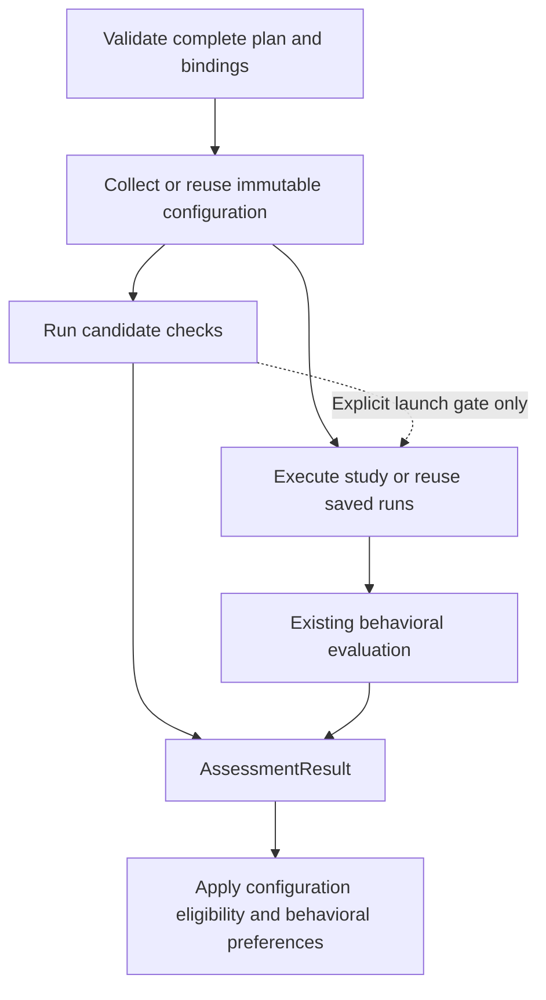

# Unified assessment implementation

The assessment extension adds `AssessmentPipeline`, `AssessmentPlan` and
`AssessmentResult` alongside the existing behavioral API. The package is
version 0.5; behavioral data keeps its v0.4 contract. Assessment plans and
results use a separate `agent-eval-flow-assessment` v0.1 envelope, with complete
v0.4 envelopes for the nested Study and EvaluationResult.



## Run the offline example

```shell
python examples/assessment_review.py --output demo-output/assessment
```

This example freezes two explicitly selected skill documents, checks a Usage
heading, saves and reloads the typed result, and renders a report. It makes no
model calls. Its document requirement is an example of a user-defined check,
not a claim about agent quality. The file collector leaves unmeasured collection
expenses unknown.

Declared check output types are validated exactly. Explicit numeric thresholds
use the existing v0.4 comparison semantics across int, float and Decimal values,
with no conversion of stored measurements; booleans are not numeric operands.

## Combine inspection and behavioral evaluation

Use an existing `Study`, its backend/evaluator bindings, a configuration
collector and a versioned configuration evaluator:

```python
from agent_eval_flow import AssessmentPipeline, AssessmentPlan, ConfigurationSpec

plan = AssessmentPlan(
    id="combined", project_id=study.project_id,
    candidates=study.candidates, behavior=study,
    configuration={
        cid: ConfigurationSpec(
            collector=collector.ref,
            params=configuration_sources[cid],
            snapshot_requirement="record_only",
        )
        for cid in study.candidates
    },
    checks=configuration_checks,
    max_concurrency=2,
)
pipeline = AssessmentPipeline(
    plan=plan, collectors={collector.ref.name: collector},
    configuration_evaluators=configuration_evaluators,
    backends=backends, evaluators=evaluators, reducers=reducers,
)
result = pipeline.eval()  # async applications: await pipeline.aeval()
result.save("results/combined")
result.report("results/combined.html", policy=assessment_policy)
```

`record_only` records configuration/runtime parity as unknown. The default
`verified` mode requires a compatible `SnapshotBinder` for fresh combined
execution. A binder prepares one complete direct request or native job, supplies
evidence and staged delegates using the existing backend protocols, and owns
cleanup. `CallbackSnapshotBinder` wraps an application-provided async context
manager; the application implements the actual environment binding. Merely
copying project files does not prove effective user-level or external settings.

`GateSpec` introduces an explicit pre-execution dependency. A failed gate blocks
the complete affected native group. Its planned runs remain `not_run`; unrelated
groups continue. Unknown gates obey `on_unknown="block"` by default; choosing
`allow` permits dispatch while retaining the factual unknown conclusion.

## Inspect with harness-eval

`HarnessEvalConfigurationEvaluator` is an optional CLI adapter for the reviewed
7.15.0 JSON dialect. It retains the raw report, stdout/stderr and invocation
settings, and normalizes findings with provider rules, severity, evidence basis
and coverage. It uses a separately installed command; the package does not
install or vendor harness-eval. Configure its `command` and `ArtifactCache`
and a `workspace_root` explicitly. See its constructor and parameter contract in
[the adapter](../../src/agent_eval_flow/adapters/harness_eval_assessment.py).

Lint and semantic review are separate, explicit checks. Review requires an
explicit model selection and can make model calls through the selected CLI;
lint does not silently invoke review or apply fixes. An empty report, skipped
rules, or omitted suppressed findings cannot establish a passing no-findings
requirement. The adapter is tested against real local fixture subprocesses and
the pinned upstream report dialect; that does not establish live compatibility
with arbitrary installed versions.

## Reuse and decision changes

```python
rechecked = pipeline.eval(
    runs=result.behavior_result.runs,
    configuration=result.configuration,
)
decision = result.select(changed_assessment_policy)
```

Supplied runs suppress backend execution; supplied configuration suppresses
collection. Selected check/metric evaluators still run. Captures must match
the requested candidates, source parameters and collector revisions. A saved
RunSet without historical snapshot proof remains unknown, even when the current
plan requests verified parity; it is never rerun to manufacture that proof.
Changing only the decision policy performs no collection, grading or execution.

Candidate reference tables use an explicit `references` registry and versioned
`plan.reference_sets`. Check requests receive only selected columns plus join
keys. Behavioral task answers are not implicitly exposed to configuration
checks. Shared assessment activities are counted once, separately from agent
execution costs. `result.resources(incremental=True)` selects only new
assessment/grading work and preserves incomplete-inventory uncertainty.

## Current boundaries

- New configuration checks dispatch per candidate. Findings can identify
  components; arbitrary component/study evaluator dispatch remains deferred.
- Snapshot preparation is application-specific. The bundled callback binder
  does not promise environment freezing for every native runtime.
- Local save/load is atomic and makes no extension or network calls. Evidence
  artifacts remain referenced; moving a manifest alone does not relocate files.
- Cancellation propagates to the caller. Its `assessment_progress` attribute
  retains acknowledged child receipts across task groups; it is a transient
  partial view, not a successful result or a resumable checkpoint.
- Reports and comparisons preserve separate configuration and behavioral
  conclusions. There are no invented confidence intervals or causal claims.
- There is no automatic assessment cache, waiver API, resumable checkpointing,
  adaptive agent scheduler or automatic upstream installation.

The [shared contract](../lld/ASSESSMENT_CONTRACT.md),
[pipeline tests](../../tests/contracts/test_assessment_pipeline.py),
[record tests](../../tests/contracts/test_assessment_objects.py) and
[adapter tests](../../tests/adapters/test_configuration_assessment.py) describe
the supported boundaries in executable form.

## Verification checkpoint

On this Windows/Python 3.12 workspace, the full suite passed **400 tests**, with
**21 existing skips**: 20 unselected live integration cases and one POSIX-only
process-containment case. This includes configuration-only and combined flows,
barrier-controlled overlap, atomic native-job gates, explicit reference isolation,
saved-source reuse, scoped identities, typed persistence, receipt reconciliation,
failure containment and cancellation progress.

The v0.5 wheel and source distribution build successfully. Distribution checks
verify packaged source and all 90 unchanged original acceptance/fixture hashes.
An installed-wheel smoke test loads and validates both behavioral v0.4 and
assessment v0.1 results, imports the optional adapters, and renders both report
templates. Dependency checks pass. The offline example also saves, reloads and
reports real captured files without model calls.
