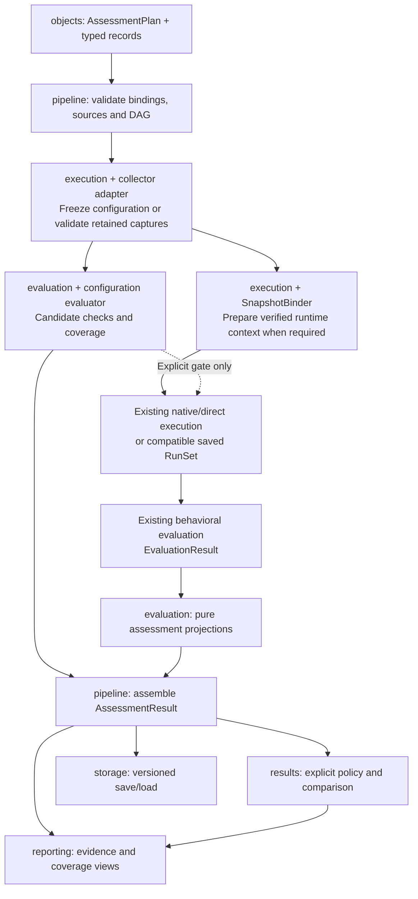
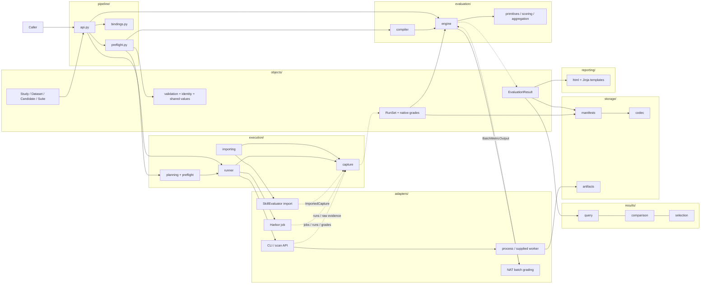

# Agent Eval Flow: module LLD and unified assessment extension

**Accepted design extension, 9 September 2026:** the
[unified assessment flow](../UNIFIED_ASSESSMENT_FLOW.md) makes configuration
inspection and behavioral evaluation peer branches over a frozen candidate.
The shared abstraction is subject, evidence, versioned evaluator and optional
references producing an assessment, followed by an explicit decision policy.
The initial extension is implemented in package 0.5; it preserves the revision-0.4
API and wire contract. See the [implemented surface and boundaries](../implementation/unified_assessment.md). Each of the eight detailed module pages now specifies the
extension's level-3 interfaces and level-4 algorithms, followed by the preserved
v0.4 behavioral specification. Start with the new
[shared assessment contract](ASSESSMENT_CONTRACT.md) for shared records,
entry points, scope and compatibility decisions.

**Implementation update, 9 September 2026:** the first library implementation
now passes the 207 offline showcase/contract tests. See
[current implementation and live integration boundaries](../IMPLEMENTATION.md).
The specifications and test-writing checkpoint below are the original design record.

**8 September 2026 — proposed design, no production implementation.** The
[test-first checkpoint](../../tests/ACCEPTANCE_MANIFEST.json) was recorded before
these level-3/level-4 module specifications were written: **222 collected cases,
205 expected missing-package setup errors and 17 unselected live cases**.
That is the original historical checkpoint. The subsequent
[showcase E2Es](../../tests/e2e/SHOWCASE.md) require richer native evidence and
refine the adapter capture bindings; see their documented LLD implications.
The [test coverage map](../../tests/README.md) explains what they require.

## Read this first: the behavioral design in under 200 words

The caller saves a Study, binds runtime connections and calls `eval()` or
`aeval()`. Pipeline preparation checks the definition and required bindings.
Execution sends a single task to a direct adapter or a complete job to a native
runtime such as Harbor. It preserves outputs, native evidence and missing work.

Evaluation reads that capture. A measurement can come from a user callback,
a batch grader such as NAT, or an already recorded native grade. Grading
activities own their expenses; results distinguish historical and new spending.
Users supply the meaning of success and the priorities used to choose candidates.

The library has eight modules. Objects owns typed records and consistency;
pipeline coordinates; execution captures; evaluation measures; results supports
inspection and selection; adapters connects existing runtimes; storage saves
data; reporting renders it.

We reuse Pydantic, AnyIO, graphlib, Jinja2 and optional native evaluation
libraries. Our implementation supplies common experiment identities, mappings,
provenance and result behavior. There is no required hosted service or new
native trial scheduler. The pages below specify each file's interfaces,
algorithms, errors, state ownership and acceptance tests.

## Unified assessment LLD: read order and module ownership

The [unified flow](../UNIFIED_ASSESSMENT_FLOW.md) defines product intent. The
[assessment contract](ASSESSMENT_CONTRACT.md) resolves common interfaces and
record identities; the module pages below specify their implementation behavior.
The implemented public records are in `objects/assessment.py`; executable boundary
coverage is linked from the [implementation guide](../implementation/unified_assessment.md).

| Detailed specification | Extension responsibility |
| --- | --- |
| [Objects](objects/README.md) | New outer plan/result, discriminated subjects, captures, check inventory, findings, namespaced activities, strict identity and behavioral-projection validation. |
| [Pipeline](pipeline/README.md) | AssessmentPipeline preparation, branch-specific explicit reuse, dependency DAG, independent failures, explicit launch gates and result assembly. |
| [Execution](execution/README.md) | Snapshot acquisition, runtime binding sessions, direct/native dispatch units, truthful blocked assignments and capture/cancellation lifetime. |
| [Adapters](adapters/README.md) | Configuration collector, separate snapshot binder and optional pinned harness-eval evaluator; report/exit-code mapping, scope, coverage and raw evidence. |
| [Evaluation](evaluation/README.md) | Candidate-check dispatch, private reference projection, unknown/partial outcomes, and pure projection of existing behavioral measurements. |
| [Results](results/README.md) | Scope-aware explanations/comparison, ConfigurationRequirement predicates, AssessmentPolicy and noncompensatory eligibility before behavioral ranking. |
| [Storage](storage/README.md) | Separate draft assessment envelope with nested unchanged v0.4 payload, atomic persistence, source-projection validation and single-owned resource accounting. |
| [Reporting](reporting/README.md) | Configuration-only/combined views, coverage and snapshot parity, provenance, explicit decisions and safe offline rendering. |

### One assessment invocation through the modules



The diagram shows a combined invocation. Saved runs bypass native execution and
SnapshotBinder; supplied configuration bypasses the collector. Config-only work
creates no dataset or RunSet. Shared preparation is not a mandatory inspection
gate: after each candidate's snapshot is ready, checks and execution can overlap
unless a policy adds a dependency. Native job groups remain indivisible.

### Proposed private additions within the eight modules

| Module | Files/services added by the extension |
| --- | --- |
| `objects` | `assessment.py`; shared validation/identity functions; collector/evaluator/binder protocol records in the boundary-record owner. |
| `pipeline` | `assessment.py`, `assessment_bindings.py`, `assessment_preflight.py`. |
| `execution` | `snapshot_assessment.py`, `configuration_assessment.py`, `snapshot_binding_assessment.py`, `dispatch_assessment.py`. |
| `adapters` | `configuration_files_assessment.py`, `snapshot_binding_assessment.py`, `harness_eval_assessment.py`. |
| `evaluation` | `configuration.py`, `assessment_projection.py`. |
| `results` | `assessment_query.py`, `assessment_comparison.py`, `assessment_selection.py`. |
| `storage` | `assessment_codec.py`, `assessment_manifests.py`, existing artifact primitives. |
| `reporting` | Assessment report view/renderer and templates specified in the reporting LLD. |

No new agent scheduler or ninth subsystem is introduced. The first implementation
dispatches configuration checks per candidate and presents existing run metrics
through source-linked projections. Component findings are supported; arbitrary
component/cohort evaluator dispatch awaits an explicit selector contract.

### Implementation and acceptance order

1. Implement strict assessment records, snapshot identities and the separate
   plan/result codec; keep v0.4 payloads and tests unchanged.
2. Implement configuration-only capture and candidate evaluation with partial
   coverage, references and namespaced activity accounting.
3. Add composition with behavioral results and pure assessment projections.
4. Add combined scheduling, SnapshotBinder sessions and explicit direct/native
   launch gates; verify independent failures and cancellation receipts.
5. Implement scope-aware policy, comparison and offline reporting; exercise the
   optional pinned scanner against owned fixtures before claiming compatibility.

The [UA01–UA12 scenarios](ASSESSMENT_CONTRACT.md#acceptance-scenarios-for-the-extension)
and each module's acceptance section define the implementation requirements.
New assessment-specific suites exercise these boundaries; the
[implementation guide](../implementation/unified_assessment.md) records the
implemented scope and deliberately deferred features.

## Existing v0.4 module directory: levels 3 and 4

| Directory / detailed specification | Level 3: files and boundaries | Level 4: completed behavior |
| --- | --- | --- |
| [objects](objects/README.md) | Six domain objects, shared values, protocols, validators and identity helpers | Strict construction, typed joins, immutable snapshots, all identity payloads, resource/inventory aggregation and import-cycle resolution |
| [pipeline](pipeline/README.md) | Facade, binding snapshot and evaluation preflight | Sync/async entry, preparation order, fresh versus saved data, compatibility, per-call state and failure propagation |
| [execution](execution/README.md) | Planning, execution preflight, runner, capture and importing | Allocation, private verifier projection, group dispatch, limits, recorder reconciliation, missing placeholders and partial native-job recovery |
| [evaluation](evaluation/README.md) | Compiler, engine, primitives, scoring and aggregation | Dependency order, single/batch/native sources, error normalization, activity accounting, all standard helpers and custom reducer containment |
| [results](results/README.md) | Queries, comparison and selection | Evidence joins, population-aware comparison, unavailable intervals, requirements, lexicographic/weighted/Pareto modes and ties |
| [adapters](adapters/README.md) | CLI/API integrations, process/worker bindings, Harbor, SkillEvaluator and NAT | Native mapping, isolated execution, source fidelity, versioned construction, cleanup and optional-package boundaries |
| [storage](storage/README.md) | Typed codec, manifest store and artifact cache | Lossless wire types, schema generation, atomic saves, load validation, local integrity and evidence portability limits |
| [reporting](reporting/README.md) | HTML renderer and packaged template/CSS | Whole-study overview, task/detail evidence, inventory-aware spending, escaping and standalone output |

Every module page is part of the final-review LLD; none is a production source
file. Public field names remain in the [typed contract](../contracts/agent_eval_flow.pyi).
Private records support implementation inside a module and are not extra
objects that a library user must configure.

## Preserved v0.4 proposed source tree

```text
src/agent_eval_flow/
├── __init__.py                       public exports; no runtime initialization
├── pipeline/
│   ├── api.py                        EvaluationPipeline, shortcuts, sync bridge
│   ├── bindings.py                   immutable registry membership
│   └── preflight.py                  fresh/saved preparation and compatibility
├── objects/
│   ├── values.py                     observations, resources, refs, common helpers
│   ├── dataset.py                    tables, inputs and keyed projections
│   ├── candidate.py                  components, variants and differences
│   ├── suite.py                      metric sources and evaluation definitions
│   ├── study.py                      study, policy, assignments and native-job plans
│   ├── runset.py                     runs, executions, native jobs and native grades
│   ├── result.py                     measured/scored/summary/selection records
│   ├── protocols.py                  public adapter and callback interfaces
│   ├── validation.py                 cross-record checks and issue reports
│   ├── identity.py                   immutable snapshots and canonical fingerprints
│   └── errors.py                     public error family
├── execution/
│   ├── planning.py                   deterministic assignment identities
│   ├── preflight.py                  binding/capability checks
│   ├── runner.py                     direct-group/native-job dispatch
│   ├── capture.py                    immutable final captures from receipts
│   └── importing.py                  native imports through the same validation
├── evaluation/
│   ├── compiler.py                   graphlib ordering and source resolution
│   ├── engine.py                     measurements, activities and result assembly
│   ├── primitives.py                 explicit run.* convenience measurements
│   ├── scoring.py                    optional rubric and threshold acceptance
│   └── aggregation.py                standard/custom candidate summaries
├── results/
│   ├── query.py                      summary and evidence inspection
│   ├── comparison.py                 candidate differences and populations
│   └── selection.py                  requirements and preference modes
├── adapters/
│   ├── process.py                    supplied containment, I/O and stop confirmation
│   ├── worker.py                     supplied prepared-runtime transport
│   ├── codex.py                      Codex CLI mapping
│   ├── claude_code.py                Claude Code CLI mapping
│   ├── opensre.py                    OpenSRE session/event and CLI mapping
│   ├── openkritt.py                   OpenKritt scan API mapping
│   ├── harbor.py                     complete native job integration
│   ├── skillevaluator.py             paired-study importer
│   └── nat.py                        actual trajectory grading in a batch
├── storage/
│   ├── codec.py                      Pydantic wire adapters and envelopes
│   ├── manifests.py                  atomic save/load
│   └── artifacts.py                  exact-byte cache and hash checks
└── reporting/
    ├── html.py                       saved-result view and rendering
    └── templates/
        ├── report.html.j2
        └── report.css
```

Packaging-only `__init__.py` files inside directories are omitted. Proposed
packaging also includes `pyproject.toml` and package data for report templates;
the project has not been scaffolded as an installable runtime yet.

## Communication, grouped by directory

This is the revision-0.4 behavioral branch. The accepted parallel configuration
branch and shared assessment boundary are shown in the
[unified flow diagram](../UNIFIED_ASSESSMENT_FLOW.md).

Solid arrows carry calls/inputs; dashed arrows return captured records. Storage
and reporting operate on data. Native grade bundles enter with the RunSet and
do not require a second native execution.



## What existing code does, and what we implement

| Existing component | Responsibility we reuse | Our responsibility |
| --- | --- | --- |
| Pydantic v2 | Record/type validation, typed JSON/schema machinery | Our field meanings, relational consistency and canonical identities |
| AnyIO | Event-loop bridge, managed threads, I/O/cancellation primitives | Dispatch ownership and evidence of actual process-tree/worker stopping |
| Python graphlib | Dependency sorting and cycle detection | Metric source/dependency rules and context projection |
| Jinja2 | HTML rendering and escaping | Report view, layout and evidence presentation |
| Harbor | Native trial/environment/agent/verifier lifecycle | Whole-job configuration mapping, planned identities and retained capture |
| SkillEvaluator | Native paired skill experiment outputs | Initial importer; optional later execution stays in its separately pinned environment |
| NAT | Native ATIF trajectory grading | Batch mapping, native failures, provenance and resource observations |
| OpenSRE / OpenKritt / CLI runtimes | Their existing agent behavior and native execution APIs | Faithful invocation and capture mapping, not another agent harness |

Core dependencies stay small; native SDKs are lazy, optional integration
dependencies. The first dependency lock must support the specified public APIs
and pass the tests before compatible ranges are advertised. SkillEvaluator's
separate environment avoids forcing its Harbor pin on the core or other worker.
The [integration research](../INTEGRATION_DECISION.md) records the evidence and
version boundaries behind these choices. A dependency pin is not a claim that
its integration has already passed.

## Decisions to review

- **One facade, eight modules:** record methods delegate to shared services;
  no second orchestration implementation behind convenience functions.
- **Native jobs remain native:** the core dispatches each group once; adapters
  own native trials/retries and enforce declared conditions. Global preflight
  validates common definitions/bindings; dialect-specific options are validated
  before that adapter's own launch. There is no universal dialect hook in 0.4.
- **Evidence survives failures:** ordinary runtime failures become captured
  outcomes, structural contradictions fail validation, and late export failure
  cannot rewrite a completed native outcome as if it never happened.
- **Expenses have an owner:** executions own agent resources; activities own
  grading resources. Unknown inventory makes full totals unknown. New versus
  historical grading stays visible without rerunning anything to fill gaps.
- **Local-first saved results:** versioned JSON and raw artifacts, atomic local
  manifests and an offline HTML report. Worker/cloud connections are supplied;
  provisioning, remote queue services and a hosted results platform are outside
  this implementation.

The full LLD now describes the approved scope. Deferred product features remain
explicit: live human pause/resume, adaptive trial generation, pairwise judging,
statistical interval estimators and optimizer training. Actual implementation,
dependency locking and prepared native test fixtures are subsequent work,
not evidence already supplied by these documents.
