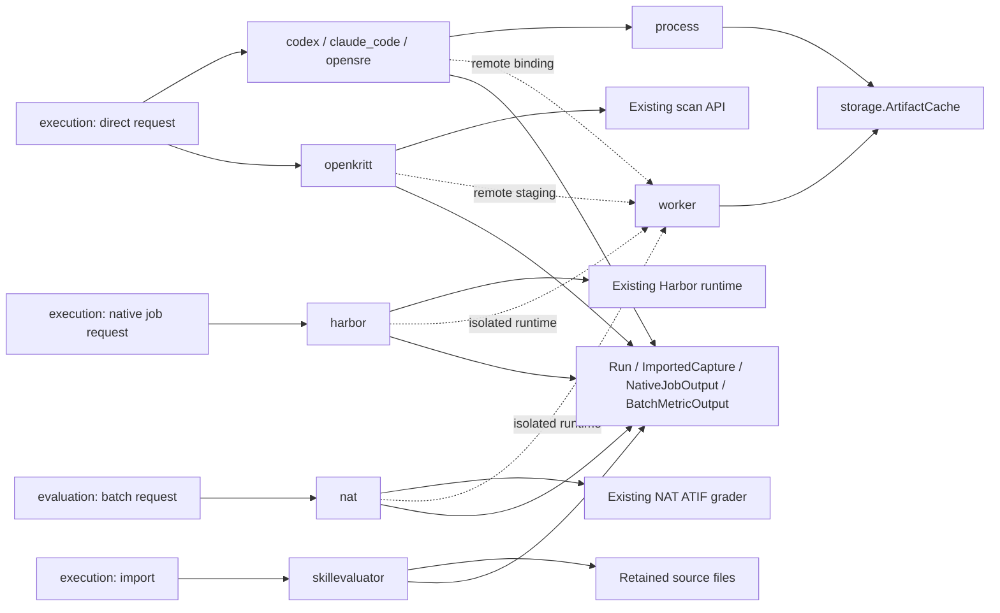

# Adapters: levels 3 and 4

**Behavioral contract 0.4; initial assessment implementation in package 0.5.**
See the [implemented surface and boundaries](../../implementation/unified_assessment.md). This module refines the private adapter details in
[level 2](../../LLD_LEVEL_2.md). The extension below adds configuration evidence
providers; existing public agent/grader records and protocols remain the
[revision-0.4 contract](../../DATA_CONTRACT.md). None of the optional library
compatibility claims below is established by collecting tests.

Adapters translate a declared agent or grader request into its existing runtime,
retain native evidence, then return the common data objects. They do not decide
whether a task succeeded scientifically. Direct CLI/API adapters own one
assignment; Harbor owns a whole native job; SkillEvaluator initially contributes
imports; NAT grades a captured batch. A prepared worker is a transport binding,
not a second agent framework or scheduling service.

## Proposed extension: configuration provider adapters

Configuration collection and evaluation are separate capabilities. They use
`ConfigurationCollector.collect` and `ConfigurationEvaluator.evaluate`, whose
requests, outputs and identity rules are defined in the
[assessment contract](../ASSESSMENT_CONTRACT.md). Neither implements
`BackendAdapter`, creates a `Run`, or receives private task answers through an
agent input. Configuration evaluators receive `AssessmentRequest` and return
`AssessmentOutput`; their checks may produce findings without numeric scores.

### Level 3: proposed files and dependencies

| Proposed file | Responsibility |
| --- | --- |
| `adapters/configuration_files_assessment.py` | `FileConfigurationCollector`: discover selected candidate sources, freeze their bytes with execution's snapshot helpers, and return source-aware configuration evidence using an explicitly selected parser/discovery configuration. |
| `adapters/harness_eval_assessment.py` | `HarnessEvalConfigurationEvaluator`: materialize retained sources for a pinned harness-eval CLI, invoke explicitly selected inspection operations, retain the native report and normalize its evidence/coverage. |
| `adapters/snapshot_binding_assessment.py` | Runtime-specific `SnapshotBinder` implementations: materialize/verify a complete dispatch unit's snapshots and provide an async `SnapshotSession` with unchanged-protocol staged backend delegates. |

Both modules depend on public assessment objects, artifact retention and the
existing process/worker services when selected. Core execution/evaluation only
depend on their protocols, never these concrete adapters. Optional imports
remain lazy; loading a saved assessment does not require harness-eval or an LLM
provider. These files extend the existing adapters module, not a ninth runtime
subsystem.

The file collector's parser/discoverer revision is distinct from the scanner
revision. The harness-eval binding pins the selected executable/upstream version,
adapter revision, report format/dialect and explicit scanner settings. Live
credentials and machine locations remain on the connection binding. Selected
rules, presets, exclusions, suppressions, scope, semantic-review model/settings
when used, and other behavior-changing options belong in the fingerprinted
check configuration. No source code from the provider is incorporated by this
design update.

### Level 3: runtime-specific snapshot binders

`SnapshotBinder` is a separate versioned preparation protocol, not an added
`BackendAdapter` or `NativeJobAdapter` method. The new facade's optional
`snapshot_binders` registry resolves it to the target backend's full revision.
Its capabilities declare whether it can prepare the selected direct/native
unit and establish the requested parity for that runtime. Capability validation
is read-only preflight; it cannot launch an agent to discover support.

`async prepare(request: SnapshotBindRequest) -> SnapshotSession` receives the
complete dispatch unit, candidate snapshots and requested parity defined by
the [assessment contract](../ASSESSMENT_CONTRACT.md). Each binder implements
the selected runtime's actual configuration channels: staged files, supported
configuration overrides, isolation of ambient scopes or verifiable existing
configuration. Copying a repository alone cannot claim that user-level settings,
hooks and remote service configuration also match.

The async session exposes evidence-backed `SnapshotBinding` records and staged
backend/job-backend delegates satisfying the original v0.4 protocols. Those
delegates own the same unit of native work as the original adapter. They cannot
split a native job, replace candidate membership, redirect private references
into agent inputs, change declared native options or start an extra outer agent
loop. Binding preparation launches no task/model; a required runtime operation
that would execute task hooks cannot masquerade as inert materialization.

Execution, not the binder registry, owns each session's lifetime. Cleanup follows
capture retention and runs after success, failure or cancellation. Retain raw
verification/staging/cleanup receipts with actual parity and stop confirmation.
Sessions and delegates contain runtime connections and temporary paths; they
are never persisted. A binder may use the existing process/worker/artifact
services, but every serialized proof must resolve independently of its client
or temporary staging directory.

Saved runs invoke neither `prepare()` nor its delegates. Fresh strict combined
work requires a compatible binder during preflight. A fresh record-only plan
with no binder uses the original adapter and keeps parity unknown. Supporting
an existing behavioral adapter does not by itself advertise verified snapshot
binding support for that adapter or upstream revision.

### Level 4: file collection and materialization

1. Consume the selected candidate and `ConfigurationSpec`, enumerate declared
   sources and freeze them with execution's snapshot helpers. Verify retained
   artifact hashes and source-root membership; do not discover additional files simply
   because an absolute path happens to be present in an instruction.
2. Preserve logical relative paths, original root provenance, source tool and
   scope. A repository instruction, a user-scope instruction and an external
   referenced component are not interchangeable files with the same basename.
   Retain parse diagnostics and unresolved relationships separately from known
   parsed components.
3. Build a collection manifest referencing original retained bytes as well as
   normalized components. A serialized parsed `Setup` or final report alone
   is insufficient when later checks require original files or filesystem
   relationships.
4. Record discovery coverage relative to the declared roots and formats. A
   parser that understands only one tool cannot claim complete coverage of an
   entire mixed-tool candidate. Keep ignored, unsupported, unreadable and
   excluded inputs distinguishable.
5. When a scanner needs real paths, materialize an invocation-owned filesystem
   view preserving those relationships. Isolate ambient user/home configuration
   discovery using supported provider controls. If the selected version cannot
   isolate or express the captured context, reject the requested scope or return
   explicit unsupported/unknown coverage; never silently scan the host's
   current settings and attach the report to the frozen snapshot.

The configuration graph describes relationships inferred from retained source
material. It does not populate runtime execution lineage or establish that a
tool ran, a secret moved, or a skill was selected during a task.

### Level 4: harness-eval inspection invocation

The initial provider is the pinned
[reviewed harness-eval source](https://github.com/redhat-community-ai-tools/harness-eval/tree/51070d5f3374aaf740b234fa068a491133ba10de).
This is a proposed optional integration, not a claim of currently tested CLI
compatibility. The adapter must maintain a tested command/output mapping for
each supported version instead of assuming command flags across releases.

1. Before its own launch, verify the selected executable identity, supported
   dialect and required output formats. Validate requested rules/presets and
   whether the configured operation invokes semantic review. Missing selected
   extras, unsupported flags and incompatible revisions produce configuration
   diagnostics before starting that invocation.
2. Construct explicit argv for the selected version over the materialized
   retained snapshot. The default inspection uses deterministic checks only.
   An LLM call requires explicit selection in the check definition, declared
   model/settings and the evaluator-only reference projection. Presence of an
   API key or an installed provider cannot enable semantic review implicitly.
   The adapter never runs fixes, changes source configuration or launches a
   task agent.
3. Use the coordinator-allocated assessment activity identity for this request;
   the adapter does not allocate a competing root activity. Capture stdout,
   stderr, native exit code, raw JSON/SARIF report when selected, scanner identity
   and resolved settings. Preserve source/evidence paths through a mapping back
   to snapshot artifacts before deleting the materialized filesystem view.
4. Classify the native process outcome using the pinned dialect. In a supported
   mode where exit code `1` indicates findings, a valid report with that exit is
   completed inspection, not scanner infrastructure failure. Conversely, zero
   exit status with malformed/missing required output is not a valid completed
   assessment. Other failures retain the raw return code and readable evidence;
   no universal exit-code table is assumed for every upstream subcommand.
5. Normalize findings onto candidate/component `SubjectRef`s. Preserve native
   rule ID, severity, evidence location, message and suggested correction as
   attributed findings. Preserve provider verdicts as provider conclusions;
   only the caller's explicit decision policy determines gating/acceptance.
6. Determine check coverage from disclosed rule inventory, input coverage and
   native completion evidence. A list of emitted findings alone cannot show
   that other rules ran and passed. If the provider does not disclose executed,
   skipped or unsupported checks, retain requested settings and mark detailed
   rule coverage unknown. Excluded/suppressed findings are not passes, and
   unavailable unsuppressed details must remain unavailable.
7. Return `AssessmentOutput` with the request identity and retained evidence.
   Multiple findings from one invocation share one activity. In this first
   contract, another CLI semantic-review invocation is a separate CheckSpec and
   request with its own coordinator-allocated activity; there is no implicit
   child-activity protocol inside one AssessmentOutput. Undisclosed
   internal LLM usage stays unknown instead of being counted from estimates of
   configuration tokens. Raw report aliases never replace source-file evidence.

Scanner-emitted paths are untrusted data. Resolve them against the saved
materialization map and verify membership. A foreign path can be retained as
an unmapped diagnostic string but cannot authorize reading or packaging that
machine file. Secrets and private references are not copied into connection
receipts or command logs wholesale.

### Failure, cancellation and resource ownership

| Condition | Required handling |
| --- | --- |
| Missing retained source or unsupported configuration scope | Missing/unknown coverage or a declared unsupported-input outcome; no fallback to live source discovery. |
| Valid completed report containing findings | Completed evaluator activity and attributed findings; no scanner-error classification solely from the findings exit code. |
| Process failure with readable partial report | Preserve report, stderr, known findings and incomplete coverage; invocation error remains distinct from candidate conclusions. |
| Report parse failure or foreign/conflicting subject IDs | Retain raw evidence and return/report the typed output failure; never an empty passing assessment. |
| Cancel/timeout | Use process/worker-owned stop handling, retain actual confirmation and available output; request delivery alone is not confirmed termination. |
| Missing usage | Unknown inspection/model usage; do not substitute zero or configuration-token estimates. |

Ordinary provider failures are contained at the configuration branch so healthy
behavioral work can finish. Only an explicit gate can make its error/unknown
coverage block fresh behavioral dispatch. Reusing retained files permits a new
explicit inspection; changing only decision policy invokes no scanner, collector
or model. Reusing the historical report must retain its original activity and
cannot charge that work again as a new invocation.

### Future acceptance scenarios

- An offline fixture preserves repository/user-scope files with equal basenames
  and maps both findings to the correct snapshot sources after staging cleanup.
- A stubbed pinned CLI returns a valid findings report and its documented exit
  code `1`; normalization produces findings and completed activity, while exit
  zero plus corrupt output produces a report error.
- A native report exposes only findings. Requested-but-unreported rule coverage
  remains unknown and an unknown-block gate blocks; an empty list cannot pass
  a full-coverage requirement.
- A semantic-review provider credential is present but the check requests only
  deterministic inspection. Observe zero provider calls; explicit review creates
  a separately attributed invocation with its selected model and input scope.
- A saved source tree is assessed while corresponding live files differ. No
  live-file read or backend dispatch occurs, and raw/source/settings provenance
  survives save/load through the proposed assessment envelope.
- A report cites a path outside the materialized roots. No read escapes the
  roots, and the unmapped location is retained as a diagnostic.
- A binder pin differs from the selected backend revision. Strict fresh
  combined preflight fails without staging or agent calls. A supported binder
  instead returns original-protocol delegates and cleans staging only after
  required capture artifacts have been retained.
- A genuine optional acceptance case runs the selected harness-eval version on
  owned fixtures and retains executable/version receipts, original report and
  normalized outputs. Fixture-only mapping tests do not establish real provider
  compatibility; advertise the pin only once this case passes.

## Existing v0.4 behavioral adapter specification

## Directory and communication

```text
src/agent_eval_flow/adapters/
├── __init__.py          lightweight adapter namespace; no eager optional imports
├── process.py           direct-process launch, output draining and confirmed stop
├── worker.py            provided worker transport, asset staging and evidence retrieval
├── codex.py             native Codex CLI request/capture mapper
├── claude_code.py       native Claude Code CLI request/capture mapper
├── opensre.py           native OpenSRE session/events and optional CLI outcome mapper
├── openkritt.py         native service scan lifecycle and findings mapper
├── harbor.py            one complete native job and its trials/verifiers
├── skillevaluator.py    retained paired-experiment importer
└── nat.py               one metric over an actual native grading batch
```



The optional worker route replaces local dispatch for that invocation. It does
not wrap an already remote adapter recursively. Every adapter depends on public
object/protocol records and artifact services; core execution/evaluation modules
never import these concrete modules.

## Common constructor records and ownership

These are **private implementation types**, not additional public library objects
or a new saved configuration format. They may be split into smaller records during
implementation without changing the public protocols.

| Record | Fields and types | Lifetime and meaning |
| --- | --- | --- |
| `AdapterBinding` | `ref: VersionRef`, `upstream_ref: VersionRef`, `workspace_root: Path`, `artifacts: ArtifactCache`, `deployment: Observation[Record]` | Configured instance. Both references have revisions. Runtime cache/host locations are not candidate behavior. Deployment observations cite an actual runtime receipt. |
| `CliConnection` | `executable: Path`, `environment: Mapping[str, str]`, `supervisor: ProcessSupervisor` | Caller supplies the executable and supported authentication environment. Environment values are never serialized wholesale. Behavior-changing environment options must also be declared in candidate/native configuration. |
| `RuntimeCapabilities` | `limits: BackendCapabilities \| None`, `native_jobs: NativeJobCapabilities \| None`, `batch_grading: bool`, `upstream_ref: VersionRef`, `formats: tuple[VersionRef, ...]`, `deployment: Observation[Record]` | Resolved from the actual local/worker runtime, checked against the selected request kind/dialect before dispatch. A job's limits agree with `native_jobs.limits`; batch support does not imply an agent limit. This private record does not replace public capability methods. |
| `StagedAsset` | `source: ArtifactRef`, `relative_path: str`, `channel: Literal["agent", "verifier", "grader"]` | Per invocation; content-addressed file bytes and intended destination. Relative paths cannot escape their channel root. A file's worker path is recorded as an effective path, not substituted into its declared candidate identity. |
| `MaterializedEvidence` | `replacements: Mapping[str, ArtifactRef]`, `original_locations: Mapping[str, str]` | Old URI to verified local reference, plus retained remote provenance. Applied to every normalized evidence-bearing record, not just `Run.artifacts`. |

Constructor bindings contain live client objects, credentials and endpoints;
they are excluded from Study serialization and fingerprints. Candidate
components/settings/native values own the declared model, prompt, skill, tools,
flow and harness behavior. ExecutionPolicy owns assignment limits and counts.
VerifierSpec owns private grading configuration and its separate budget. A
runtime cannot silently override those declarations. Missing effective details
remain unknown; an unchecked requested pin is not reported as an observed pin.

All constructors are inert with respect to task execution. They can validate
local configuration. The core globally checks the public envelopes, registry
references and declared capabilities. Each adapter's private preparation checks
its actual runtime identity and native dialect/options before **its own** launch,
without invoking an agent; there is no public dialect-validation hook that
guarantees all native configurations were inspected before an earlier job ran.
ConfigurationError from this private preparation propagates rather than becoming
a fabricated agent failure. Caller-supplied connections remain caller-owned. An adapter
owns its per-invocation namespace and transient native resources. Evidence-cache
retention is a separate owner decision and outlives task cleanup.

### Shared mapping rules

1. Preserve native bytes before interpreting them. Stream large traces to the
   artifact cache, compute hashes, and cite exact source locations in projected
   Events, Observations, errors and grades.
2. Join requests, trials, grades and executions by explicit mapped IDs. Native
   task names, array positions and completion order are not replacement IDs.
3. Return the allocated `Run.id` and `assignment_id`; preserve native identities
   separately. Recorder progress and final snapshots refer to those same IDs.
4. Map known native child/retry/review executions with **exclusive** resources.
   If only a native aggregate is available, represent one aggregate execution
   and state the inventory limitation. Do not add both aggregate and child bills.
5. Output capture, execution status and measurement status are independent.
   A budget stop can retain a delivered artifact. Captured JSON null is
   `output_state="available"`; absent or unobserved output is explicit.
6. Unknown native fields remain in raw artifacts. `ProjectionReport` identifies
   mapper and format revisions, omitted fields and mapping issues. It is not a
   claim that the normalized view reproduces the whole native trace language.
7. Agent usage remains on executions; verifier/grader usage becomes activities.
   An inseparable native total remains raw evidence rather than two invented
   bills. Requested scope cannot relabel observed expense categories.
8. A later export/materialization failure does not rewrite an already evidenced
   native terminal outcome. Preserve that terminal Run snapshot, mark missing
   evidence/inventory explicitly, and attach the export issue through the
   projection/error evidence. Successfully completed native work and incomplete
   capture can coexist.

## `process.py`: supervise a direct process

### Level 3: types and methods

```text
ProcessLaunch(
    argv: tuple[str, ...], stdin: bytes, workspace: Path,
    environment: Mapping[str, str], wall_time_s: float,
    stop_grace_s: float = 5.0,
    capture_files: Mapping[str, str] = {},  # artifact alias -> workspace-relative file
)
StopEvidence(
    requested: bool, confirmed: bool, reason: str,
    evidence: tuple[EvidenceRef, ...] = (),
)
NativeProcessCapture(
    stdout: ArtifactRef, stderr: ArtifactRef,
    exit_code: int | None, started_at: datetime,
    ended_at: datetime | None, stop: StopEvidence,
    output_complete: Observation[bool],
    artifacts: Mapping[str, ArtifactRef] = {},
)

ProcessSupervisor(*, launcher: ContainedProcessLauncher, artifacts: ArtifactCache)
async ProcessSupervisor.execute(launch: ProcessLaunch) -> NativeProcessCapture
```

`stdout`/`stderr` deliberately refine level 2's private in-memory `bytes` fields
into retained artifact references. Output is drained incrementally; its existence
does not require keeping an entire agent trace in RAM. NativeProcessCapture does
not guess the upstream session ID or construct a Run.

`ContainedProcessLauncher` is a private supplied platform boundary:

```text
async start(launch: ProcessLaunch) -> ContainedProcess

# Returned ContainedProcess:
stdout: AsyncByteReceiveStream
stderr: AsyncByteReceiveStream
async write_stdin(data: bytes) -> None
async close_stdin() -> None
async wait() -> int
async stop_tree(*, grace_s: float) -> StopEvidence
```

Use AnyIO process/stream primitives for the supported local launcher. A launcher
must contain and stop the relevant process tree, not only abandon its wait. A
POSIX launcher uses a contained process group established at launch. A Windows
profile supplies a verified Job Object-backed launcher or a prepared worker with
equivalent containment. The library does not add a speculative Windows process
manager or claim that killing a parent proves its children stopped. Until the
selected launcher establishes that capability, hard wall-time support is false
and a requiring profile fails preflight.

### Level 4: execute and stop

1. Validate nonempty argv, an absolute executable/workspace, finite positive
   budget and nonnegative grace. Resolve the workspace under the configured
   invocation root. Build argv as separate strings and send task text on stdin.
   Never use `shell=True`, command interpolation or a shell command assembled
   from a prompt, path or candidate option.
2. Open two cache staging files with `ArtifactCache.open_writer(name, media_type)`, launch once,
   and concurrently drain both output
   streams while feeding/closing stdin. Use a monotonic deadline for control and
   UTC timestamps for captured observations. Draining must continue while the
   process waits so a full pipe cannot deadlock execution.
3. Wait for normal exit or the deadline. On cancellation/deadline, request native
   tree stop and give cleanup its bounded cancellation-shielded scope. Continue
   draining obtainable bytes. Never let a timeout handler suppress a prior
   capture/cleanup failure or turn an unconfirmed stop into completion.
4. Feed chunks through `ArtifactWriter.write()` and finalize with `commit()` to
   obtain validated references/hashes; `abort()` removes only abandoned staging
   data. Collect any declared `capture_files` that exist, validating resolved
   paths stay inside the invocation workspace. Missing declared files are not
   fabricated; native mappers determine output availability from the capture.
   If a stream failed or evidence was
   cut short, mark `output_complete` false/unknown with the available bytes.
   Never silently truncate a raw trace and label it complete.
5. Return the capture. The native mapper decides known native outcome states.
   A confirmed budget stop supports `timed_out`; unconfirmed termination has
   incomplete execution/duration evidence. The direct adapter owns its documented
   infrastructure retries within the remaining complete-assignment budget. The
   outer executor calls it once; this supervisor owns one native attempt and
   does not independently repeat invocations.

Sensitive connection environment values are not written to invocation receipts.
Behavior settings needed for comparison are captured through their declared and
observed configuration fields. Actual argv may be retained only after keeping
credentials out of argv in the first place.

## `worker.py`: connect a prepared runtime

### Level 3: minimal supplied transport

`PreparedWorkerClient(*, worker: RuntimeWorker, expected: RuntimeCapabilities,
artifacts: ArtifactCache, poll_interval_s: float = 1.0)` delegates to a
caller-supplied implementation of this private protocol:

```text
class RuntimeWorker(Protocol):
    async def describe(self) -> RuntimeCapabilities: ...
    async def submit(self, submission: WorkerSubmission) -> WorkerHandle: ...
    async def poll(self, handle: WorkerHandle, *, cursor: str | None) -> WorkerUpdate: ...
    async def stop(self, handle: WorkerHandle, *, reason: str) -> StopEvidence: ...
    async def fetch(self, source: ArtifactRef, *, destination: Path) -> ArtifactRef: ...
    async def release(self, handle: WorkerHandle) -> None: ...

WorkerSubmission(
    request_id: str,
    kind: Literal["direct", "native_job", "batch"],
    request: RunRequest | NativeJobRequest | BatchMetricRequest,
    assets: tuple[StagedAsset, ...],
)
WorkerHandle(id: str, request_id: str, native_refs: Mapping[str, str])
WorkerUpdate(
    cursor: str | None,
    state: Literal["running", "completed", "failed", "cancelled", "unknown"],
    capture: Run | NativeJobOutput | BatchMetricOutput | None,
    error: ErrorRecord | None,
)

async PreparedWorkerClient.invoke(
    submission: WorkerSubmission,
    *, record_partial: Callable[[Run | NativeJobOutput | BatchMetricOutput], None],
) -> Run | NativeJobOutput | BatchMetricOutput
```

This is an injected connection to an existing prepared CLI/API/GCP worker. Its
implementation adapts that runtime's transport and authentication. We do not
build a queue, provisioner, RPC server, worker discovery system or alternative
Harbor scheduler. The request union is validated by existing typed-record
validation; the chosen transport can encode it without publishing another
general-purpose public wire protocol. Local implementations can call the native
adapter directly instead of serializing it.

### Level 4: dispatch and materialization

1. Compare actual `describe()` revisions, supported formats and limit capabilities
   with the binding and declared request. Require the request kind to match the
   union member and allocate `request_id` from its existing run/job/activity ID.
2. Stage only referenced input assets. Each destination has a declared channel
   and a containment-checked relative path. Public tasks and skills/tools go to
   the agent channel; selected verifier references go to its private channel;
   captured trajectories/references for NAT go only to the grader channel.
3. Submit once. The provided worker owns any native lifecycle and dispatch
   acknowledgment. Do not automatically resubmit after an ambiguous network
   failure: without demonstrated idempotency that could duplicate agent work.
   Preserve the request ID and any acknowledged native handle for investigation.
4. Poll updates at the configured interval and forward validated nonterminal
   job/run progress to the invocation recorder. Repeated progress snapshots
   update the same identities; polling is not new execution. Grade bundles are
   emitted only when their invocation facts are final, then remain immutable.
   A worker transport failure is not proof that the remote agent terminated.
5. On cancellation or an explicit deadline supplied by the native runtime,
   invoke `stop` for an acknowledged handle and retain
   the actual confirmation. Native job trial budgets remain the native adapter's
   responsibility. This transport has no implicit task/grading deadline;
   BatchMetricRequest supplies no general post-run Budget. A caller's transport
   cancellation does not establish enforcement of native trial limits.
6. Fetch each declared output artifact into cache staging, verify its hash when
   supplied, then recursively relocate every normalized ArtifactRef/EvidenceRef
   in runs, executions, observations, events, errors, native job records, grade
   bundles and projection reports. Preserve original remote locations and IDs.
   Leave native source bytes unchanged, including paths mentioned inside them.
7. Call `release` for invocation-owned temporary resources after capture. Release
   never deletes shared workers/projects or the retained client evidence cache.
   Failed cleanup remains an explicit diagnostic; it cannot certify stop or
   erase otherwise valid outputs.

A GCP binding verifies the prepared host/image identity and stages fixtures via
the deployment's existing mechanism. It supplies ADC/service connections through
the configured runtime. GCP hosting and Vertex model routing are separate
observations. OpenKritt's native scan lifecycle can use an existing service
connection directly; it need not be transported as a process.

## Direct CLI modules

The following constructors implement `BackendAdapter`; they retain the common
public signatures `capabilities()` and `run(request, recorder=...) -> Run`.
Private async capture functions allow process/worker I/O to share the pipeline's
coordination path. Direct callback dispatch follows the execution module's
synchronous-adapter bridge; no adapter creates a second hidden event-loop thread.
Concretely, execution runs the sync adapter using
`anyio.to_thread.run_sync(..., abandon_on_cancel=False)` in a managed worker thread;
built-in adapters use `anyio.from_thread.run` to run their async I/O on the same
pipeline event loop. They do not call `asyncio.run` inside the active pipeline.
Manual calls to a built-in adapter's `run()` outside this managed execution
context are outside the library execution API; user code enters through Study or
EvaluationPipeline. This restriction does not change the public callback shape.

| Module/class | Constructor | Private mapping methods |
| --- | --- | --- |
| `codex.py / CodexBackend` | `binding: AdapterBinding`, `connection: CliConnection \| PreparedWorkerClient`, `dialect: CodexDialect` | `prepare(request) -> ProcessLaunch`; `parse(capture) -> CodexCapture`; `map_capture(request, capture, native) -> Run` |
| `claude_code.py / ClaudeCodeBackend` | Same shape, `dialect: ClaudeDialect` | `prepare(request) -> ProcessLaunch`; `parse(capture) -> ClaudeCapture`; `map_capture(request, capture, native) -> Run` |
| `opensre.py / OpenSREBackend` | Same shape, `dialect: OpenSREDialect` | `prepare(request) -> ProcessLaunch`; `parse(capture) -> OpenSRECapture`; `map_capture(request, capture, native) -> Run` |

The dialect is a private version-specific mapper, not an arbitrary dynamic import
name in Study. It validates the selected native settings and records source
format/reference revisions. `*Capture` parser records contain the decoded native
envelope/events plus source locators; they are short-lived, never substituted for
raw evidence and never added to the public saved object catalog.

The private parser record fields are fixed enough to implement without adding
another normalized trace format:

| Type | Fields |
| --- | --- |
| `LocatedRecord` | `value: Record`, `source: EvidenceRef` pointing into the original stream/envelope |
| `CodexCapture` / `ClaudeCapture` | `terminal: LocatedRecord \| None`, `events: tuple[LocatedRecord, ...]`, `usage: tuple[LocatedRecord, ...]`, `final_output: JSONValue`, `output_state: Literal["available", "unavailable", "unknown"]`, `native_refs: Mapping[str, str]`, `issues: tuple[ValidationIssue, ...]` |
| `OpenSRECapture` | `envelope: LocatedRecord \| None`, `native_refs: Mapping[str, str]`, `issues: tuple[ValidationIssue, ...]` |

Parsed event/usage values still use their native versioned schemas. Parser issues
include source paths; missing final output requires a reason in mapped evidence.
For Codex, the launch's explicit capture-file map retains its final-response
file as well as the stdout stream. For Claude, the output may be in its retained
terminal envelope. Parsers distinguish those sources instead of guessing that
the last stdout line is always the delivered answer.

### `codex.py`: concrete flow

1. Check the selected CLI identity, model/component declaration, workspace and
   requested tool/skill configuration. Stage only that request's public input
   and declared files into a fresh namespace. Do not silently load unrelated
   user/project configuration into the compared candidate.
2. Build the supported non-interactive argv and stdin from the pinned dialect.
   The current profile's documented shape uses `codex exec`, JSON events, a
   chosen model, response schema and final-response file. Exact flags remain
   those verified in [runtime profiles](../../../tests/e2e/PROFILES.md); new CLI
   revisions need a new compatibility check rather than guessed flags.
3. Capture stdout JSONL, stderr and the final response artifact. Map native
   thread/turn/item identities and usage when exposed. A terminal item does not
   license inventing missing tool inputs, output tokens or a dollar bill.
4. Construct source-linked tool/skill events only from recorded loading or actual
   native operations. The tiny fixture's `skill_loaded`/`tool_call` aliases require
   observed content hashes and arguments/results, never a model's assertion.
5. Read the delivered response through the declared schema, preserving malformed
   bytes on parse failure. Set output availability independently from stop state.
   Add executions and error/configuration evidence before returning the final Run.

The live toy profile requires `native.trace` and `native.receipt`. Receipt fields
identify actual invocation/runtime/model/deployment; native trace bytes remain
the source of behavioral evidence. Codex owns its model/provider logic; this
module does not wrap native model calls in a second mandatory LLM client.

### `claude_code.py`: concrete flow

1. Resolve the pinned native CLI, provider connection and explicit tool/skill
   settings. Vertex authentication, when selected, belongs to that CLI's
   documented provider configuration, independent of the execution host.
2. Use the native programmatic JSON/streaming output path documented in the
   runtime profile. Capture the complete stream and terminal result, including
   native session ID, finish/error state and exposed `total_cost_usd`.
3. Map the structured response separately from terminal metadata; retain both.
   Map native tool events and subagent work without duplicating terminal aggregate
   spend into every tool/subagent execution. If only total usage is visible,
   preserve that aggregate and record the lower-level inventory limitation.
4. Follow the same source-linked skill/tool event and output-state rules as the
   Codex adapter. A native spend field remains within its evidenced categories;
   it is not automatically the model-plus-compute cost of a cloud deployment.

### `opensre.py`: concrete flow

**Showcase revision:** the [current OpenSRE E2E](../../../tests/e2e/fixtures/opensre/README.md)
requires the complete native AgentSession harness and typed runtime/tool events.
The CLI-only flow below describes the earlier minimal mode; it cannot pass that
showcase. A prepared native session binding must install the existing runtime
observer, expose the scenario tools and retain its actual TurnResult plus raw
events. OpenSRE still owns its loop, tool choices and iteration limits. This
is an additional capture binding within this adapter, not a replacement loop.
The worker retrieves the incident report, input provenance and full evidence
bundle. Unknown unexported usage remains unknown in either mode.

The earlier CLI boundary was:
`["opensre", "--json", "ask", "-"]`, with prompt text on stdin.

1. Project the configured public prompt column for this unit. Resolve the declared
   native provider/model tiers and fresh native state directory. Record the
   actual upstream revision and worker execution identity.
2. Supervise the native command once. Preserve exact stdout/stderr and the
   separate adapter-owned `native.receipt` described in the fixture.
3. Parse the native fields `status`, `response`, `denied_tools`, `error` while
   retaining extra fields in raw output. Successful terminal native completion
   maps to `completed`; native error maps to `agent_error`; terminal native
   cancellation maps to `cancelled`. The selected CLI's terminal
   `approval_denied` is preserved as its stopping reason and a non-successful
   execution, rather than fabricated interactive waiting. A different genuinely
   pending interface would require its own evidenced status mapping.
4. A confirmed supervisor budget stop takes precedence over a missing terminal
   JSON record. Malformed or contradictory transport captures preserve bytes
   and map to explicit capture/infrastructure diagnostics; they cannot be
   reported as a successfully completed native outcome.
5. Return the native JSON envelope unchanged as available output when parsed.
   For the `cli_json_only` profile, cost/input/output tokens are **unknown with
   reasons** because that export contains no usage. Additional telemetry would
   be a separately tested capture mode, not an estimate silently inserted here.

The GCP fixture selects native `vertex-ai`, with actual project/location and
resolved tier models recorded separately from the worker host. This adapter
does not assume OpenSRE is a Harbor task or compare it with OpenKritt.

## `openkritt.py`: retain the native scan workflow

### Level 3: constructor and provided service boundary

```text
OpenKrittBackend(
    *, binding: AdapterBinding, service: OpenKrittConnection,
    dialect: OpenKrittDialect, poll_interval_s: float = 1.0,
)

# Private version-specific connection; maps these operations to the existing API.
async OpenKrittConnection.stage_fixture(assets: tuple[StagedAsset, ...], *, namespace: str) -> Record
async OpenKrittConnection.import_workflow(source: ArtifactRef) -> Record
async OpenKrittConnection.create_scan(payload: Record) -> Record
async OpenKrittConnection.get_scan(scan_id: str) -> Record
async OpenKrittConnection.get_findings(scan_id: str) -> tuple[Record, ...]
async OpenKrittConnection.export_scan(scan_id: str) -> ArtifactRef
async OpenKrittConnection.stop_scan(scan_id: str) -> StopEvidence
async OpenKrittConnection.release_namespace(namespace: str) -> None
```

These method names are our private wrapper interface, **not claims about upstream
SDK methods or unverified routes**. `OpenKrittDialect` owns payload/status mapping
against its selected source pin. The verified create/details/findings/export
boundary and scriptability limits are in the
[OpenKritt fixture](../../../tests/e2e/fixtures/openkritt/README.md). Stop support
must be verified for that deployment; lack of confirmed stop fails a hard-limit
capability requirement before scan submission.

### Level 4: one assignment, potentially several native executions

**Showcase revision:** the public scan/findings API alone cannot provide the
required history. The prepared worker must export existing native step metadata
and results, including retry/repeat/predecessor identities, and retain successful
harness stdout/stderr through an explicit capture observer. A selected native
harness must expose actual tool requests/results. These are additional private
connection capabilities, not claimed public upstream trajectory endpoints.
The scan also requires a prepared native post-script ID. The complete evidence
bundle exists independently of the conditional findings ZIP described below.
Exact payloads and source evidence are in the [revised fixture](../../../tests/e2e/fixtures/openkritt/README.md).

1. Stage the owned repository snapshot in one immediate child of the prepared
   local-repository mount, using its unique namespace. Validate asset paths and
   hashes. Import the declared native workflow. Credentials and service endpoint
   remain on the runtime connection, outside the candidate's saved input.
2. Submit through the native scan API once and persist the returned scan identity
   immediately in the recorder. Poll that scan; do not submit another scan after
   a transient polling failure. Keep native status snapshots as evidence.
3. Retain native snapshot/agent-step executions where actually exposed. Both
   OpenKritt snapshot passes remain executions within the one planned task;
   they do not become extra independent tasks. Unknown step inventory remains
   explicit. Map cost only from native usage records that support its scope.
4. On terminal state, fetch scan details and canonical findings. Capture
   `openkritt.scan` and `openkritt.findings` even when findings are empty. Fetch
   `openkritt.export` only when the native service can produce it. The pinned
   service refuses an export with no findings, so record explicit unavailability
   rather than generating a substitute ZIP.
5. Produce the documented normalized output `{scan_id, native_status, findings,
   export}`. Canonical findings remain native data. The mapper does not infer a
   security score, expected issue count or vulnerability correctness.
6. On deadline/cancellation, request stop and capture its confirmation separately
   from HTTP delivery. Retrieve available evidence, then release only this
   invocation's staged namespace and owned native work. Preserve completed scan
   evidence and output lineage before cleanup.

Native statuses are mapped by a tested table for the pinned dialect; an unknown
status cannot default to `completed`. The GCP profile uses the provider supported
by that native checkout. It makes no unverified claim of native Vertex support.

## `harbor.py`: delegate a complete native job

### Level 3: boundary

```text
HarborJobAdapter(
    *, binding: AdapterBinding,
    runtime: HarborRuntime | PreparedWorkerClient,
    dialect: HarborDialect,
)
ref: VersionRef
capabilities() -> NativeJobCapabilities
async run_job(request: NativeJobRequest, *, recorder: NativeJobRecorder) -> NativeJobOutput

# Private delegation seam around the selected real Harbor runtime:
async HarborRuntime.run_job(
    config: Record, *, artifacts_dir: Path,
    on_capture: Callable[[ArtifactRef], None],
) -> ArtifactRef
```

The private runtime method returns a retained native result-tree manifest. Its
implementation invokes the supported whole-job entry point of the selected
Harbor version, locally or in its locked worker. The dialect converts the public
request into that version's native task/job configuration. This is an internal
delegation seam, not a replacement for Harbor's environment/agent abstractions.
`on_capture` can publish retained partial manifests when the native runtime
exposes them. It does not promise progress records absent from that runtime.
Expected native job failures return the available partial manifest and native
error evidence; an unexpected wrapper failure still leaves acknowledged recorder
snapshots intact. Cancellation cleanup belongs inside this runtime delegation.

### Level 4: native job dispatch and capture

1. Validate the job's candidate/backend ownership and exactly the supplied
   assignment set; do not re-expand units or repetitions. Resolve the selected
   native configuration schema and reject settings that conflict with declared
   repetitions, behavior, per-assignment budgets or maximum concurrency.
2. Allocate native task/trial aliases that map unambiguously back to the supplied
   assignment/run IDs and persist that mapping before dispatch. Task assets and
   private verifier assets use separate native channels. Each verifier's budget
   is independent of the agent assignment budget; unsupported limits fail before
   starting the job.
3. Call Harbor's native job lifecycle once. Harbor owns native trial scheduling,
   environment provisioning within the supplied runtime, retries, cleanup and
   pre-teardown verification. There is no outer library loop retrying individual
   Harbor trials or a second concurrency controller around its inner scheduler.
4. Require native artifact retention. Capture trial results, trajectories when
   exposed, verifier output and native configuration before environment teardown.
   Native grades become `NativeGradeBundle`s with distinct grading activities;
   capture failed grader attempts even if they emitted no grade rows.
5. Normalize trial executions and output through the saved mapping. Emit one
   `NativeJobRecord` with the complete planned assignment IDs, `NativeRunLink`s
   only for native identities actually observed, and a `ProjectionReport` for
   the format conversion. Preserve raw native job identity and effective options.
6. Return the observed subset of runs and explicit grading inventory. The core
   reconciler creates missing-assignment placeholders from the original allocated
   IDs. An incomplete export is not proof that absent native work never ran.
   Interrupted capture without inventory evidence remains unknown.
7. Forward nonterminal job/run progress into `NativeJobRecorder`; final snapshots
   reconcile by ID. Emit grade bundles only when their invocation facts are
   final; a new grading attempt needs new activity/bundle IDs. If native
   teardown/capture fails, retain observed records and raw errors.
   Stop/cleanup remains delegated to the selected native runtime and provider.

For the optional tiny-task test, alias raw artifacts as `native.result` and
`native.verifier`, plus separate `integration.receipt`. This convention does not
rename upstream files inside their retained archive. The first release supports
the tested native job path, not every Harbor provider or replay mode.

Harbor regrading is **not silently implemented by saved-run evaluation**. When a
future explicit regrade adapter is added, its source-format restrictions, needed
artifacts and native verifier environment must be checked separately; repeated
historical agent totals must not create new agent executions or charges. Current
version constraints are recorded in the
[Harbor/SkillEvaluator evidence](../../research/harbor_skillevaluator_integration_evidence.md).

## `skillevaluator.py`: import the retained paired experiment

### Level 3: constructor and methods

```text
SkillEvaluatorImporter(
    *, ref: VersionRef, source_format: VersionRef,
    dialect: SkillEvaluatorDialect, artifacts: ArtifactCache,
)
read(source: Path, *, plan: RunPlan) -> ImportedCapture

SkillEvaluatorDialect.discover(source: Path) -> tuple[NativeSource, ...]
SkillEvaluatorDialect.map_sources(
    sources: tuple[NativeSource, ...], *, plan: RunPlan,
) -> ImportedCapture
```

`NativeSource` is a private source-file descriptor containing the actual path,
format reference and hash. The importer can reuse published compatible native
schema validation without importing the live agent stack. Source format and
importer revisions remain separate. Loading an already normalized RunSet needs
neither this module nor SkillEvaluator installed.

### Level 4: parsing and identity mapping

1. Open the declared retained source tree/archive. Resolve references within the
   source root; verify supplied hashes and reject escaping paths. Do not execute
   native scripts or replay agents while importing. Copy required raw files to
   the cache when their source lifetime would otherwise expire.
2. Validate the native format with its pinned schema/parser. Preserve unmapped
   fields and record projection issues. Public dimension-summary rows are not
   expanded into fabricated per-trial executions or trajectories.
3. Join actual native baseline/skill arms, tasks and attempts to the supplied
   plan's candidate/unit/repetition identities. A filename or displayed model
   name alone cannot decide the arm. Unmapped/ambiguous identities are capture
   errors; an absent planned trial remains explicit missing capture.
4. Map retained child work and resources without flattening a paired native job
   into separately relaunched studies. Preserve original native statuses, grades,
   verifier evidence and grade activity IDs, including failed native attempts.
   If emitted job records need plan-native-job ownership, require that matching
   configuration in the supplied plan.
5. Return `ImportedCapture` with runs, native jobs where represented, grade
   bundles, projection reports and explicit grading-inventory completeness. Unknown
   completeness is not established by an empty grade list. The core importer
   service performs final reconciliation/validation and records import provenance.

The first integration is import-only. A later `SkillEvaluatorJobAdapter` would
delegate the entire paired evaluation in its separate compatible environment;
it is not an implied method or an additional file in the first implementation.
The inspected source pins an older Harbor line than the general Harbor path.
Those runtime environments remain separate. The required genuine paired archive
is described in the [optional profiles](../../../tests/integrations/PROFILES.md)
and has not yet been supplied; the published summary catalog is insufficient.

## `nat.py`: one native grading batch

### Level 3: constructor and methods

```text
NATBatchEvaluator(
    *, ref: VersionRef, runtime: NATGradingRuntime | PreparedWorkerClient,
    dialect: NATDialect, artifacts: ArtifactCache,
)
async compute_batch(request: BatchMetricRequest) -> BatchMetricOutput

# Private wrapper around the actual selected ATIF-only grading entry point:
NATInputItem(
    run_id: str, native_item_id: str, trajectory: ArtifactRef,
    references: Mapping[str, tuple[Record, ...]],
    dependencies: Mapping[str, Measurement],
)
async NATGradingRuntime.grade(
    items: tuple[NATInputItem, ...], *, configuration: Record, artifacts_dir: Path,
) -> ArtifactRef
```

The private wrapper returns retained native grading output, not a new library
score language. NAT's selected native validator/converter checks its trajectory
schema; the library does not hand-write an alternative ATIF schema. Required
grader configuration and provider clients are explicitly bound. The full NAT
workflow runner is a separate possible native-job integration and is not invoked
by this batch evaluator.
References and dependency measurements remain scoped to each identified input
item; they are not flattened into a table that loses the run-to-reference join.

### Level 4: grading and output mapping

1. Require nonempty items, one per allocated run ID, one metric source and a fresh
   activity/configuration fingerprint. Collect captured trajectories and the
   relevant projected references/dependency measurements. No backend handle is
   present or reconstructed from saved candidate names.
2. Validate/convert each source once using the compatible native components;
   retain originals and conversion evidence. Build an explicit native item-ID
   map back to requested run IDs. If a required input is missing, record the
   native/mapping failure according to the evaluator contract; do not generate
   a replacement agent trajectory.
3. Invoke the real ATIF-only grading path once over the batch. The existing
   native evaluator owns its internal grading concurrency/provider calls. This
   module does not call the same full batch once for every requested run.
4. Retain actual native grader output and usage. Map native per-item IDs, values,
   explanations, errors and detail evidence to the selected metric. Inspect
   native error fields as well as numeric scores: an error carried beside zero
   maps to `status="error", value=None, basis=None`, retaining the raw zero/error.
5. Return one `EvaluationActivity` with the request's ID/fingerprint, selected
   evaluator, exact requested run set and phase `post_run`. Associate every
   returned row with that ID. Shared grading expenses occur once on the activity;
   they are not copied to per-run resources or divided among candidates.
6. Preserve missing native items as omissions for the engine's explicit missing
   rows, or return their explained missing/error measurements. Duplicate/foreign
   IDs, type mismatches and activity mismatches are invalid output, not scores.
   If an expected native invocation failure has readable output/usage, return an
   error activity and explained error measurements with that evidence and actual
   captured resource observations. An unexpected uncaptured exception reaches
   the evaluation engine, which records its failed activity with unknown absent
   usage and error measurements without changing any Run status.

Grader expenses use the suite's declared grading scope; absent usage is unknown.
The current post-run API has no separate hard `Budget` argument. The adapter
must not silently apply the agent's budget to grading. A provider-specific
grader limit can be declared through its versioned metric params/configuration;
it must be validated and fingerprinted. Adding a general post-run grader budget
would require an explicit future public-contract change.

Known source/release differences and error-shape concerns are in the
[NAT integration evidence](../../research/nemo_integration_evidence.md).

## Optional imports, failures and release compatibility

Importing `agent_eval_flow`, loading saved roots, rendering results or collecting
tests must not load native SDKs, authenticate providers or inspect a cloud worker.
Each concrete adapter loads its optional runtime dependency only when its
constructor/preparation actually needs it. Missing selected extras produce an
actionable ConfigurationError with adapter and required pin; they do not turn
the integration into a scripted fallback. Import-only schemas should use their
small compatible dependency subset, not pull in the entire live worker stack.

| Boundary failure | Required handling |
| --- | --- |
| Missing executable/client, mismatched selected pin, incompatible dialect or unsupported hard limit | ConfigurationError before agent/grader dispatch |
| Native agent failure/confirmed budget stop | Captured Run outcome and native reason; keep available output/evidence |
| Native API/transport failure after acknowledged submission | Preserve native handle and partial recorder state; do not infer stop or resubmit implicitly |
| Unknown/duplicate assignment mapping or contradictory capture identity | CaptureValidationError; retain raw sources and mapping issues |
| Invalid native grader output/callback failure | Evaluation error/missing output according to engine contract; preserve Run statuses |
| Evidence retrieval/hash failure | Explicit storage/capture diagnostic with retained known locations; no fabricated local artifact or success receipt |
| Failed stop or cleanup | Preserve confirmation state and diagnostics; no false completed duration or removal of earlier evidence |

For the first release, advertise compatibility only for a concrete row whose
selected pins, deployment and required real acceptance case have passed. Keep a
checked-in compatibility record with upstream and adapter revisions, format
versions, worker image/launcher, enabled provider, fixture hashes, test command
and result-artifact reference. New pins or capture modes need their relevant
case rerun; documentation/source inspection alone does not inherit that result.
This is an implementation/release requirement, not a blocker to completing this
reviewable design. Today the real factories and optional archives remain
prerequisites. The original checkpoint had 17 integration cases; the revised
showcase adds three live dependency-investigation cases, all unselected by default.

| Profile | Cases | Adapter/connection boundary | Required real evidence and existing test |
| --- | ---: | --- | --- |
| `codex_local` | 5 | `codex.py` + verified local launcher | Four smoke modes plus real dependency investigation, tool/source/report bundle; [live toy tests](../../../tests/e2e/test_live_toy.py) |
| `claude_local` | 5 | `claude_code.py` + verified local launcher | Four smoke modes plus real dependency investigation through the actual Claude CLI; [runtime profile](../../../tests/e2e/PROFILES.md) |
| `vertex_gcp` | 5 | Test-owned tiny Vertex harness + provided GCP binding | Real model/skill/tool/flow records plus dependency investigation; remains a test factory; [live toy tests](../../../tests/e2e/test_live_toy.py) |
| `opensre_gcp` | 1 | `opensre.py` + prepared GCP worker, native Vertex routing | Native AgentSession iterations, log/tool receipts, incident report and downloaded bundle; [OpenSRE test](../../../tests/e2e/cloud/test_opensre_gcp.py) |
| `openkritt_gcp` | 1 | `openkritt.py` + prepared service/fixture staging | Native step/repeat lineage, harness tools, findings/evidence bundles and GCP provenance; [OpenKritt test](../../../tests/e2e/cloud/test_openkritt_gcp.py) |
| `harbor_native` | 1 | `harbor.py` + pinned native runtime | One real native job/two receipt tasks, retained trial/verifier evidence and saved grading; [optional tests](../../../tests/integrations/test_optional_libraries.py) |
| `skillevaluator_import` | 1 | `skillevaluator.py`, no live dispatch | Genuine paired archive, failed trial, explicit mapping and immutable source hashes; [optional profiles](../../../tests/integrations/PROFILES.md) |
| `nat_batch` | 1 | `nat.py` + pinned ATIF grader | Genuine trajectories, one actual batch, native grade output and no new agents; [optional tests](../../../tests/integrations/test_optional_libraries.py) |

The focused offline contracts additionally specify native-job reconciliation,
private reference projection, grading inventory, callback errors and resource
accounting. They validate our boundaries once implemented; they cannot establish
compatibility with an unexecuted upstream runtime or remote cleanup mechanism.
