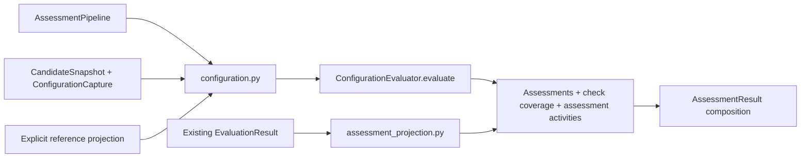
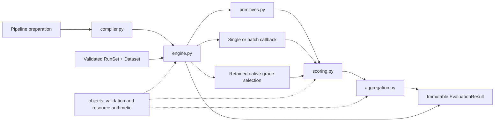

# Evaluation modules — levels 3 and 4

**Initial assessment implementation in package 0.5.** See the
[implemented surface and boundaries](../../implementation/unified_assessment.md). The following
sections specify configuration evaluation alongside the existing behavioral
engine. Shared record fields and identity rules are defined only in the
[assessment contract](../ASSESSMENT_CONTRACT.md). The preserved revision-0.4
behavioral specification follows below; its records remain defined by the
[typed contract](../../contracts/agent_eval_flow.pyi) and
[data contract](../../DATA_CONTRACT.md). See the
[implementation status](../../IMPLEMENTATION.md) for the current package.

## Next extension — level 3: configuration evaluation and shared views

`AssessmentPipeline` can dispatch configuration work while the existing
`EvaluationPipeline` performs task work. The evaluation module receives frozen
evidence; it never discovers mutable directories, executes an agent, downloads
missing artifacts or invokes a collector to repair missing input. Collection
lifecycle belongs to [execution](../execution/README.md), using the
[adapter protocol](../adapters/README.md), and branch/gate
scheduling belongs to [pipeline](../pipeline/README.md).

| Planned file within `evaluation/` | Responsibility |
| --- | --- |
| `configuration.py` | Compile candidate-scoped `CheckSpec` definitions, project required evidence/references, invoke `ConfigurationEvaluator.evaluate`, normalize outputs and retain check coverage. |
| `assessment_projection.py` | Expose saved behavioral measurements as shared `Assessment` views with explicit source keys; preserve their existing values, status, evidence and activity ownership. |
| Existing compiler, engine, scoring and aggregation files | Keep the current `MetricEvaluator`, `RunSet`, task rubric and summary behavior unchanged. Configuration findings do not enter their task-row reducers. |

The first extension evaluates a candidate snapshot. A finding about one of its
components uses a component locator within that candidate's evidence. The
design does not introduce arbitrary component/cohort evaluator dispatch: those
APIs require a future explicit selector, population and completeness contract.



Illustrative internal interfaces use the canonical shared records; these are
planned implementation boundaries, not additions to the current Python API:

```python
# configuration.py; registry bindings are local and never serialized
def validate_configuration_checks(
    checks: tuple[CheckSpec, ...],
    evaluators: Mapping[str, ConfigurationEvaluator],
) -> None: ...

def make_assessment_request(
    snapshot: CandidateSnapshot, capture: ConfigurationCapture, check: CheckSpec,
    *, activity: ActivityRef, projected_references: Mapping[str, DataTable],
    prerequisites: tuple[Assessment, ...],
) -> AssessmentRequest: ...

async def invoke_configuration_check(
    evaluator: ConfigurationEvaluator, request: AssessmentRequest,
) -> AssessmentOutput: ...

# assessment_projection.py; pure lookup/projection, never evaluator dispatch
def project_behavioral_assessments(
    result: EvaluationResult,
) -> tuple[Assessment, ...]: ...
```

`ConfigurationEvaluator.evaluate` uses the request/output protocol in the
[shared contract](../ASSESSMENT_CONTRACT.md). The engine, rather than a plugin,
allocates and validates invocation identity. Its per-call mutable state holds
the complete planned `(candidate snapshot, check)` inventory, normalized
assessments, coverage and a map of namespaced activity references. It is not a
new scheduler or a persistent global cache.

## Next extension — level 4: compile, invoke and normalize

1. Validate unique check identities, supported candidate subject scope, full
   evaluator versions, parameters, evidence requirements, reference selectors
   and dependency acyclicity before invoking any extension. Resolve only named
   evaluator bindings. Static/dynamic evidence and reference-based/reference-free
   checks are independent dimensions; neither determines a check's validity.
2. Expand the explicit planned check inventory per candidate. Join capture and
   snapshot fingerprints, retained scope and evidence provenance. A mutable path
   or matching candidate label does not establish identity. Invalid joins fail
   validation. Missing, unsupported or partial evidence stays visible in coverage.
3. Build each request from retained evidence and exactly its declared reference
   projection. Candidate-keyed reference tables are explicitly bound through
   `AssessmentPlan.reference_sets`; validate their candidate IDs and project only
   declared columns plus join identities. Behavioral task answers do not become
   configuration references. The evaluator receives no whole private dataset, agent connection,
   unrelated reference rows or implicit filesystem/network access through the
   core. The recorded fingerprint includes the check/evaluator definition,
   evidence identity and relevant reference/context versions. Reference-free
   checks receive an empty projection.
4. Before a real callback invocation, allocate its `ActivityRef` in the
   `assessment` namespace. Invoke once; do not automatically retry exceptions.
   Invocation cancellation propagates using the behavioral engine's cancellation
   rules. A check blocked before invocation has an explicit coverage reason and
   no fictitious invocation or estimated charge.
5. Validate the output's requested subject, check and invocation identity;
   unique finding/measurement keys; supported typed values; evidence locators;
   claim basis; and resource ownership. Numeric measurements are optional. A
   syntactically valid findings-only output is a complete representation when
   the check declares no numeric output.
6. Persist normalized assessments together with actual coverage and activity
   receipts. An evaluator's assertion that it completed is separate from whether
   the requested evidence was completely inspected. Partial scans may retain
   supported positive findings; they cannot establish absence of a problem over
   uninspected scope. Do not turn an empty findings list into a pass.
7. Finish independent checks after an ordinary callback failure. Failed
   prerequisites block dependent checks with unknown conclusions and no invocation.
   Compatible successful prerequisites are projected only for the same candidate;
   the engine cannot silently substitute a passing value.
   A decision is evaluated later from these records under an explicit policy.

| Boundary outcome | Required retained meaning |
| --- | --- |
| Complete valid output with findings | Evaluator completed; findings retain their observed/inferred claims, severity and evidence. Blocking permission comes from policy and declared criteria, not severity alone. |
| Complete valid output with no findings | No findings for this versioned check over its declared inspected scope; no universal safety or quality verdict. A matching explicit predicate may use this evidence. |
| Partial capture, unsupported input or skipped requested check | Coverage remains incomplete with the exact reason. Absence-based predicates are unknown. Any retained positive evidence remains inspectable. |
| Exception or malformed output | Mark the requested invocation/check as failed or unavailable; do not convert the candidate to fail. Retain valid independently identified resource receipts and source diagnostics; otherwise consumption is unknown. |
| Unexpected subject, check or activity identity | Reject the normalized output under the requested identity; never attach foreign findings or charges to the candidate. |
| Suppressed or waived provider finding | Retain available raw evidence, original finding and the separate suppression/waiver decision. Disclose provider-omitted findings rather than reconstructing them. A waiver does not erase a finding or manufacture inspected coverage. |

Invocation status, claim basis, finding severity, gate eligibility and policy
decision are separate values. A possible interaction inferred from files remains
an inference even if the scanner completed successfully. An LLM's stated
confidence cannot be relabeled as measured calibration. Reference presence does
not change this distinction.

## Next extension — level 4: projection and accounting

Behavioral projection reads stored `EvaluationResult` measurements and preserves
their origin keys: run, metric and typed detail key within that source result. It retains
the owning candidate fingerprint and original evidence/status. Projection does
not call `MetricEvaluator`, produce a replacement task grade, change a rubric,
rerun a reducer or create a paid assessment activity. Source task/detail identity
remains distinct from candidate-scoped configuration findings. A numeric value
has an unknown projected conclusion unless an explicit originating gate supplies
one; projection does not invent an acceptance threshold.

Historical behavioral activity IDs resolve through
`ActivityRef(namespace="behavior", id=...)`; configuration collection and
evaluation activities resolve through `namespace="assessment"`. Identical text
IDs in different namespaces are distinct. Every reference resolves to one
immutable source activity. A shared scanner invocation supporting many findings
or candidates is counted once, just as one behavioral batch activity is counted
once. Neither finding count nor task count allocates or multiplies its cost.

Retained activity inventory and newly performed activity references are separate.
Reusing compatible captures retains historical receipts but does not mark them
performed now. The initial facade still invokes selected configuration checks;
there is no assessment cache. Any later assessment-reuse API must validate the
full compatibility key before retaining an assessment without a fresh invocation.
Known zero requires a complete empty inventory;
missing receipts or incomplete inventories propagate unknown quantities under
the [shared resource arithmetic](../objects/README.md). Preserve collection,
configuration evaluation, behavioral grading and agent execution categories;
do not sum behavioral projections back into the behavioral source totals.

Configuration-only output requires neither a dataset nor a `RunSet`. Combined
output composes these records with the optional original `EvaluationResult`;
configuration findings do not become fabricated task measurements. Reassessment
is explicit and requires retained compatible input evidence; browsing or changing
decision priorities never triggers it.

## Next extension — planned implementation acceptance scenarios

These are future checks, not newly implemented tests or claims about v0.4:

| Scenario | Observable acceptance condition |
| --- | --- |
| One candidate, one findings-only check, no behavioral study | One candidate assessment and actual activity receipt; no fake task, run, rubric or numeric score. |
| Five requested checks, one parse failure and four empty outputs | All five remain in coverage; the missing check cannot make an absence-based gate pass. |
| Inferred trigger overlap and an observed tool event | Separate bases survive normalization/projection; no inferred runtime leak or causal claim appears. |
| One scanner activity, three findings, 100 behavioral runs | One configuration observation per finding and one scanner charge; no task-rate denominator change. |
| Both branches use activity ID `a1` | `assessment/a1` and `behavior/a1` resolve independently and are each counted once. |
| Configuration judge needs only policy column `required_tools` | Request contains that projection; private task answers and unrelated columns are absent. |
| Malformed scanner result after a valid receipt | Requested check is unavailable, receipt remains attributed once, and independent checks complete. |
| Reload then project existing behavior | Evaluator/collector invocation counters remain unchanged; source origin keys and historical costs remain stable. |
| Change check version or required reference projection | Previous assessment is not reused as a compatible new result. |

## Preserved revision-0.4 behavioral specification

The remainder records the existing behavioral design. Its historical test-first
checkpoint is not the current implementation status. The extension above does
not change these signatures, task joins, score semantics or saved records.

This directory takes a validated capture and the user's evaluation definitions.
It resolves checks, invokes them, records what each invocation cost, applies any
chosen rubric, and produces candidate summaries. Its entry point receives no
agent backend. A missing grade can therefore never start an agent accidentally.

## Level 3: files and communication

```text
src/agent_eval_flow/evaluation/
├── __init__.py       internal service exports; no work at import time
├── compiler.py       validate references and bind the requested implementations
├── engine.py         contexts, single/batch/native dispatch and grading activities
├── primitives.py     documented run.* measurements over captured facts
├── scoring.py        optional linear rubric and threshold conjunction
└── aggregation.py    built-in and custom candidate summaries
```



Solid arrows carry calls/data; dashed arrows are shared-library dependencies.
All five files use public records from `objects`; none imports a concrete native
adapter, cloud SDK, report renderer or filesystem store. `graphlib` supplies
dependency ordering. Pydantic-backed validators supply record validation.
These modules contain our joins and invocation bookkeeping, not a second agent
scheduler or schema framework.

### Internal structures and signatures

These signatures are design specifications, not additional public classes.
Record-like structures are frozen snapshots unless marked mutable. Mapping
bindings retain caller-owned implementation objects; they are not serialized.

```python
# compiler.py
@dataclass(frozen=True)
class CompiledEvaluation:
    suite: EvalSuite
    metric_order: tuple[str, ...]        # declared metrics, topological order
    primitive_ids: tuple[str, ...]       # referenced run.* helpers
    post_score_ids: tuple[str, ...]      # requested quality.score/task.accepted
    metrics_by_id: Mapping[str, MetricSpec]
    evaluators: Mapping[str, MetricEvaluator]
    batch_evaluators: Mapping[str, BatchMetricEvaluator]
    reducers: Mapping[str, SummaryReducer]
    metric_definition_fingerprints: Mapping[str, str]

def compile_suite(
    suite: EvalSuite,
    evaluators: Mapping[str, MetricEvaluator],
    batch_evaluators: Mapping[str, BatchMetricEvaluator],
    reducers: Mapping[str, SummaryReducer],
) -> CompiledEvaluation: ...

# engine.py: mutable, confined to one evaluate invocation
@dataclass
class EvaluationState:
    tasks: dict[tuple[str, str], Measurement]  # (run_id, metric_id)
    details: dict[tuple[str, str], tuple[Measurement, ...]]
    activities: dict[str, EvaluationActivity]
    performed_ids: set[str]

class EvaluationEngine:
    async def evaluate(
        self, compiled: CompiledEvaluation, dataset: EvalDataset, runs: RunSet,
        *, performed_native_activity_ids: tuple[str, ...],
        native_grading_inventory_complete: Observation[bool],
    ) -> EvaluationResult: ...

def make_context(
    dataset: EvalDataset, runs: RunSet, assignment: Assignment,
    run: Run, spec: MetricSpec,
    task_measurements: Mapping[tuple[str, str], Measurement],
    *, evaluation_cost_scope: tuple[CostCategory, ...],
) -> EvaluationContext: ...

def grading_fingerprint(
    spec: MetricSpec, *, dataset_fingerprint: str,
    evaluation_cost_scope: tuple[CostCategory, ...],
) -> str: ...

def select_native_grade(
    spec: MetricSpec, run: Run, bundles: tuple[NativeGradeBundle, ...],
) -> tuple[Measurement, tuple[Measurement, ...]]: ...

def normalize_single_output(
    output: MetricOutput, *, spec: MetricSpec, run: Run,
    activity_id: str, dependencies: Mapping[str, Measurement],
    known_activities: Mapping[str, EvaluationActivity],
) -> tuple[Measurement, tuple[Measurement, ...], Resources]: ...

def normalize_batch_output(
    output: BatchMetricOutput, *, request: BatchMetricRequest,
    known_activities: Mapping[str, EvaluationActivity],
) -> tuple[tuple[Measurement, ...], EvaluationActivity]: ...

# primitives.py
def measure_run(run: Run, metric_id: str) -> Measurement: ...

# scoring.py
def score_task(
    suite: EvalSuite, run_id: str, measurements: Mapping[str, Measurement],
) -> TaskScore: ...

def evaluate_threshold(threshold: Threshold, measurement: Measurement) -> GateResult: ...
def combine_gates(
    gates: tuple[GateResult, ...],
) -> tuple[Decision, Literal["observed", "estimated"] | None]: ...
def score_measurements(
    score: TaskScore, source_measurements: Mapping[str, Measurement],
    *, requested_ids: tuple[str, ...],
) -> tuple[Measurement, ...]: ...

# aggregation.py
@dataclass(frozen=True)
class SummaryInputs:
    assignments: tuple[Assignment, ...]
    runs: tuple[Run, ...]
    source_rows: tuple[Measurement, ...]  # one task row per candidate run
    planned: int
    observed: int
    missing: int
    errors: int
    not_applicable: int

def summarize_candidate(
    compiled: CompiledEvaluation, candidate_id: str,
    assignments: tuple[Assignment, ...], runs: tuple[Run, ...],
    measurements: tuple[Measurement, ...], task_scores: tuple[TaskScore, ...],
) -> tuple[CandidateSummary, ...]: ...

def make_summary_inputs(
    spec: SummarySpec, assignments: tuple[Assignment, ...],
    runs: tuple[Run, ...], measurements: tuple[Measurement, ...],
) -> SummaryInputs: ...

def reduce_builtin(spec: SummarySpec, candidate_id: str, inputs: SummaryInputs) -> CandidateSummary: ...
def validate_summary_output(
    output: CandidateSummary, *, spec: SummarySpec, candidate_id: str,
    inputs: SummaryInputs,
) -> CandidateSummary: ...
```

`combine_gates`' second item is the observed/estimated basis, not an error
message. Normalizers raise a public/schema validation error to their engine
caller; they never invent a replacement value internally.

## Level 4: compilation

1. Validate the suite's immutable records, unique metric/summary IDs, native
   selectors, rubric references, threshold operands and summary sources. Reject
   redefinitions of reserved helpers. Native selectors require empty `params`
   and `depends_on`.
2. Resolve each evaluator-source name in exactly the registry selected by
   `mode`; check the full `VersionRef`, including revision. Resolve custom
   reducers similarly. Extra unused bindings are harmless; binding objects are
   not called to discover behavior. Native grades need no evaluator binding.
3. Collect referenced `run.*` IDs from dependencies, rubric, gates and summaries.
   A dependency may name a declared metric or a documented run helper. It cannot
   name `quality.score` or `task.accepted`, which are produced later. Acceptance
   cannot reference `task.accepted`; use of `quality.score` requires a rubric.
4. Pass the dependency mapping to `graphlib.TopologicalSorter`. Convert its
   cycle error into `ConfigurationError` naming the cycle. Use declaration order
   within each ready group for repeatable presentation; ordering never joins
   data by array position. Do not implement another graph engine.
5. Validate built-in reducer compatibility: `rate` consumes booleans; numeric
   reducers accept boolean/integer/float/decimal sources, with explicit arithmetic
   below. Text summaries require a custom reducer. Built-in `params` must be
   empty; specialized populations/transformations use explicit custom definitions.
6. Compute versioned fingerprints of each complete metric definition using the
   shared canonical codec, then return `CompiledEvaluation`. These identify the
   definition only, not the final grading invocation's full configuration. Suite
   labels alone never establish implementation identity.

Every compilation error is a `ConfigurationError` before execution or grading.
`EvalSuite.validate()` performs the structural portion without runtime bindings;
compilation adds binding checks. Direct `EvalSuite.evaluate()` also checks dataset
fingerprint and typed unit keys against the capture before invoking a callback.

## Level 4: one evaluation call

The engine validates capture joins and dataset compatibility first. It indexes
runs by ID and assignment ID, imports **all** captured native grading activities
into state, and verifies the supplied newly performed native IDs are a distinct
subset. Identical activity records deduplicate; a conflicting retained activity
is `CaptureValidationError`, not a callback failure. Fresh execution supplies its
native grading inventory; saved-run evaluation supplies `()` and observed true.

Before a fresh single/batch dispatch, `grading_fingerprint` hashes the structured
tuple of source `VersionRef`, complete `MetricSpec`, dataset fingerprint and
declared grading scope using `objects.identity.semantic_fingerprint` with kind
`grader-config`. New activity/run IDs are excluded. This is the non-null
configuration fingerprint written to the activity/request; the compiler's
definition-only fingerprint cannot substitute for it. Native verifier fingerprints
follow the separate [native fingerprint rule](../objects/README.md#fingerprints-and-planning-identities):
the adapter has VerifierSpec, native options and supplied input projections, not
the complete dataset fingerprint. It must not claim access to undisclosed data.

For each required run helper, materialize one task row. Then visit declared
metrics in compiled order. Single callbacks run sequentially once per planned
run. A batch callback receives one request containing all runs for that metric,
including failed, pending and missing captures; no empty batch is invoked.
Native sources only read retained records. The engine makes no automatic retries
and no implicit choice to skip or penalize a failed dependency.

`make_context` joins `run.assignment_id` to its assignment, projects public input
through `dataset.agent_input`, and selects private reference rows for that typed
unit key. `measurements` contains exactly that metric's declared task dependencies
for this run, including error/missing values. It also supplies the owning native
job record when present and the suite's grading cost scope. No backend, full
study or other task's private reference rows enters the context.

The engine finishes every requested cell, scores each run, materializes requested
post-score helper rows, and summarizes candidates in plan order. It returns a
validated immutable `EvaluationResult` with a fresh ID and UTC creation time,
the original `RunSet`, the exact suite/fingerprint, rows and grading activity
accounting. The state and compiled callback bindings end with the call.

Unused helpers are not appended automatically. Requested helpers are normal
task measurements without new grading activities. `quality.score` and
`task.accepted` come from the stored `TaskScore`; their computation does not
invoke evaluators. Thus a suite containing only one native metric can return
exactly one declared task measurement per run. Output order follows assignment
order, compiled metric order and retained detail order; IDs determine joins.

### Callback normalization and continuation

| Boundary outcome | Engine action |
| --- | --- |
| Valid single output | Accept one `key=None` task row and uniquely keyed details for the requested run/metric. Allocate one activity, copy this call's resources and stamp its ID. |
| Single exception or invalid output | Produce one error task row for the requested cell, drop invalid normalized rows, retain a correctly identified error activity, continue other cells and dependent metrics. |
| Valid batch output | Validate activity ID/fingerprint/evaluator/phase/run set against the request, plus every row's IDs, strict type, unique task/detail identity and activity references. Join by IDs. |
| Batch omits a task row | Keep the valid returned rows; emit an explicit missing task row for each omitted run, referencing the same activity. |
| Invalid batch envelope/identity/type or duplicate task/detail rows | Reject the whole normalized batch; produce an error task row for every requested run and one error activity under the allocated request ID. Never retain a foreign activity ID as if requested. |
| Batch callback raises | Same error cells and one error activity; consumption without a receipt is unknown. |

For all sources, `ok` requires a non-null correctly typed value and basis;
non-ok requires null value/basis and a reason. Boolean and integer are different
metric types. Detail keys are typed, run-local diagnostic identities, not more
task attempts. A detail without its task row is invalid; a missing batch task
with no details is an ordinary omission.

Single callbacks may retain known dependency activity references. The engine
adds the current activity ID and checks every reference covers that run. Batch
rows must already include the request activity ID; additional references must
resolve to previously captured activities covering that run. Charges are never
copied from dependencies into the new invocation's resources.

Independently valid resource receipts can survive a row-validation failure when
their requested invocation identity is intact. A mismatched batch activity or an
exception without such a receipt produces unknown resources in the requested
scope. Accepted artifact references and validation issues remain attached to the
error activity/measurement; arbitrary Python objects are not dumped into a
manifest. Error reasons identify the extension and failure, not an agent verdict.

Only ordinary callback exceptions and output-validation failures are converted.
Cancellation, `KeyboardInterrupt` and `SystemExit` propagate; no completed result
is fabricated and no callback is retried. Synchronous callbacks cannot be
promised a hard stop merely because an async caller cancelled. There is no
crash-durable evaluation checkpoint in this version.

### Native grade selection

Filter by channel, native metric and optional evaluator/activity selector, then
by the requested run. Exactly one matching task grade supplies value, status,
basis, reason, evidence and its activity ID. Its same-activity detail grades
follow. Zero task matches becomes `missing`; multiple matches become `error`
listing the conflicting IDs. Selection does not choose an arbitrary latest pass.
Selected values must satisfy `MetricSpec.output_type`; a mismatch is an error
cell with the native evidence retained. Every original bundle/activity remains
in the capture, including unused channels. Native error-plus-zero encodings must
already have been normalized as errors by the mapper, with raw source evidence.

## Level 4: activity accounting

The engine uses the shared functions in `objects/values.py`:

```python
def combine_inventory(
    observations: Sequence[Observation[bool]],
) -> Observation[bool]: ...

def aggregate_resources(
    items: Sequence[Resources], *, inventory_complete: Observation[bool],
    cost_scope: tuple[CostCategory, ...],
) -> Resources: ...
```

Let N contain every unique activity in `RunSet.native_grades`. Let P be the
validated IDs supplied by fresh execution and C the IDs allocated immediately
before this engine dispatches callbacks. F is `P union C`; retained activities
are `unique(N union callback_records)`. P is already represented in N, so it is
not charged twice. Saved-run grading sets P empty. All callback attempts receive
an activity, including failures, which establishes callback-inventory completeness
without claiming their quantities are known.

`performed_grading_inventory_complete` combines the supplied fresh-native
inventory with the observed-complete callback inventory. The full total combines
that observation with `runs.grading_inventory_complete`; the incremental total
uses only performed completeness and activities in F. `combine_inventory` returns
observed false if any input is observed false; otherwise any input that is not
observed true produces unknown; otherwise it returns observed true. An estimated
true inventory is insufficient. Empty observed-complete sets aggregate to known
zero; missing inventory does not create an invented activity.

Quantities are summed independently. An unknown quantity makes only that
quantity unknown when inventory is complete; incomplete inventory makes every
full quantity unknown. Any estimated contributing quantity leaves its known
total estimated. Grading totals use `suite.evaluation_cost_scope`; a receipt in
another scope cannot fill its cost field, but its independent known token/human
quantities remain usable. The original scoped activity is retained. No shared
batch cost is divided among candidates, and agent execution costs never move
into grading records.

## Level 4: primitives and scoring

| Helper | Exact source |
| --- | --- |
| `run.completed` | `True` for completed; `False` for agent error, timeout, infrastructure error or cancellation; missing for not-run, unobserved, running, awaiting input or paused. |
| `run.duration_s` | Root `Run.duration_s()` observation; never the sum of overlapping child intervals. |
| `run.cost_usd`, `run.input_tokens`, `run.output_tokens`, `run.human_minutes` | Corresponding `Run.resources()` observation over exclusive execution charges and complete inventory. |
| `quality.score` | Optional rubric total in `TaskScore.score`; requires a rubric when referenced. |
| `task.accepted` | Boolean pass/fail from `TaskScore.acceptance`; unknown acceptance becomes missing. |

Observed/estimated observations become `ok` measurements with the same basis;
unknown observations become `missing` with their reason. Resource helper reasons
include the cost scope when relevant. Helpers retain source evidence and inherited
activity provenance; none creates a grading invocation. Execution completion says
nothing about correctness and adds no implicit acceptance gate.

`score_task` uses task rows only. Each opted-in rubric term requires a boolean
or numeric fraction in `[0, 1]`. It records `earned = fraction * points`, the
declared possible points and source evidence. A missing/error/not-applicable or
out-of-range term leaves its contribution unknown; other contributions stay
visible. Any unknown contribution leaves the exact total unknown, with no weight
redistribution or clipping of an invalid fraction. A known total is estimated
if any contributing source was estimated. `rubric=None` yields an unknown score
and no contributions; it does not manufacture zero quality.

Thresholds use compatible typed values: ordered comparisons are numeric;
equality/inequality also support same-type text and booleans. A false value with
status ok is a known value. Missing/error/not-applicable inputs make a gate
unknown. Gates on `quality.score` read the newly computed score. Conjunction is
fail if any gate fails, otherwise unknown if any gate is unknown, otherwise pass.
An observed failing gate establishes observed failure even when other gates are
unknown; if failure depends only on estimated failing gates it is estimated.
Passing conjunctions are estimated if any required passing gate is estimated.
Unknown decisions have no basis. No acceptance rule means unknown acceptance.
An explicitly empty conjunction is pass; an explicitly empty rubric sums to
observed zero. Those are caller-chosen definitions, distinct from omission.

## Level 4: candidate aggregation

For each summary, `make_summary_inputs` joins all candidate assignments to runs
and the selected metric's task row. Counts describe the source before any custom
exclusion/imputation: `planned = observed + missing + errors + not_applicable`.
Here `observed` counts all ok rows, including rows whose basis is estimated; basis
is represented separately in the aggregate observation. Detail rows never affect
these counts. Unavailable agent runs still enter; their source metric decides
whether its value is known.

Built-in reducers operate on all planned task rows. If any required row is not
ok, `value` is unknown and `available_value` contains the same reducer over the
available ok subset, or null when that subset is empty. Included IDs identify
the ok rows; exclusions name every other planned run and its source reason.
`available_value` is descriptive and cannot replace the full aggregate for
selection/comparison. A custom explicitly named subset reducer can return a
known subset value while preserving all source counts and exclusion reasons.

| Reducer | Defined arithmetic for a nonempty known population |
| --- | --- |
| `sum` | Sum all values; booleans count as 0/1 by this helper's definition. |
| `mean` | Sum divided by count, including booleans as 0/1. |
| `min`, `max` | Minimum/maximum; preserve the source scalar type. |
| `p95` | Sort ascending; set `h = (n - 1) * 0.95`, `i = floor(h)`, `f = h - i`; return `x[i] + f * (x[min(i + 1, n - 1)] - x[i])`. For one value, return that value. |
| `rate` | Boolean sources only: count true / planned count, a fraction in `[0, 1]`. |

This explicitly selects linear interpolation for p95. It uses ordinary numeric
operations, not a claimed SciPy dependency or a statistical confidence method.
Integer sums stay integer; integer/boolean means, rates and interpolated p95
produce floats. Float sums use `math.fsum`. Decimal sums, means and interpolation
stay Decimal, using a local decimal context with precision 34 and half-even
rounding so caller-global context changes cannot change this helper. Min/max
preserve an integer/boolean/Decimal source type. No reducer accepts nonfinite
results; an arithmetic overflow is an unavailable summary with its source counts.
An empty planned population produces unknown with reason, including for sum/rate;
it is not evidence of success or free work.

Custom reducers receive the complete candidate assignments, runs, measurements
and task scores once per `SummarySpec`. Validation checks returned candidate and
summary IDs, all five source counts, strict observation values, and a disjoint,
complete included/excluded partition of that candidate's run IDs. No unknown or
duplicate IDs and no empty exclusion reasons are allowed. The validator checks
facts, not whether the custom aggregate is scientifically sensible.

A callback exception or malformed summary becomes one unknown summary under the
requested IDs. Preserve recomputed source counts; exclude every planned run with
the failure reason, set `included_run_ids=()` and `available_value=None`. Do not
reuse a malformed callback's known value. Continue other candidate summaries.
Reducers have no resource-reporting field in revision 0.4: they are local
aggregation callbacks. Paid/remote grading belongs in a metric activity before
reduction; this version cannot truthfully account for an undisclosed remote call
inside a reducer.

## Verification and ownership

| Written tests | Responsibilities exercised |
| --- | --- |
| [Evaluation boundaries](../../../tests/contracts/test_evaluation.py) | Dependency graph/reuse, context projection, strict single/batch responses, native selection, N/F accounting, unknown inventories and scopes. |
| [Reducers](../../../tests/contracts/test_reducers.py) | Six built-ins, task/detail population, callback inputs and malformed-summary continuation. The p95 fixture is constant; its interpolation choice above still needs an implementation-level varying-value check. |
| [Results/scoring](../../../tests/contracts/test_results_storage.py) | Rubric contributions/missingness, conjunction, estimated basis and full-population summaries. |
| [Native jobs](../../../tests/contracts/test_native_jobs.py) | Fresh verifier projections, preserved grades and newly performed native grading. |
| [Capture](../../../tests/contracts/test_capture.py) | Shared inventory/resource arithmetic and graph validation relied upon before grading. |
| [Data-contract E2Es](../../../tests/e2e/test_data_contract.py) | Native-grade transport, shared batch cost and saved-run consumption. |
| [Toy E2Es](../../../tests/e2e/test_toy_pipeline.py) | Whole configure/run/evaluate/inspect flow and reuse without hidden execution. |

The suite was written before the package existed. That historical checkpoint
does not establish the current result of any test; current implementation and
integration status is recorded in [IMPLEMENTATION.md](../../IMPLEMENTATION.md).
The extension acceptance scenarios above remain planned.
