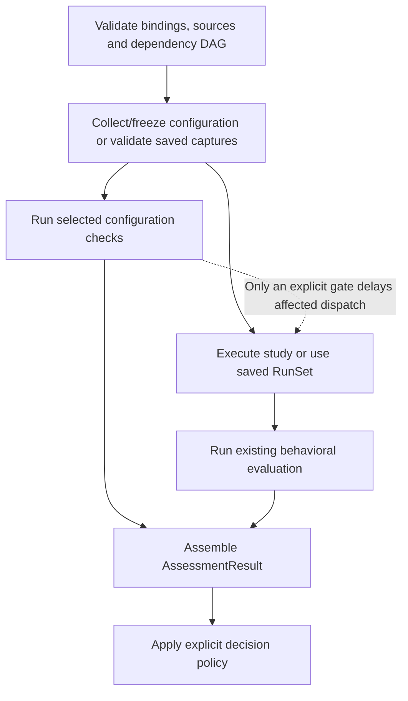
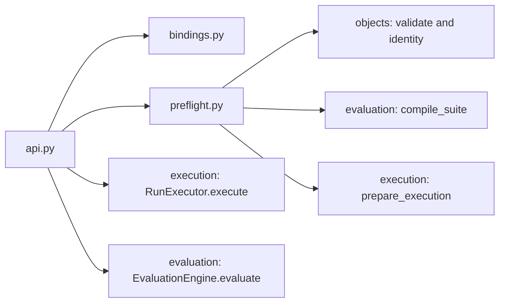

# Pipeline: complete request coordination

**Behavioral contract 0.4; initial assessment implementation in package 0.5.**
See the [implemented surface and boundaries](../../implementation/unified_assessment.md). The extension below refines the accepted
[unified flow](../../UNIFIED_ASSESSMENT_FLOW.md); subsequent v0.4 sections retain
their existing public contracts and acceptance links. This page completes
levels 3 and 4 for `agent_eval_flow/pipeline/`.
The [data contract](../../DATA_CONTRACT.md) owns public record shapes;
[objects](../objects/README.md), [execution](../execution/README.md) and
[evaluation](../evaluation/README.md) own their lower-level operations.

The pipeline has one job: prepare the whole request before work, obtain a
capture when requested, evaluate it, and return the result. It does not run
individual trials, interpret native settings, calculate metric values, persist
results automatically or restart a failed agent.

## Proposed extension: assessment coordination, levels 3 and 4

The new `AssessmentPipeline` composes configuration assessment with the existing
`EvaluationPipeline`. It does not generalize a `Run` into an arbitrary subject
or add scan methods to `BackendAdapter`. Definitions and serialized fields are
owned by the [assessment contract](../ASSESSMENT_CONTRACT.md); the names below
refer to the shared contract; public classes are available in the package.

### File and state ownership

| Proposed file | Responsibility and private operations |
| --- | --- |
| `pipeline/assessment.py` | `AssessmentPipeline`, `coordinate_assessment(prepared)`, branch lifetimes, outer result assembly; reuses the existing sync bridge. |
| `pipeline/assessment_bindings.py` | Copies collector/check/`snapshot_binders` maps and retains a separate snapshot of existing behavioral bindings; never imports concrete adapters. |
| `pipeline/assessment_preflight.py` | `prepare_assessment(plan, bindings, runs, configuration)`, resolves all selected references, compiles check/gate dependencies, validates explicit reuse and prepares optional behavioral evaluation. |

`PreparedAssessment` is invocation-local private state: validated plan, resolved
bindings, compiled dependency graph, source selections and optional prepared
behavioral work. It is not another persisted definition. Actual snapshot
collection is owned by [execution](../execution/README.md), check invocation
and reference projection by [evaluation](../evaluation/README.md), and decision
application by [results selection](../results/README.md). The facade has no hidden
previous-result cache and no automatic persistence.

The proposed public surface is:

```text
AssessmentPipeline(plan: AssessmentPlan, ...explicit runtime bindings...)
pipeline.eval(*, runs: RunSet | None = None,
              configuration: Mapping[candidate_id, ConfigurationCapture] | None = None)
    -> AssessmentResult
await pipeline.aeval(*, runs: RunSet | None = None,
                     configuration: Mapping[candidate_id, ConfigurationCapture] | None = None)
    -> AssessmentResult
```

Constructor details and binding protocols remain in the assessment contract.
The existing `EvaluationPipeline.eval(runs=...)` and its `EvaluationResult`
return type remain unchanged. The mode is derived from `AssessmentPlan`:
configuration-only has configuration plans/checks and no `behavior: Study`;
behavior-only has the study and no configuration branch; combined has both.
No caller-supplied mode flag can contradict these declarations.

The new facade accepts optional
`snapshot_binders: Mapping[str, SnapshotBinder]`. This is a separate preparation
registry; it neither adds a capability method to `BackendAdapter` nor changes
`BackendCapabilities`. Each selected binder must match the target backend's
complete version reference, including revision. Registry name agreement alone
is insufficient. The copied map retains caller-owned implementations, while
live sessions are allocated only during this invocation's execution phase.

### Preflight and explicit source selection

`prepare_assessment` completes these steps before launching either branch:

1. Validate candidate IDs/fingerprints, configuration source definitions and
   ownership, all `CheckSpec` evidence and reference declarations, gates and
   optional study membership. The candidate definition used by the study must
   agree with the corresponding assessment candidate; a shared display name
   is insufficient.
2. Resolve every selected collector/evaluator and behavioral binding, their
   revisions and declared capabilities. Compile check prerequisites and explicit
   gate edges into one acyclic graph. Reject a gate whose dependency requires
   the behavioral work that it would block. Planning performs no scan, model
   call, native task, credential discovery or configuration collection. Resolve
   selected `reference_sets` against candidate-keyed `references` tables;
   behavioral task answers are not an implicit reference binding. For a fresh
   combined branch with `snapshot_requirement="verified"`, resolve a compatible
   `SnapshotBinder` by the target backend's full revision and validate its
   declared binding capabilities before either branch starts. Do not invoke
   `prepare()` during preflight. Saved runs need no binder; `record_only`
   proceeds with unknown parity when none is supplied.
3. For fresh behavioral work use existing study preparation. For supplied
   `runs`, apply v0.4 capture validation and experiment compatibility plus the
   extension's candidate-snapshot joins. Validate supplied configuration
   captures against candidate, snapshot, retained evidence and collector
   provenance. A mismatch fails before any evaluator or backend runs.
4. Require a supplied configuration mapping to cover exactly the configuration
   candidates requested by the plan. Reject unknown keys and missing entries;
   do not silently mix saved captures with freshly collected missing candidates.
   An omitted mapping requests fresh collection for that branch. Supplying
   captures for a branch absent from the plan is a configuration error.
5. Return prepared sources without doing the selected work. Runtime-specific
   dialect checks still belong to the relevant adapter before its own launch;
   this does not promise introspection of arbitrary native dialect options.

Reuse is branch-specific and explicit:

| Inputs in a combined plan | Configuration source | Behavioral source |
| --- | --- | --- |
| Neither keyword supplied | Fresh collection | Fresh native execution |
| `configuration` only | Retained evidence; no collector | Fresh native execution |
| `runs` only | Fresh collection, subject to snapshot compatibility | Retained runs; no backend |
| Both supplied | Retained evidence; no collector | Retained runs; no backend |

Selected evaluators may still run on retained evidence. A raw configuration
report is not an implicit request to recollect live files, and retained agent
runs never authorize rerunning a backend. Missing evidence becomes missing or
unknown coverage. The facade never repairs it by executing hidden work.

### Coordination algorithm and dependency semantics



After preflight, use the selected collector to resolve each candidate snapshot
once and retain immutable, source-aware bytes before either consumer starts.
This shared acquisition boundary precedes parallel inspection and execution;
configuration-only collection is valid even when no checks are selected.
Reused sources must already
identify compatible snapshots; the coordinator cannot label today's mutable
directory as the historical configuration of saved runs. Snapshot declarations
alone do not prove that a native runtime consumed those bytes. Materialization
and parity evidence follow the execution extension below; missing parity stays
unknown or prevents fresh dispatch when `snapshot_requirement="verified"`.
`record_only` permits a qualified comparison. A missing historical binding on
otherwise compatible saved runs remains unknown and starts no replacement work.

After applicable gates release a fresh dispatch unit, execution calls
`await binder.prepare(SnapshotBindRequest(...))` and owns the returned async
`SnapshotSession` through capture. The request includes the complete dispatch
unit, its candidate-to-snapshot map and requested parity. The session provides
validated `SnapshotBinding` records and staged delegates implementing the
original direct/job backend protocols. Sessions, temporary paths and live
delegates never enter saved plan/result records. Snapshot preparation does no
agent work; unsupported or failed verification blocks affected strict dispatch
while preserving independent configuration assessments.

Schedule ready graph nodes in invocation-owned task groups. Bound configuration
collector/evaluator invocations by `AssessmentPlan.max_concurrency`; preserve
the study's separate agent/native-job concurrency ownership. Expand new check
requests once per selected candidate with same-candidate prerequisite edges.
Component findings are allowed, but arbitrary component/study dispatch is
outside this first extension. Independent configuration checks and behavioral
work can overlap. Evidence dependencies
wait for their required capture, not all unrelated scans. Configuration-only
work neither builds a behavioral plan nor creates assignments or `RunSet`s.
Behavior-only work retains the existing execution and evaluation semantics,
with the outer result referring to its unchanged `EvaluationResult`.

For each explicit gate, retain the source assessments, versioned decision rule,
tri-state result (`pass`, `fail`, `unknown`) and declared `on_unknown` policy
(`block` or `allow`). A passing gate releases its affected dispatch units;
failure blocks them; an unknown follows the saved policy without being relabeled
pass. An error check cannot manufacture a candidate failure. All gates affecting
a native job must resolve before launching that entire job, as specified by
[execution](../execution/README.md). Gates applied to saved runs can report a
current decision, but cannot rewrite history as work that was blocked.

Assembly retains configuration captures, assessments, per-check coverage,
optional `behavior_result`, `branch_outcomes` and the activity inventory. A
`BranchOutcome` records completed, partial, error, cancelled, not-run or unknown
branch progress with the applicable diagnostics, gate decisions and raw source
artifacts; it does not make an invalid typed payload valid. Link behavioral records
through namespaced `ActivityRef(namespace="behavior", id=...)`; collection and
configuration evaluation use `namespace="assessment"`. Do not convert every
finding into a new activity or repeat an inspection expense per task run.
Historical source activities remain distinct from work performed by this call.

### Failure and cancellation behavior

| Condition | Required behavior |
| --- | --- |
| Bad binding, source mismatch, invalid check/gate graph | Preflight error; neither branch launches. |
| Collection or ordinary check failure | Retain partial evidence and error/unknown coverage; unrelated behavioral work continues. A required snapshot binding or explicit gate may prevent affected dispatch. |
| Ordinary agent/runtime failure | Preserve the existing behavioral capture rules; configuration checks continue. |
| Invalid returned evidence or contradictory identities | Retain a branch error outcome and raw evidence; exclude its invalid typed payload. Preserve a valid sibling result. If outer assembly itself violates an invariant, raise `CaptureValidationError` rather than returning a corrupt envelope. |
| Gate blocks fresh work | Keep every planned assignment as `not_run` with the gate reason and no agent execution; do not delete it from the population. |
| Parent cancellation or interruption | Cancel outstanding local tasks, request adapter-owned stop, retain acknowledged partial receipts, then propagate cancellation. Unknown stop confirmation stays unknown; no successful outer result or implicit save/resume is claimed. |

Branch workers turn ordinary operational failures into their typed outcomes
before they leave the task group. Otherwise one scanner exception would cancel
healthy agent work through task-group fail-fast behavior. Structural errors
remain errors, not candidate judgments. External cancellation is different
from one branch failing: it applies to the complete caller-owned invocation.

### Future acceptance scenarios

These requirements are covered by the new assessment-specific tests; the
v0.4 acceptance suite remains a separate compatibility check:

- A configuration-only plan scans two candidates, one partially unreadable,
  and returns coverage/error evidence without creating a dataset or a run.
- Barrier-controlled scanner and backend callbacks both enter before either
  is released for an ungated combined plan; no timing heuristic is needed to
  establish that there is no mandatory scan-before-run dependency.
- A missing evaluator or cyclic gate is detected with zero collector,
  scanner, model and backend dispatches.
- A strict fresh combined plan with no compatible binder fails preflight;
  the same otherwise compatible saved `RunSet` requires no binder and starts
  no materialization. A record-only fresh plan without a binder retains unknown
  parity while using the original backend.
- A scanner failure leaves an independent healthy behavioral result intact;
  with an explicit unknown-block gate the same failure instead preserves
  affected assignments as `not_run` with the decision evidence.
- Supplied compatible sources take exactly the branches in the reuse table;
  a supplied mapping missing one candidate fails without opportunistic work.
- An inspection producing twenty findings linked to one hundred runs retains
  one inspection activity; identical textual IDs in the two activity namespaces
  remain distinct, and shared references within a namespace charge once.
- Cancelling after one branch completes retains that branch's acknowledged
  receipts and the other branch's actual stop outcome without returning success.

## Existing v0.4 behavioral specification

## Level 3: files, dependencies and state

```text
pipeline/
├── __init__.py     packaging only; no registration or client construction
├── api.py          public EvaluationPipeline and private sync bridge
├── bindings.py     copied runtime name-to-implementation maps
└── preflight.py    complete evaluation preparation and capture compatibility
```



Only `api.py` coordinates both execution and evaluation. The compiler never
calls the executor; the evaluator receives no backend registry. Object methods
delegate into these services at call time so record imports do not import
agent SDKs or create circular runtime initialization.

| Private record | Exact fields | Lifetime |
| --- | --- | --- |
| `RuntimeBindings` | `backends: Mapping[str, BackendAdapter]`; `job_backends: Mapping[str, NativeJobAdapter]`; `evaluators: Mapping[str, MetricEvaluator]`; `batch_evaluators: Mapping[str, BatchMetricEvaluator]`; `reducers: Mapping[str, SummaryReducer]` | One facade; immutable maps containing caller-owned implementation references |
| `PreparedEvaluation` | `dataset: EvalDataset`; `evaluation: CompiledEvaluation`; `source: PreparedExecution \| RunSet` | One invocation; immutable and never serialized |

`EvaluationPipeline` stores `_study: Study` and `_bindings: RuntimeBindings`.
It does not store a previous capture, result, recorder, active event loop or
compiled suite. Two calls allocate their own prepared state. Caller-owned
adapters must support concurrent independent callers or serialize their own
operations; the facade does not make mutable SDK clients thread-safe.

## `bindings.py`: copy membership, preserve implementation identity

```python
@dataclass(frozen=True)
class RuntimeBindings:
    backends: Mapping[str, BackendAdapter]
    job_backends: Mapping[str, NativeJobAdapter]
    evaluators: Mapping[str, MetricEvaluator]
    batch_evaluators: Mapping[str, BatchMetricEvaluator]
    reducers: Mapping[str, SummaryReducer]

def snapshot(
    backends: Mapping[str, BackendAdapter] | None,
    job_backends: Mapping[str, NativeJobAdapter] | None,
    evaluators: Mapping[str, MetricEvaluator] | None,
    batch_evaluators: Mapping[str, BatchMetricEvaluator] | None,
    reducers: Mapping[str, SummaryReducer] | None,
) -> RuntimeBindings: ...
```

For each map, `None` becomes an empty map; otherwise copy its entries into a
fresh dictionary and expose a read-only mapping. Preserve each implementation
object by reference. Do not deepcopy a client, inspect its `ref` property,
call `capabilities()`, perform package discovery or import optional adapters.
Changing the caller's dictionaries after construction cannot change bindings.
Changing a client's internals remains the caller's responsibility.

Registry key/name and revision validation occurs during preparation. Extra
unreferenced entries are allowed; they are not called merely because they
exist. A saved-run evaluation does not access direct/job backend entries.

## `api.py`: public entry and a single sync bridge

Public constructor and method signatures remain those in the
[typed proposal](../../contracts/agent_eval_flow.pyi):

```text
EvaluationPipeline(study=..., evaluators=..., backends=None,
                   job_backends=None, batch_evaluators=None, reducers=None)
pipeline.study -> Study
pipeline.eval(*, runs: RunSet | None = None) -> EvaluationResult
await pipeline.aeval(*, runs: RunSet | None = None) -> EvaluationResult

# Private helper shared by synchronous convenience methods.
def run_sync(operation: Callable[[], Awaitable[T]]) -> T: ...
```

Construction assigns the immutable study and snapshots runtime maps. It starts
no validation callbacks, backend work, evaluator work, background tasks or
file writes. The `study` property returns the same immutable definition.

`run_sync` calls `anyio.get_current_task()` before creating the coroutine;
catch only `anyio.NoEventLoopError` to establish that no supported loop is
running. If the call succeeds, raise `ConfigurationError` with an issue directing
the caller to `await pipeline.aeval(...)`. Otherwise use one AnyIO event-loop
runner with its asyncio backend to await `operation()`. Never create a hidden
helper thread to bypass a caller's event loop. The context detector and bridge
are shared by `Study.run`, `Study.evaluate`, `EvalSuite.evaluate` and the
module-level convenience function, rather than copied into each record class.
An async-native integration still runs under that invocation's loop.
This uses the documented [AnyIO task detector](https://anyio.readthedocs.io/en/stable/api.html#anyio.get_current_task);
the eventual dependency lock must support that public exception/API pair.
Do not catch exceptions from `operation()` as if they indicated a missing loop.

`eval` delegates exactly once to `run_sync(lambda: self.aeval(runs=runs))`.
`aeval` has this call order:

```text
prepared = prepare_evaluation(study, bindings, runs)
if prepared.source is PreparedExecution:
    captured = await RunExecutor().execute(prepared.source)
    fresh_native_ids = distinct activity IDs in captured.native_grades
    native_inventory = captured.grading_inventory_complete
else:
    captured = prepared.source
    fresh_native_ids = ()
    native_inventory = Observation(True, observed, explicit no-new-native-work reason)
return await EvaluationEngine().evaluate(
    prepared.evaluation, prepared.dataset, captured,
    performed_native_activity_ids=fresh_native_ids,
    native_grading_inventory_complete=native_inventory)
```

Use the typed constructors' keyword arguments in implementation; the pseudocode
observation above abbreviates them. Deduplicate activity IDs by identity with
the common consistency validator; conflicting copies are errors, not a second
charge. Include activities from unsuccessful native grading even when no
measurements select them. A later `Study.run()` followed by separate grading
treats its native grades as historical, because they were not performed by the
grading invocation. The engine receives no `RuntimeBindings` object.

## `preflight.py`: resolve everything that can be checked before execution

```python
def prepare_evaluation(
    study: Study, bindings: RuntimeBindings, runs: RunSet | None,
) -> PreparedEvaluation: ...

def check_capture(study: Study, runs: RunSet) -> ValidationReport: ...
```

Preparation proceeds in this order:

1. Validate study/dataset/candidate/suite/execution definitions with shared
   record validators. Return configuration issues with their field paths;
   no evaluator or backend has run yet.
2. Call `compile_suite(study.suite, bindings.evaluators,
   bindings.batch_evaluators, bindings.reducers)`. Resolve only referenced
   implementations and validate metric dependencies, source modes, summary
   references and implementation revisions. Missing checks fail before agents.
3. For fresh execution, call `prepare_execution(study, bindings.backends,
   bindings.job_backends)` and return that prepared source. This step checks
   runtime capabilities; it does not execute an assignment.
4. For supplied runs, validate their identity/resource/evidence graph. Invalid
   capture structure raises `CaptureValidationError`. Check compatibility below;
   incompatibility raises `CaptureCompatibilityError`. Retain the original
   `RunSet` without replacing its plan or allocating replacement run IDs.
5. Return `PreparedEvaluation(dataset=study.dataset, evaluation=compiled,
   source=prepared_execution_or_original_runs)`.

Native grade source selectors are structurally compiled here; whether their
selected grades exist is resolved against the resulting capture by evaluation.
A missing retained grade becomes a missing measurement as specified by the
source contract, rather than a request to run the agent or historical verifier.

### Compatibility comparison

`check_capture` returns all discoverable mismatches as a `ValidationReport`;
it is read-only and calls no runtime implementation. Compare these semantic
fields using the [identity rules](../objects/README.md):

| Compare | Rule |
| --- | --- |
| Project and dataset | Same project ID, dataset fingerprint and typed root-key columns, including fixed private references |
| Candidates | Same candidate ID set and behavior fingerprints |
| Assignments | Same multiset of `(candidate_id, typed unit key, repetition)`; no duplicates or absent declared work |
| Execution | Same validated execution policy, including native job/verifier configuration and limits |
| Shared environment | Same declared `ComponentSpec` or both `None` |

Study ID/question, suite definitions, rubric, acceptance, summaries, contrasts
and whole-study fingerprints are excluded. Assignment/run IDs are preserved
from the capture; regenerated opaque IDs are not used as compatibility keys.
A failed, pending or unobserved run remains usable captured evidence. Never
replace it with new execution when the caller supplies `runs`.

## Failure, cancellation and resource ownership

| Condition | Behavior |
| --- | --- |
| Invalid definition, missing registration, unsupported capability | `ConfigurationError`; no agent dispatch |
| Wrong capture experiment or malformed captured graph | Compatibility or capture validation exception respectively; no grading begins |
| Ordinary backend/native runtime failure | Execution returns faithful failure/partial capture according to its own recorder rules |
| Ordinary evaluator failure | Evaluation retains error measurements/activity records; pipeline adds no retry |
| Invalid backend/job capture shape or conflicting retained record identities | Propagate `CaptureValidationError`; do not disguise a capture defect as an agent judgment |
| Invalid evaluator output shape | The evaluation engine records error cells/activity and continues; invalid reducer output becomes an unknown summary with source coverage |
| Native adapter's before-launch configuration rejection | Propagate `ConfigurationError`; execution must not convert it into infrastructure failure |
| Cancellation, `KeyboardInterrupt`, `SystemExit` | Propagate through the coordinator; never report successful completion or infer a stopped remote process |

AnyIO owns task-group and thread-wait lifetimes; adapters own stopping native
processes/services and enforcing their declared budgets. Cancelling an await
does not prove the worker stopped, and this facade offers no automatic remote
resume or implicit save-on-cancel. Prepared records and runtime bindings are
not part of resource accounting. Only captured agent executions and explicit
grading activities contribute observations.

## Acceptance links

- [Pipeline runtime tests](../../../tests/contracts/test_pipeline_runtime.py):
  `test_async_facade_runs_and_regrades_without_nested_event_loop`,
  `test_sync_facade_inside_event_loop_rejects_before_work`,
  `test_registry_maps_are_snapshotted_at_configuration`,
  `test_saved_capture_incompatibility_fails_without_new_work`.
- [Toy lifecycle tests](../../../tests/e2e/test_toy_pipeline.py):
  `test_pipeline_preflight_fails_before_any_backend_call`,
  `test_rescore_saved_runs_without_rerunning_backend`,
  `test_pipeline_reuse_starts_fresh_runs_without_hidden_cache`,
  `test_one_call_convenience_returns_the_same_public_result_contract`.
- [Native tests](../../../tests/contracts/test_native_jobs.py): group dispatch,
  preflight, fresh invocation identity and partial native runtime exceptions.

These tests specify observable behavior. Internal class names above organize
implementation; they do not require exporting prepared records to users.
