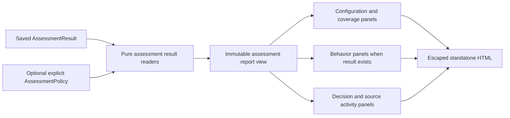

# Reporting: a saved result becomes HTML — levels 3 and 4

**Initial assessment implementation in package 0.5.** See the
[implemented surface and boundaries](../../implementation/unified_assessment.md). Reporting will
read `AssessmentResult` alongside its existing `EvaluationResult` input path.
Shared records are specified by the
[assessment contract](../ASSESSMENT_CONTRACT.md). The preserved revision-0.4
behavioral renderer specification follows below. Neither path resolves adapters,
evaluates metrics, recomputes custom summaries or queries a hosted service.

## Next extension — level 3: combined and configuration-only reports

| Planned file within `reporting/` | Interface/responsibility |
| --- | --- |
| `assessment_html.py` | `AssessmentHtmlReportRenderer.write(result: AssessmentResult, path: Path, policy: AssessmentPolicy \| None = None) -> Path`; build an immutable view using pure result readers and render standalone local HTML. |
| `templates/assessment_report.html.j2` | Candidate identity, configuration evidence/check coverage, findings, optional behavioral panels and explicit policy outcomes. |
| Existing `templates/report.css` | Shared accessible tables, status text, evidence links and print layout; embedded without network requests. |
| Existing `html.py` and behavioral template | Preserve the current `EvaluationResult` renderer and v0.4 layout contracts. |

The assessment report view is an internal mapping, not a third saved result
format. Its source is the validated `AssessmentResult` and, when supplied,
the exact `AssessmentPolicy` evaluated through pure
[results helpers](../results/README.md). No live plugin objects, credentials,
private reference-table contents or Python execution context enter templates.
The view may render intentionally retained evidence excerpts, but it never
automatically expands whole reference inputs just because their fingerprints
were needed for evaluation.

## Next extension — level 4: render algorithm

1. Validate the outer result and optional policy. Reconcile candidate identities,
   configuration capture fingerprints, snapshot bindings, assessment origin keys,
   check coverage and namespaced activity references. Invalid joins raise a
   validation error; a valid unknown/error state remains reportable.
2. Show plan/candidate identity and configured branch coverage first. A
   configuration-only plan has no task/dataset section and explicitly identifies
   its scope. If behavioral work was requested but produced no result, show its
   recorded branch outcome and error; do not describe that as configuration-only
   success or render an empty behavioral pass rate.
3. Build a configuration panel per candidate: intended snapshot, inspected
   source-tool/scope, omissions, collector/check revisions and parameters,
   requested/completed/partial/failed/blocked checks, and source report artifacts.
   Distinguish collection completion from individual rule coverage. Requested
   checks with no findings still appear in the coverage table.
4. Render findings and typed values with their exact subject/locator, claim
   basis, source check, evidence and reason. Invocation outcome, severity,
   provider tier/calibration metadata and policy eligibility have separate labels.
   Do not color an incomplete scan green merely because its findings list is
   empty. Finding-only checks have no invented score column or score of zero.
5. Show waived/suppressed findings with the original finding when retained and
   the separate attributed decision. If the provider omitted raw suppressed
   findings or rule inventory, display that limitation. The report cannot infer
   that missing records were examined or reconstruct their text.
6. When `behavior_result` exists, render its stored summaries, runs, task/detail
   measurements, resource observations and behavioral limitations through the
   existing pure views. Link run records to their candidate panel. Do not copy
   candidate findings into each task's measurement table or task count.
7. Show snapshot binding/effective-configuration status explicitly: verified,
   mismatch or unknown, with source evidence. A declared candidate name is not
   proof of matching inspected/executed bytes. Preserve differences between
   configured references, inferred relationships and captured runtime events.
   Side-by-side evidence does not establish causation.
8. If a policy was supplied, display its identity/revision and each requirement's
   pass/fail/unknown, coverage and source assessments. Show any operational gate
   `on_unknown=allow` separately from its unknown factual result. Render behavioral
   ranking only when the policy requests it and usable comparable summaries exist.
   Without a policy, display evidence and conclusions without inventing a winner.
9. Build activity tables by unique `ActivityRef`, retaining collection,
   configuration evaluation, behavioral grading and agent execution ownership.
   Show historical totals and newly performed totals with inventory completeness
   and cost scope. The same activity linked from many findings appears once;
   behavioral source totals are not added again through assessment projections.
10. Escape and write the view using the atomic output algorithm below. Rendering
    never starts reassessment, invokes a reducer or accesses missing evidence.
    A new policy changes only the pure decision view.

### Evidence and output safety

All provider messages, source filenames, component names, suggested fixes,
metadata, policy reasons, JSON values, error text and link labels are untrusted
display values. Jinja autoescape stays enabled; do not mark scanner-provided
HTML/Markdown as safe or emit it as executable markup. JSON display uses escaped
text, not untrusted content injected into a script tag.

Evidence URLs receive scheme validation before becoming anchors. HTTP(S) and
supported local artifact paths follow the existing renderer policy; `javascript:`,
`data:`, executable/unsupported schemes and malformed URLs render as escaped text.
HTML attributes are escaped separately. Generate document anchor IDs from internal
identities rather than concatenating raw provider text. Preserve original locators
as readable text, and do not fetch URLs or auto-embed remote/local artifact bytes.
Opening an external artifact is an explicit viewer action.

Unknown accessibility is labelled as unverified availability; do not claim a link
is broken or reachable without evidence. The standalone report itself remains
readable offline through embedded static CSS and retained information. No external
scripts, telemetry, fonts, scanners or hidden evaluation controls are required.

Write beside the requested destination and atomically replace the final output
only after rendering succeeds. Return its actual path. Filesystem failures use
the existing `StorageError` boundary and leave the old report intact. Rendering
errors do not mutate saved assessment or behavioral records.

## Next extension — planned implementation acceptance scenarios

These are design acceptance requirements. The initial implementation covers
the current assessment records; waiver rendering remains deferred with the waiver API:

| Scenario | Observable acceptance condition |
| --- | --- |
| Configuration-only result with one findings-only check | HTML has evidence/coverage/activity panels and no fake tasks, dataset, score or winner. |
| Behavior requested but failed before valid capture | Recorded branch failure remains visible; absent behavior is not presented as zero successful work. |
| Completed scanner with unknown per-rule coverage and no findings | Coverage is explicitly unknown; the report shows no implied pass or green success badge. |
| Advisory inferred finding beside an observed failed run | Separate claim/status labels and provenance remain visible; no causal statement appears. |
| One candidate finding linked from 100 runs, with two activities both named `a1` | One finding source; `assessment/a1` and `behavior/a1` are distinct, each charged once. |
| Inspected snapshot differs from observed runtime settings | Mismatch and its evidence appear in overview and relevant candidate comparison. |
| Waiver plus omitted provider findings | Original available findings, waiver decision and omission limitation all remain visible. |
| Provider message contains `<script>` and suggestion URL uses `javascript:` | Text is escaped, unsafe URL is not an active anchor, and no script executes. |
| Render twice with a different explicit policy while offline | No collector, grader, reducer or network calls; only policy outcome presentation changes. |
| Report output cannot be written | `StorageError` is returned without replacing the existing report or changing result data. |

## Preserved revision-0.4 behavioral specification

The remainder specifies the behavioral `HtmlReportRenderer`. Its interface and
stored-result semantics remain unchanged by the new outer report path.

## Files and interface

| Planned file | Interface | Responsibility |
| --- | --- | --- |
| `html.py` | `HtmlReportRenderer.write(result: EvaluationResult, path: Path, selection: Selection \| None = None) -> Path` | Build a read-only view and render local HTML through Jinja2 |
| `templates/report.html.j2` | Template receives `view: ReportView` | Summary, task rows, diagnostic evidence and selection details |
| `templates/report.css` | Packaged static asset | Accessible tables, wrapping long explanations and print layout; embedded in the standalone report |

ReportView is an internal immutable presentation mapping, not another result
format. It contains experiment metadata, candidate specifications/differences,
coverage, summaries, agent resource observations, grading resource observations,
task scores, measurements, activities/evidence, and optional selection rows.
Its values come from stored records and pure result helpers. Templates do not
receive live callback objects or the Python runtime environment.

## Render algorithm

1. Validate that a supplied Selection.result_id matches this result. Retain the
   exact policy/requirements/objectives; do not silently rerank it.
2. Build candidate and assignment indexes. Join task scores, measurements,
   activities and evidence by IDs, not ordering. Keep failed/pending/unobserved
   tasks and excluded source rows visible.
3. Present the whole-study view first: candidates, planned task/repetition
   counts, summaries and optional choice. Provide task detail anchors for every
   run, including those with unavailable output.
4. Show values together with status, basis, reason and unit. Unknown is labelled
   unknown; estimated is labelled estimated; neither is a blank or numeric zero.
   Boolean false is a captured value. Resource scopes are shown beside costs.
5. Display agent resource data separately from grading activities. Show total
   retained-plus-new grading and incremental grading, with inventory completeness
   and shared activity IDs. Do not allocate batch costs to candidate rows.
6. Render rubric contributions and acceptance gates with their explanations.
   A custom numeric metric can be shown without a rubric. A page/polygon detail
   row links to its task and evidence; it does not increase task count.
7. Escape all dynamic content with Jinja autoescape, including reasons, labels,
   arbitrary JSON and native errors. Embed static CSS only. No external script,
   telemetry, font request or notebook execution is required.
8. Write a temporary file beside the requested output and atomically replace
   the final report. Return the actual Path; filesystem failures use StorageError.

Evidence links preserve the original URI and locator. Render supported local
file and HTTP(S) links safely; unsupported active URI schemes are displayed as
escaped text. JSON pointers/line references are readable even if a viewer
cannot navigate directly to them. Missing external evidence is labelled without
making an automatic network request. The HTML remains usable offline for its
stored information; external artifact availability is a separate fact.

The report should not claim that a trace proves causal attribution or that a
missing statistical interval exists. It displays the comparison's recorded
limitations. This is faithful presentation of the chosen checks, not another
metric policy.

## Acceptance links

- [HTML escaping and no rerun](../../../tests/contracts/test_results_storage.py).
- [Complete saved-result consumer](../../../tests/e2e/support.py).
- [Real native integration artifacts](../../../tests/integrations/test_optional_libraries.py).

Jinja2 owns template rendering and escaping. Our implementation supplies the
view mapping and report layout; it does not create a custom templating engine
or web application.
