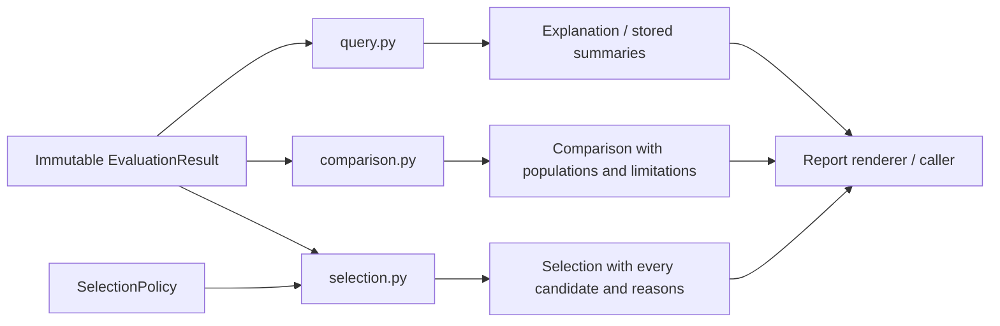

# Result modules — levels 3 and 4

**Initial assessment implementation in package 0.5.** See the
[implemented surface and boundaries](../../implementation/unified_assessment.md). The following
sections add pure consumers of `AssessmentResult`, composing configuration
assessments with optional behavioral results. The
[assessment contract](../ASSESSMENT_CONTRACT.md) owns the proposed shared record
fields. The preserved revision-0.4 behavioral specification follows below;
its API remains defined by the [typed contract](../../contracts/agent_eval_flow.pyi).
See [implementation status](../../IMPLEMENTATION.md) for the current package.

## Next extension — level 3: assessment queries and decisions

These readers consume immutable saved results. They receive no collector,
evaluator, runtime binding, source directory or artifact-fetching service. They
can explain a configuration-only result without constructing an empty behavioral
study. Existing `EvaluationResult` methods remain unchanged.

| Planned file within `results/` | Responsibility |
| --- | --- |
| `assessment_query.py` | Index snapshots, captures, checks, assessments, coverage and namespaced activity references; expose candidate explanations and optional run links. |
| `assessment_comparison.py` | Compare explicitly matched candidate checks, findings and values; report incompatible scopes, definitions, references or evidence. |
| `assessment_selection.py` | Apply explicit `AssessmentPolicy` requirements and optional behavioral selection using the current pure ranking helpers. |
| Existing query/comparison/selection files | Continue reading behavioral records with unchanged populations, scores and numerical selection rules. |

The internal assessment index keys activities by the full `ActivityRef`, and
keys projected behavioral rows by their source result/run/metric/detail identity.
It indexes candidate configuration findings once and follows links to relevant
runs on demand. Displaying a candidate finding beside a run does not create an
additional assessment or observation.

```python
# Illustrative planned internal interfaces; views are transient presentation
# mappings, not additional persisted record definitions.
def explain_candidate_assessments(
    result: AssessmentResult, candidate_id: str,
) -> Mapping[str, object]: ...

def compare_candidate_assessments(
    result: AssessmentResult, baseline: str, challenger: str,
    *, check_ids: tuple[str, ...],
) -> Mapping[str, object]: ...

def decide_assessments(
    result: AssessmentResult, policy: AssessmentPolicy,
) -> Mapping[str, object]: ...

def wrap_behavior_result(
    existing_result: EvaluationResult, *, plan: AssessmentPlan,
) -> AssessmentResult: ...
```

The versioned policy and its `ConfigurationRequirement` predicates are defined
in the [shared contract](../ASSESSMENT_CONTRACT.md), rather than inferred from a
provider's severity labels. The returned decision view retains the complete
policy identity, every candidate's eligibility, each requirement's evidence and
coverage, and any behavioral ranking. These signatures specify internal services;
they do not promise currently available methods or a final serialized view type.

`wrap_behavior_result` requires an explicit compatible behavior-only plan with
its full Study. Saved DatasetInfo cannot reconstruct those task/reference tables.
Validate execution/candidate/dataset compatibility and result-suite identity,
then compose without executing or regrading. The new outer result has no newly
performed activity refs; the nested result preserves its original provenance.

## Next extension — level 4: explanation and comparison

1. Validate snapshot/capture/assessment/activity joins and optional behavioral
   candidate membership before querying. Reject dangling or conflicting IDs;
   distinguish them from correctly represented missing evidence. Resolve activity
   references by namespace plus ID, never by text ID alone.
2. A candidate explanation returns the exact requested check inventory, retained
   findings/values, invocation outcomes, evidence basis, scope/completeness and
   source activity receipts. Keep original findings and separate waivers visible.
   Include behavioral source rows only as explicitly identified linked evidence.
   Do not copy candidate findings into each run's task measurement collection.
3. Follow retained references without reading artifact bytes or downloading
   missing inputs. Distinguish a recorded evidence locator from a verified
   accessible artifact. Derived display views preserve origin keys and do not
   count as new grading or scanning work.
4. For comparison, validate candidate/check IDs and match the requested subject
   scope, full check/evaluator definitions, parameters, reference-policy versions,
   collector scope and evidence completeness. Candidate bytes may differ because
   the candidate changed; that is the object of comparison. Incompatible inputs
   remain side-by-side with a reason, not a claimed common pass rate or delta.
5. Compare findings using a provider-declared stable finding identity or an
   explicit canonical locator/check identity. Where no stable match exists,
   present each side without inventing a resolved/new-finding classification.
   An absent finding is resolved only when the corresponding check and relevant
   scope were completely assessed under compatible definitions.
6. Compute numerical deltas only for compatible, known typed values with equal
   meaning/units. Findings need no numeric encoding. Behavioral summary comparison
   delegates to existing population-aware helpers and retains task/cluster counts.
   Configuration comparison retains candidate/check coverage; neither population
   substitutes for the other.
7. Preserve declared snapshot differences separately from captured native effective
   settings. Missing settings, observed drift or a mismatch between inspected and
   executed configuration qualifies cross-branch comparison and blocks any claim
   that both assessed the same effective setup. Report the actual available facts.

Explanations may show an inferred trigger overlap next to a captured skill choice
and a failed answer grade. Their association is a hypothesis for another declared
experiment. It does not demonstrate that the overlap caused the failure, and the
reader cannot create a follow-up experiment automatically.

## Next extension — level 4: explicit policy evaluation

`AssessmentPolicy` carries versioned candidate-level configuration requirements
and an optional current `SelectionPolicy`. The initial configuration predicates
are `conclusion_pass(check_id)`,
`no_findings(check_id, min_severity, allowed_tiers=None)` and
`value(check_id, value_id, op, expected_value)` with the detailed types and any
allowed evidence tier/waiver handling specified by the canonical contract.
No rule is implicitly required because a scanner emitted a warning.

For each candidate:

1. Resolve each predicate to its exact requested check and retained coverage.
   Record the source assessment, its provenance and the reason for the predicate's
   pass/fail/unknown result. An unknown check ID is an invalid policy, whereas a
   planned check that failed or was not run supplies unavailable evidence.
2. Evaluate `conclusion_pass` only from an explicit supported conclusion;
   successful callback completion does not substitute for one. For `no_findings`,
   matching eligible retained findings can establish failure; passing requires
   complete coverage and no matching finding. `allowed_tiers=None` explicitly
   considers all tiers; a supplied tier filter compares provider-attributed
   `Finding.evidence_tier`. An unavailable tier on a relevant finding leaves the
   predicate unknown unless another eligible finding already establishes failure;
   it is never silently excluded. Partial/missing coverage cannot establish absence.
   For `value`, apply typed threshold semantics to the named
   usable value; unavailable values remain unknown. Evidence/eligibility and waiver
   constraints are explicit inputs to this reasoning, not erasures of raw evidence.
3. Keep invocation failures separate from candidate failure. A failed invocation
   normally leaves its requested conclusion unknown. A supported failing finding
   may still establish a predicate failure when its own evidence is valid; unrelated
   failed checks cannot erase it. An advisory finding cannot become an eligible
   blocking finding merely because its severity is high; a policy may explicitly
   include advisory findings through its selected tier criteria.
4. Combine required configuration predicates as a noncompensatory conjunction:
   fail dominates, otherwise any unknown yields unknown, otherwise pass. Keep each
   individual outcome visible. If the explicit policy requests no configuration
   requirements, it contributes no additional restriction and makes no claim
   that the configuration was inspected or found safe.
5. If a behavioral policy is present, validate the existing summary IDs, objective
   comparability and behavioral result availability. Combine configuration
   eligibility with the existing behavioral eligibility per candidate; unknown
   remains unknown unless a known failed requirement determines failure. Retain
   absent behavior as unavailable, never a passing empty task population.
6. Apply current pure lexicographic, weighted or Pareto helpers only to eligible
   candidates with the requested usable, comparable behavioral summary values.
   Compute ranks after combining eligibility; do not merely remove a blocked
   winner from an already selected ID list. Keep all failed/unknown candidates and
   their reasons in the result. Configuration-only policies produce eligibility
   and explanations without inventing objectives or a winning candidate.

No scanner severity contributes points to a task rubric or an average success
rate. A high behavioral score cannot compensate for a failed required
configuration predicate. Waivers remain versioned policy decisions with reasons,
not changed scanner outputs. Changing policy rereads existing assessments and
summaries; it invokes no scanner, grader, collector or reducer.

Resource views list unique source activities rather than summing the activity
references on every finding. Totals retain the separate branch/categories,
inventory completeness and retained/new distinction. An optional behavioral
result supplies its original source totals; projected views do not add another
copy. Namespaced IDs prevent collisions between old behavioral activities and
new inspection activities.

## Next extension — planned implementation acceptance scenarios

These checks are planned for the extension; the existing tests below do not
already verify the proposed interfaces:

| Scenario | Observable acceptance condition |
| --- | --- |
| Configuration-only result, no behavioral policy | Candidate eligibility, evidence and coverage are available; no task IDs, success averages or synthetic ranking. |
| High-severity advisory finding, gate permits validated tier only | Severity remains visible without silently gaining blocking eligibility. |
| Tier filter requested, relevant finding has no tier | Requirement remains unknown; the finding is not silently excluded. |
| Policy explicitly includes advisory tier | A matching advisory finding may fail that policy requirement, with the explicit choice retained. |
| No findings from a partial scan | `no_findings` is unknown with missing coverage, not pass. |
| Valid failing predicate plus an unavailable required check | Overall eligibility is fail; unavailable check remains explicitly unknown. |
| Candidate A has best behavior but fails a required configuration check | Ranking is computed among combined eligible candidates; A is retained with its failure reason. |
| Same candidate finding shown beside 100 runs | Query returns one source assessment and 100 optional links, with one associated source charge. |
| Same rule name but different revision/reference policy or scanned scope | Comparison reports incompatibility and does not infer a resolved finding or numerical improvement. |
| Waived finding and observed runtime configuration drift | Both remain visible; waiver never rewrites raw evidence or hides the mismatch. |
| Saved result queried/compared under two policies | Collector/evaluator/reducer counters remain unchanged; original records and costs are identical. |

## Preserved revision-0.4 behavioral specification

The remainder records the existing behavioral contracts. The extension does not
change these query signatures, task populations, selection modes or records.
Its historical test-first status is separate from current implementation status.

The user can inspect a run, compare two candidates, or change the objective from
accuracy to cost or latency using the same result. These operations read saved
facts. They receive no backend, evaluator or reducer registry and never perform
new agent work, grading, evidence downloads or hidden summary recomputation.

## Level 3: files, inputs and outputs

```text
src/agent_eval_flow/results/
├── __init__.py      internal query-service exports
├── query.py         stored summaries, run explanations and evidence joins
├── comparison.py    candidate changes, descriptive deltas and limitations
└── selection.py     requirements and three explicit preference modes
```



These files depend on `objects` and pure standard-library arithmetic. Shared
threshold semantics may be imported from `evaluation.scoring`; that function has
no callbacks or engine dependency. They do not depend on `pipeline`, `execution`,
native integrations or storage. Reporting calls these readers; readers do not
render HTML themselves.

### Exact internal structures and methods

```python
# query.py: a transient index over immutable records, never persisted
@dataclass(frozen=True)
class ResultIndex:
    runs: Mapping[str, Run]
    assignments: Mapping[str, Assignment]
    scores: Mapping[str, TaskScore]
    measurements: Mapping[str, tuple[Measurement, ...]]  # run ID
    summaries: Mapping[tuple[str, str], CandidateSummary]
    activities: Mapping[str, EvaluationActivity]
    native_jobs: Mapping[str, NativeJobRecord]

def index_result(result: EvaluationResult) -> ResultIndex: ...
def stored_summaries(result: EvaluationResult) -> tuple[CandidateSummary, ...]: ...
def explain_run(result: EvaluationResult, run_id: str) -> Explanation: ...
def collect_run_evidence(index: ResultIndex, run_id: str) -> tuple[EvidenceRef, ...]: ...

# comparison.py
@dataclass(frozen=True)
class ComparedPopulation:
    task_count: int
    cluster_count: int
    same_included_work: bool
    notes: tuple[str, ...]

def compare_candidates(
    result: EvaluationResult, baseline: str, challenger: str,
    metrics: Sequence[str], confidence: float | None,
) -> Comparison: ...

def compare_summary_values(
    baseline: CandidateSummary, challenger: CandidateSummary,
    *, confidence: float | None,
) -> ComparisonRow: ...

def describe_population(
    result: EvaluationResult, baseline: str, challenger: str,
    *, summaries: tuple[str, ...],
) -> ComparedPopulation: ...

def configuration_limitations(
    result: EvaluationResult, baseline: str, challenger: str,
) -> tuple[str, ...]: ...

# selection.py
@dataclass(frozen=True)
class PreparedPreference:
    candidate_id: str
    eligibility: Decision
    reasons: tuple[str, ...]
    objective_values: tuple[MetricValue, ...] | None

def select_candidates(result: EvaluationResult, policy: SelectionPolicy) -> Selection: ...
def validate_selection_policy(result: EvaluationResult, policy: SelectionPolicy) -> None: ...
def prepare_preference(
    candidate_id: str, policy: SelectionPolicy,
    summaries: Mapping[tuple[str, str], CandidateSummary],
) -> PreparedPreference: ...

def rank_lexicographic(
    rows: tuple[PreparedPreference, ...], objectives: tuple[ObjectiveTerm, ...],
) -> tuple[SelectionRow, ...]: ...
def rank_weighted(
    rows: tuple[PreparedPreference, ...], objectives: tuple[ObjectiveTerm, ...],
) -> tuple[SelectionRow, ...]: ...
def rank_pareto(
    rows: tuple[PreparedPreference, ...], objectives: tuple[ObjectiveTerm, ...],
) -> tuple[SelectionRow, ...]: ...
```

`EvaluationResult.summary()` delegates to `stored_summaries`, `explain` to
`explain_run`, `compare` to `compare_candidates`, and `select` to
`select_candidates`. The public default `confidence=None` is passed explicitly
to the internal comparison. Rank helpers receive all candidate preference rows
and retain unavailable/ineligible rows in their output.

## Level 4: queries and explanations

1. `index_result` validates/indexes the existing result's IDs without calling
   any extension. Every result run has exactly one task score; summaries are
   unique by `(candidate_id, summary_id)`. Invalid stored joins are validation
   errors, not missing answers that a reader repairs.
2. `stored_summaries` returns the existing immutable summary tuple in its stored
   order. It does not reduce measurements again, even for a custom summary.
3. `explain_run` resolves the requested run, gathers its task score and all task
   and detail measurements, then gathers their evidence. A nonexistent run ID
   produces `ValidationError` naming the requested ID.
4. Evidence includes explicit measurement/contribution references, the run's
   artifact references, source events, execution/error/environment observations,
   relevant native-job artifacts and referenced grading activity artifacts. It
   follows references already in the result; it does not open file bytes or
   traverse unrelated runs merely because a batch activity covers them.
5. Deduplicate identical full `EvidenceRef` values in first-occurrence order.
   Different locators/descriptions remain separate. A named raw artifact without
   a locator becomes an `EvidenceRef` describing that artifact. Native detail
   identifiers and original trace locators stay intact.

The returned `Explanation` contains the requested run ID, stored `TaskScore`,
measurements and evidence. It explains which recorded facts produced the chosen
rules' output. It does not infer that a trace proves why a skill, model or tool
caused improvement. An empty evidence tuple is valid when the capture genuinely
contains no evidence; the reader cannot create evidence by rerunning work.

## Level 4: comparisons

Validate both candidate IDs and requested summary IDs before reading values.
Reject duplicate summary requests, an empty request, and confidence values that
are not finite or not strictly between 0 and 1. Comparing a candidate with itself
is valid and yields zero known numeric deltas. The result already fixes project,
dataset and suite: this API cannot compare an OpenSRE result to an OpenKritt
result or silently join results from different studies.

For each requested summary, retain the original baseline and challenger
observations. Compute `delta = challenger - baseline` only for known numeric
values. Boolean/text values remain inspectable but have an unknown numeric
delta with a reason. If either operand is unknown, the delta is unknown; never
substitute `available_value`. If either known operand is estimated, the numeric
delta is estimated. Finite integer/float/Decimal values are subtracted with their
appropriate numeric arithmetic before conversion to the public float delta;
an unrepresentable float result is unknown with an explicit overflow reason.

`changes` comes from `Candidate.diff`, preserving add/remove/replace operations,
paths and typed values. This describes declared changes; arbitrary native fields
are not interpreted through a universal harness schema.

### Populations and effective configuration

`task_count` is the number of distinct typed unit keys present in both candidates'
planned assignments. Repetitions remain attached to their unit and never inflate
this count. `cluster_count` counts distinct declared grouping tuples among those
units, using `RunPlan.dataset.units` and `cluster_by`; without grouping it equals
task count. These counts describe planned comparable work, not successful rows.

For each summary, translate included run IDs through assignments into typed
`(unit key, repetition)` identities. Different candidate run IDs are expected;
compare those work identities, not the opaque IDs. Report source counts and any
excluded work in limitations. If populations differ, explicitly state that the
descriptive aggregate delta is not paired over identical included work. A known
custom subset aggregate remains a valid value under its declared definition.

`configuration_limitations` reports unresolved declared revisions, unknown or
estimated effective-configuration observations, relevant mapper warnings and
observed runtime configuration differences. Declared component changes remain
separate from observed effective settings. Unknown native dialect fields are
reported for inspection rather than automatically classified as an undeclared
behavior change. This version makes no automatic isolated-cause label; descriptive
comparisons remain available while attribution limits stay visible.

### Confidence intervals

Revision 0.4 has no interval estimator. For a valid requested confidence,
every row returns `interval=None` with `interval_note` explaining that no
supported recorded interval method exists; the comparison also includes that
limitation. Without a confidence request, interval fields are null. No bootstrap,
custom reducer rerun, pairwise judge or new agent execution is hidden here.
The preserved task/cluster identities make a later declared estimator possible
without pretending this implementation already provides one.

## Level 4: selection preparation

Selection operates on named candidate summaries, not individual measurement
rows. Validate that objectives are nonempty, their IDs are distinct and known,
and all requirement IDs are known. Weights are finite and positive. For weighted
mode every objective requires finite fixed bounds with `low < high`; bounds
describe that summary's units, not the observed min/max of these candidates.
The caller's policy is preserved in the returned `Selection`.

For each candidate, evaluate requirements against `CandidateSummary.value`.
Threshold comparison semantics match the opted-in acceptance helper. No
requirement is added from run completion, cost, safety or source coverage by
default. Missing/unknown values are unresolved. Estimated values are unresolved
unless `allow_estimates=True`. A known failed requirement dominates unresolved
requirements; otherwise any unresolved requirement makes eligibility unknown.

All objective values must also be known, numeric and permitted by the estimate
flag. Missing or disallowed objective values make an otherwise passing candidate
unknown for ranking. Text objectives are invalid for these numeric ranking
helpers; custom text summaries can still be inspected or used in compatible
equality requirements. Boolean objectives use the explicit numeric convention
false=0, true=1. `available_value` is never substituted. Every candidate has a
row, including failed/unknown eligibility and its reasons.

## Level 4: preference modes and ties

Rank only candidates with eligibility pass. Presentation order is stable by the
plan's candidate order, but order cannot break a tie.

| Mode | Computation and output |
| --- | --- |
| Lexicographic | Compare objective values in their declared order, using each direction. The first unequal value decides; equal full vectors tie. Weight/bounds fields do not affect this mode. |
| Weighted | For value `x`, compute `z = clamp((x-low)/(high-low), 0, 1)`; use `z` when maximizing and `1-z` when minimizing. Normalize positive weights by their sum and add weighted utilities. Larger preference wins. |
| Pareto | A dominates B when A is no worse on every objective and strictly better on at least one, after respecting directions. Return all nondominated eligible candidates; weights/bounds do not alter dominance. |

Lexicographic and weighted modes assign dense ranks: tied values share a rank
and the next distinct value takes the next integer. Their best-ranked candidate
IDs are selected. One best candidate yields status `selected`; multiple equal
best candidates yield `tie`. Weighted rows carry the computed finite
`preference_score`; other modes leave that field null. Pareto frontier rows have
rank 1 and other rows no rank; with any eligible candidate its status is
`frontier`, including a singleton frontier. Failed/unknown rows have no rank.
No eligible candidates yields `none_eligible` and an empty selected tuple.

Weighted arithmetic uses a local Decimal context with precision 34 and half-even
rounding. Convert finite float bounds/weights/values through their round-trippable
decimal string; retain Decimal values and exact integers. Convert the bounded
final utility to the public float `preference_score` and rank that recorded float.
Lexicographic/Pareto comparisons retain finite numeric values without converting
Decimal inputs to floats. These choices avoid dependence on caller-global decimal
settings and avoid accidental integer-to-float overflow during comparisons.

Ties use exact comparisons of the validated/computed numeric values in this
helper version; there is no hidden statistical tolerance. Numeric conversion
must not coerce typed text into a number. Calculations use finite checked values;
arithmetic that cannot produce a finite preference makes that row unknown with
a reason rather than an apparent best score. A future tolerance policy would
need an explicit recorded definition.

For the fixture with quality/cost A=`0.8/0.1` and B=`1.0/0.9`, lexicographic
quality-first chooses B. With `[0,1]` bounds and quality/cost weights `1/3`,
weighted utilities are A=`0.875` and B=`0.325`, so A wins. Pareto returns both.
All three answers use the same stored summaries; none changes the task rubric
or reruns the evaluator.

## Failures, lifetime and verification

Malformed caller requests raise public `ValidationError`; schema construction
may reject them earlier. Invalid result joins are not converted into a known
comparison or selection. Missing source facts are ordinary unknown observations
with reasons, not exceptions. No operation mutates the result or caller policy.
Indexes and prepared preferences are per-call local state; there is no global
result cache, plugin registry or background work in this directory.

| Written tests | Responsibilities exercised |
| --- | --- |
| [Results and storage](../../../tests/contracts/test_results_storage.py) | Three modes, ties, no eligible candidates, missing/estimated objectives, partial summaries, unavailable intervals, validation and no regrading. |
| [Reducer boundaries](../../../tests/contracts/test_reducers.py) | Malformed reducers cannot publish a known selectable summary; source counts and IDs remain inspectable. |
| [Evaluation boundaries](../../../tests/contracts/test_evaluation.py) | Unknown/error/native sources and activity provenance feeding explanations. |
| [Toy E2Es](../../../tests/e2e/test_toy_pipeline.py) | Inspect, compare, select and reload the same result without more callbacks. |
| [Data-contract E2Es](../../../tests/e2e/test_data_contract.py) | Saved native-grade evidence and original incremental grading costs remain usable. |

Rendering/escaping and persistence are specified by their own module designs.
These tests originated as acceptance specifications before implementation;
current execution/integration status is recorded in
[IMPLEMENTATION.md](../../IMPLEMENTATION.md). They do not yet establish the
planned assessment-extension behavior above.
