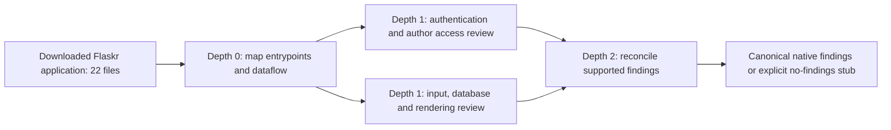

# OpenKritt: review a real application and preserve its entire workflow

The input is the **complete Flaskr tutorial application from Pallets Flask 3.1.2**,
not a one-function example written to satisfy our evaluator. We downloaded 22
unchanged files (26,053 bytes): authentication, blog CRUD, SQLite access/schema,
HTML templates, CSS, upstream tests and test data, project configuration, README
and BSD-3-Clause license. `source_manifest.json` pins every file to commit
`2c1b30d0503cfb064f1cb252e6614a06915a362a` with its URL, SHA-256 and byte length.
The source is in [review_target/](review_target/README.rst); it is read as review
input, never imported or executed by our test suite.

## The mission and actual agent flow

The agent reviews authentication, author-only edits and the flow of submitted
values through validation, SQL and rendering. It uses its real repository tools.
The version-2 native [workflow](workflow.json) has this shape:



Each of the four steps runs **two native cumulative iterations**. The second
iteration sees the first iteration's results for that exact step/input; a
no-new-results stub is valid. The two review branches consume the complete map;
the final stage consumes both review streams. This produces eight completed
workflow attempts per scan, plus any real retries or native post-processing.
These are internal agent iterations, not eight independent evaluation tasks.

The shared study creates two candidate configurations, A and B, differing only
by a test tag. Both review the same pinned source in **fresh scans**, with one
AEF repetition each. That is two evaluation runs and sixteen completed native
workflow attempts. This tests grouping and comparison usability; it makes no
claim about one candidate being smarter. OpenSRE is a separate study.

## Inputs and runtime configuration

The task contains `task_id`, `repo_kind="local"`, a fresh `repo_full` namespace,
and the declared review scope. `candidate.settings.openkritt_e2e` supplies:

| Setting | Requirement |
| --- | --- |
| `fixture_dir` | The local `review_target/` directory; stage exactly the manifest files. |
| `source_manifest` | The downloaded source provenance manifest. |
| `workflow_file` | The four-step native workflow, imported unchanged. |
| `upstream_revision` | OpenKritt `1ba10d410b4a0a309bacf5bc2d14ec1c27ed8a09`. |
| `scan_configuration` | Native `configuration: {"repeat_runs": 2}`. |
| `post_script_id` | A real configured native post-script from the selected profile. |
| `artifact_dir` | Local destination for downloaded evidence after the cloud run. |
| `capture_contract` | `aef-openkritt-capture/2`, defined below. |
| `require_tool_trace` | True; a final answer without actual tool records fails. |
| `artifact_bundle` | `openkritt.bundle`; always retrieve the complete evidence ZIP. |

The selected `openkritt_gcp` profile supplies the backend, existing GCP deployment,
model/provider and `post_script_id`. The post-script should be a bounded,
source-review-only summary step configured by the operator. The test captures
its actual definition; it does not silently choose an arbitrary default.
The pinned native create-scan route requires a valid `postScriptId`; an empty
post-script list is not a way to disable that requirement.

A native Codex JSONL harness or an observable Claude stream-JSON harness can
satisfy the tool contract. Pinned OpenKritt uses Claude stream-JSON for its
OpenRouter path; ordinary Claude JSON result mode alone is insufficient.
GCP denotes hosting, **not assumed native Vertex model support**. Each assignment
has a 1,800-second wall-time limit with confirmed termination. The profile stages
only this input into an immediate child of the VM's local-repository mount,
submits via the native API, captures evidence before cleanup and removes only
its owned staged files/jobs. It neither provisions GCP nor installs packages in
the reviewed application.

## What must be returned

`Run.output` retains `scan_id`, `native_status`, the unchanged native canonical
`findings` array and native export availability. The rich result is also in
`Run.executions`, `Run.events` and hash-addressed artifacts; it must remain
usable after `RunSet.save()` and `RunSet.load()`.

| Artifact | Captured source |
| --- | --- |
| `openkritt.scan` | Unmodified `GET /api/scans/:id` JSON. |
| `openkritt.workflow` | Imported native workflow detail, including real step IDs. |
| `openkritt.post_script` | The selected native post-script definition. |
| `openkritt.findings` | Unmodified canonical findings JSON. |
| `openkritt.step_metadata` | Read-only export of all native `workflows.step_metadata` rows for this scan. |
| `openkritt.step_results` | Read-only export of all native `workflows.step_results` rows for this scan. |
| Per-attempt stdout/stderr | Actual native harness output, including successful attempts. |
| `openkritt.capture` | Our provenance/index envelope linking those sources. |
| `openkritt.export` | Native finding ZIP, only when native findings exist. |
| `openkritt.bundle` | Always-present adapter-produced evidence ZIP, including inputs and all other artifacts. |

The database exports use PostgreSQL `row_to_json` naming: `scan_id`, `step_id`,
`repeat_run`, `prev_id`, `prev_table`, `prompt_filled`, `output_json`, timestamps,
`raw_token_usage`, model/harness/provider and the existing remaining columns.
They preserve failed/retried attempts and post-processing rows as well as success.
A worker-side, scan-scoped, read-only collector obtains them. There is no claimed
native public HTTP endpoint for this complete trajectory.

The `openkritt.capture` envelope is **our proposed adapter instrumentation**, not
an upstream object:

```json
{
  "schema_version": "aef-openkritt-capture/2",
  "scan_id": "native ID",
  "source_manifest_sha256": "hash of our manifest",
  "workflow_sha256": "hash of the submitted portable workflow",
  "staged_files": [{"path": "flaskr/auth.py", "sha256": "observed remote file hash"}],
  "metadata_inventory_complete": true,
  "observer": {"name": "profile capture implementation", "revision": "pinned observer revision"},
  "traces": [{
    "metadata_id": "native step_metadata ID",
    "stdout_artifact": "artifact key for this attempt's raw stdout",
    "stderr_artifact": "artifact key for this attempt's raw stderr",
    "protocol": "codex-jsonl"
  }]
}
```

The actual envelope lists **all** staged files and at least all completed workflow
attempts. Supported protocols in the test decoder are `codex-jsonl` and
`claude-stream-json`. Other protocols need an explicit verified decoder.

A future capture observer must retain `HarnessResult.output`/`HarnessOutput`
without altering native prompts, tools, decisions or scheduling. Pinned upstream
persists structured successful output and usage in metadata, but normally keeps
full raw model-output artifacts for errors, so this observer is real integration
work still to implement. A synthetic transcript cannot replace it.

Each metadata row maps to one `Execution` with `native_refs.step_metadata_id`,
`step_id` and `repeat_run`. Each completed workflow attempt has a `workflow_step`
event with its unchanged `output_json`, repeat number and an `EvidenceRef` to
`/<row index>` in the native metadata artifact. Tool events retain native IDs,
actual names, arguments and results. Their source/output evidence uses
`line:<1-based line>` in the captured stream. Codex command events preserve the
command, aggregated output and exit code; Claude tool events pair native
`tool_use` and `tool_result` IDs. Extra tool types may coexist.

### The downloadable deliverable

`openkritt.bundle` is an actual ZIP downloaded from the prepared profile to the
local evidence cache. It exists even when there are no findings. It is distinct
from the optional native `openkritt.export`, which is included inside the bundle
when available. The evidence ZIP contains:

```text
manifest.json
inputs/source_manifest.json
inputs/review_target/                 # All 22 unchanged inputs, including LICENSE.txt
configuration/workflow.json
native/                              # Scan, findings, workflow, post-script, metadata, results
traces/                              # Every captured harness stdout/stderr
capture/                             # Capture index and any other retained evidence
```

The first four paths are fixed. Other paths are declared in the bundle manifest;
their names may follow the profile's layout. `manifest.json` has this schema:

```json
{
  "schema_version": "aef-openkritt-evidence-bundle/1",
  "scan_id": "native scan ID",
  "run_id": "AEF run ID",
  "assignment_id": "AEF assignment ID",
  "files": [{"path": "native/scan.json", "sha256": "file hash", "bytes": 1234}],
  "artifacts": {"openkritt.scan": "native/scan.json"}
}
```

`files` lists every non-directory ZIP member except the manifest itself.
`artifacts` maps every run artifact except `openkritt.bundle` to a unique member.
The test rejects duplicate/unsafe paths and checks every byte count/hash, every
downloaded source byte, the workflow definition and raw artifact bytes against
their individual captured artifacts. Trace references resolve through this
mapping without contacting GCP. These checks repeat after saving/loading the run.

## What the assertions prove

- Local input hashes match the downloaded snapshot, and observed staged hashes
  match those same files. Imported native prompts/schema match our workflow.
- Both native review branches really ran, along with mapping and reconciliation.
  Every declared step has completed native repeat 1 and repeat 2 records.
- Every previous-stage JSON result is present in the next stage's filled prompt,
  including both branches at the merge. Second-repeat instructions are retained.
- Structured maps/review records exist even when the finding list is empty.
  Native intermediate rows exactly match the corresponding attempt payloads.
- Every supported raw tool result survives normalization with source locations;
  each mapping/review branch actually invoked tools. No exact tool order or
  specific model prose is required.
- All captured metadata rows have unique execution identities. Raw JSON and ZIP
  evidence have correct hashes, scan identities and finding links.
- These checks still hold after persistence; shared E2E checks also exercise
  evaluation, explanation, aggregation, comparison, selection and reporting.

The caller-defined base metric now **counts actual completed native workflow
attempts from `openkritt.step_metadata`**, with an evidence pointer for each row.
This fixture expects eight. The second configured metric adds seven, producing
15, to retain the independent dependency-wiring check. The base count is an
observable workflow fact, not an intelligence or vulnerability-detection score.

Zero canonical findings remains valid. Native OpenKritt refuses a finding ZIP
in that case; the output must say unavailable with a reason, while retaining the
full stage/iteration/tool bundle. Unknown billing or unexposed model-call details
remain unknown with provenance. The richer artifacts and measured workflow count
remain inspectable without claiming vulnerability detection quality.

Offline input verification, without importing the downloaded application:

```powershell
.venv/Scripts/python.exe -c "from tests.e2e.cloud.test_openkritt_gcp import verify_inputs; m,w=verify_inputs(); print(len(m['files']), sum(f['bytes'] for f in m['files']), len(w['workflow']['levels']))"
```

Expected: `22 26053 3`. Third-party test files are review inputs and are excluded
from this repository's pytest discovery. Selecting the live profile must fail if
the adapter, capture observer, required deployment or credentials are absent.
Unselected live profiles may skip. No cloud or model run has been performed.

## Verified sources

Reviewed at the pinned revisions on 2026-09-08:

- [Downloaded Flask tutorial source](https://github.com/pallets/flask/tree/2c1b30d0503cfb064f1cb252e6614a06915a362a/examples/tutorial) and [license](review_target/LICENSE.txt).
- [OpenKritt workflow imports](https://github.com/Kritt-ai/open-kritt/blob/1ba10d410b4a0a309bacf5bc2d14ec1c27ed8a09/docs-site/workflows/import-and-export.mdx), [native repeats](https://github.com/Kritt-ai/open-kritt/blob/1ba10d410b4a0a309bacf5bc2d14ec1c27ed8a09/docs-site/workflows/depth-and-siblings.mdx) and [batching](https://github.com/Kritt-ai/open-kritt/blob/1ba10d410b4a0a309bacf5bc2d14ec1c27ed8a09/docs-site/workflows/batches.mdx).
- [Native metadata/result schema](https://github.com/Kritt-ai/open-kritt/blob/1ba10d410b4a0a309bacf5bc2d14ec1c27ed8a09/backend/prisma/schema.prisma).
- [Worker persistence](https://github.com/Kritt-ai/open-kritt/blob/1ba10d410b4a0a309bacf5bc2d14ec1c27ed8a09/engine/open_kritt_engine/worker.py), [harness output](https://github.com/Kritt-ai/open-kritt/blob/1ba10d410b4a0a309bacf5bc2d14ec1c27ed8a09/engine/open_kritt_engine/harnesses.py), [queue/dataflow](https://github.com/Kritt-ai/open-kritt/blob/1ba10d410b4a0a309bacf5bc2d14ec1c27ed8a09/engine/open_kritt_engine/queue.py) and [prompt rendering](https://github.com/Kritt-ai/open-kritt/blob/1ba10d410b4a0a309bacf5bc2d14ec1c27ed8a09/engine/open_kritt_engine/prompting.py).
- [Scan creation and export routes](https://github.com/Kritt-ai/open-kritt/blob/1ba10d410b4a0a309bacf5bc2d14ec1c27ed8a09/backend/src/routes/scans.js) and [workflow/scan serialization](https://github.com/Kritt-ai/open-kritt/blob/1ba10d410b4a0a309bacf5bc2d14ec1c27ed8a09/backend/src/lib/serialize.js).
